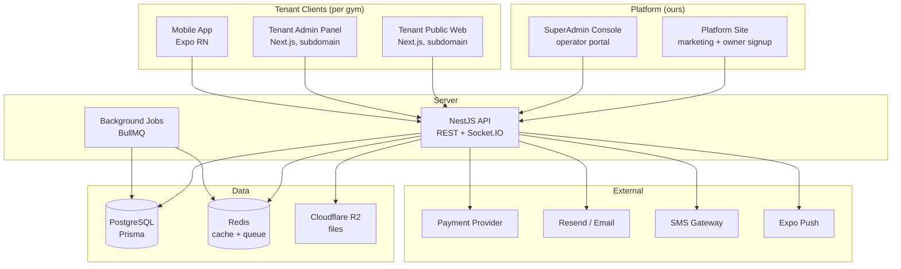

# Fit - Project Plan

*Generated: 2026-05-20*
*Last Updated: 2026-05-20*

## Overview

**Project Name**: Fit

**Description**: Multi-tenant SaaS platform for gyms and fitness centers. Includes a public website for class discovery and member signup, a member mobile app (Expo / React Native) for booking classes and personal training with QR check-in, an admin panel for staff (owner, manager, receptionist, trainer), a web-based POS system, an online shop for physical products (supplements, food, accessories), subscription and credit-pack billing with freeze/pause/trial/promo, real-time live occupancy and admin feed, and advanced analytics with cohorts and custom reports. Built as a Turborepo monorepo using Next.js, NestJS, Expo, PostgreSQL/Prisma, hosted on Vercel and Railway with Cloudflare R2 file storage.

**Target Users**: Gym owners, fitness studio managers, trainers, receptionists, and gym members in Georgia (Tbilisi market first, then broader CIS). Members are adults 18-50 seeking class booking, personal training, and on-site purchases. Operators are SMB fitness businesses with 1-5 locations.

**Project Type**: Full-Stack Web + Mobile Application (Multi-Tenant SaaS)

**Status**: Planning (0% complete)

---

## Non-Goals

Explicitly out of scope for this milestone, to keep tasks from sprawling:

- **No real payment-provider integration** beyond the abstraction + stub (T8.8). Wiring Stripe or TBC/BOG to live charges is a follow-up milestone.
- **No card-present hardware terminals** — POS card payments are manual entry only; no SDK/terminal integration.
- **No multi-currency** — a single currency (GEL) per gym; FX and multi-currency pricing are deferred.
- **No third-party marketplace / aggregator sync** (ClassPass, MindBody, Glofox import/export).
- **No public developer API or webhooks** for third parties; the API serves only our own clients.
- **No white-label custom domains** per gym; tenants live under the shared app domains.
- **No real platform billing in this milestone** — gym owners sign up on a trial/free tier (what gyms pay *us* for the SaaS). Real platform subscription charging is deferred to Full Launch. (Distinct from member→gym billing in Phase 8.)
- **No native desktop app** — staff use the responsive web admin.
- **No marketing/CRM campaign engine** — only transactional email/SMS/push; no bulk campaign builder or drip automation.
- **No trainer-authored nutrition or workout-plan builder** in the member app.
- **No native in-app payments (Apple/Google IAP)** for subscriptions; billing is provider-driven, not store-driven.

---

## Architecture

### System Overview



### Monorepo Layout

```
fit/
├── apps/
│   ├── platform/     # Our SaaS marketing + owner signup (Next.js 15, root domain)
│   ├── superadmin/   # Platform operator console (Next.js 15, separate site)
│   ├── web/          # Tenant public site — per gym, subdomain (Next.js 15)
│   ├── admin/        # Tenant staff admin — per gym, subdomain (Next.js 15)
│   ├── mobile/       # Member app (Expo RN)
│   └── api/          # NestJS API + WebSocket
├── packages/
│   ├── db/           # Prisma schema & migrations
│   ├── ui-web/       # shadcn components + tokens
│   ├── ui-mobile/    # NativeWind components
│   ├── types/        # Shared DTOs + zod schemas
│   ├── utils/        # Date / money / formatters
│   ├── i18n/         # Translation keys
│   └── config/       # ESLint / TS / Tailwind base
├── turbo.json
└── pnpm-workspace.yaml
```

### Multi-Tenancy Model

- **Tenant** = `Gym` (organization) — root entity for all scoped resources.
- Every resource (members, classes, products, sales) carries a `gymId` foreign key.
- NestJS middleware extracts `gymId` from the authenticated JWT and injects it into a request-scoped context; a Prisma extension automatically applies the `gymId` filter on all queries.
- Super Admin role bypasses tenant scoping for platform management.

---

## Tech Stack

### Frontend
- **Web (public + admin)**: Next.js 15 (App Router) + TypeScript + Tailwind CSS + shadcn/ui + next-intl
- **Mobile**: Expo (managed) + React Native + TypeScript + NativeWind + Expo Router + i18next

### Backend
- **API**: NestJS (Node.js 20) + TypeScript + REST + Socket.IO gateway
- **Validation**: zod (shared schemas across server + clients via `packages/types`)
- **Background jobs**: BullMQ (Redis)

### Data & Storage
- **Database**: PostgreSQL (Railway) + Prisma ORM with row-level tenant scoping
- **Cache / queue**: Redis (Railway)
- **Files**: Cloudflare R2 (S3-compatible)

### External Services
- **Email**: Resend (transactional templates)
- **SMS**: TBD local Georgian aggregator
- **Push**: Expo Push Notifications
- **Payments**: TBD (Stripe + TBC/BOG hybrid candidate)

### DevOps & Infrastructure
- **Hosting**: Vercel (web + admin), Railway (API + Postgres + Redis), Cloudflare R2 (files)
- **CI/CD**: GitHub Actions (lint, type-check, unit + integration tests, preview deploys)
- **Monitoring**: Sentry (frontend + backend errors) + Vercel/Railway logs + UptimeRobot
- **Secrets**: `.env` locally, Vercel/Railway secret stores in production
- **CLI tooling**: all infra is CLI-provisioned and CLI-queryable — Railway CLI (Postgres/Redis/API), Vercel CLI (web/admin/platform/superadmin), Cloudflare `wrangler` (R2), EAS CLI (mobile), plus a unified project CLI `fit` (T1.12) wrapping them. See **Developer CLI & Environment Access** below.

### Roles & Permissions

| Capability                  | SuperAdmin | Owner | Manager | Receptionist | Trainer | Member |
| --------------------------- | :--------: | :---: | :-----: | :----------: | :-----: | :----: |
| Manage gyms / billing       |     ✓      |   –   |    –    |      –       |    –    |   –    |
| Edit gym settings           |     ✓      |   ✓   |    –    |      –       |    –    |   –    |
| Manage staff & roles        |     ✓      |   ✓   |    ✓    |      –       |    –    |   –    |
| View full analytics         |     ✓      |   ✓   |    ✓    |      –       |    –    |   –    |
| Members CRUD                |     ✓      |   ✓   |    ✓    |   partial    |    –    |   –    |
| Classes CRUD                |     ✓      |   ✓   |    ✓    |      –       |   own   |   –    |
| Check-in members            |     ✓      |   ✓   |    ✓    |      ✓       |    –    |   –    |
| POS sales                   |     ✓      |   ✓   |    ✓    |      ✓       |    –    |   –    |
| Products CRUD               |     ✓      |   ✓   |    ✓    |      –       |    –    |   –    |
| Book class for self         |     –      |   –   |    –    |      –       |    –    |   ✓    |

---

## Developer CLI & Environment Access

**Principle:** everything the project needs — server, database, cache, storage, secrets, queues, deploys — is provisioned and inspected through a CLI, never hunted for in a dashboard. A single unified CLI `fit` (built in **T1.12**) is the source of truth; it wraps the vendor CLIs (`railway`, `vercel`, `wrangler`, `eas`) and adds project introspection.

**Convention (applies to EVERY task):** when a task needs a runtime detail (a connection string, a service URL, an env value, a signed upload URL, a test token, queue/job state, health), it obtains it from the CLI at run time — it never hardcodes the value. Tasks that touch infrastructure carry a `**CLI**:` hint listing the exact commands; all other tasks inherit this convention implicitly.

**Standard `fit` commands (single source of truth):**
- `fit env get <KEY> [--env local|preview|prod]` / `fit env check` — read/validate env (delegates to Railway/Vercel stores)
- `fit db url` · `fit db migrate` · `fit db studio` · `fit db seed` · `fit db reset` — database access (wraps Prisma + Railway)
- `fit services status` · `fit services health` — Postgres / Redis / R2 / API reachability
- `fit token --role <ROLE> --gym <slug>` — mint a JWT for local/integration testing
- `fit r2 config` · `fit r2 sign <key>` — storage config / presigned URL
- `fit queue status [<queue>]` · `fit queue retry <jobId>` — BullMQ introspection
- `fit deploy <app> [--env]` · `fit logs <app>` — deploy / tail logs (wraps Vercel/Railway)
- `fit gym create|list` — tenant provisioning helpers (wrap `POST /auth/register-gym`)

---

## Testing Strategy

Testing runs alongside every feature — it is not a final phase.

- **Unit tests** (Vitest): pure functions, services, validators. Run on every commit. Target ≥80% on `packages/utils` and service layers.
- **Integration tests** (Vitest + Testcontainers Postgres): API endpoints with a real DB. Target every NestJS controller has at least happy-path + 1 failure-path test.
- **E2E tests** (Playwright web, Detox/Maestro mobile): critical user flows — signup, class booking, subscription purchase, POS sale, QR check-in. Run nightly + pre-release on preview deployments.
- **Contract tests**: shared `packages/types` zod schemas verify request/response shapes between API and clients.
- **Acceptance criteria**: every Medium/High task lists explicit, testable criteria. Tests turn each criterion into a check.
- **Coverage gate**: minimum 70% line coverage on services; CI blocks merges below this.
- **Companion test tasks**: each feature task is paired with a test task (linked via `**Test Task**: T<id>`).

---

## Production Readiness Checklist

These are mandatory for shipping. The validator will flag missing items.

- [ ] Deployment pipeline configured (CI/CD, preview deploys, production)
- [ ] Environment management (.env.example, secret store per env)
- [ ] Logging (structured JSON, request ID, centralized)
- [ ] Error tracking (Sentry on web + admin + API + mobile)
- [ ] Monitoring & uptime alerts (Sentry + UptimeRobot)
- [ ] Global error boundaries on every client app
- [ ] API error handler with consistent JSON response shape
- [ ] Rate limiting on public endpoints (auth, booking, signup)
- [ ] Input validation (zod) on every endpoint
- [ ] Tenant isolation tests — guarantee no cross-tenant data leak
- [ ] Security review (deps audit, auth flows, sanitization, OWASP)
- [ ] Database backups (Railway daily snapshots) + restore drill

---

## Tasks & Implementation Plan

### Phase 1: Foundation & Infrastructure

**Goal**: Stand up the Turborepo monorepo, databases, API, client app shells, CI/CD, storage, and error handling so all feature work can begin on a reproducible, observable base.

**Exit Criteria**:
- A fresh clone builds every app via `pnpm turbo run build` and CI is green
- API `/health` reports DB + Redis up and Sentry captures a thrown error
- Web, admin, and mobile shells run/deploy with shared configs and env validation
- R2 presigned upload works end-to-end without a proxy

#### T1.1: Initialize Turborepo monorepo skeleton
- [ ] **Status**: TODO
- **Complexity**: Medium
- **Estimated**: 4 hours
- **Dependencies**: None
- **Description**:
  - Initialize git repo with `.gitignore` for Node + Expo + Next + IDE files
  - Set up `pnpm-workspace.yaml` and root `package.json` with workspaces
  - Add `turbo.json` with pipeline (build, lint, test, type-check)
  - Create empty `apps/{web,admin,mobile,api}` and `packages/{db,ui-web,ui-mobile,types,utils,i18n,config}` directories
  - Document the layout in `README.md`
- **Steps**:
  1. Run `git init` and create `.gitignore` covering `node_modules`, `.env*`, Expo `.expo/`, Next `.next/`, build outputs
  2. Create `pnpm-workspace.yaml` listing `apps/*` and `packages/*`; create root `package.json` with `"private": true` and workspace scripts
  3. Create `turbo.json` defining `build`, `lint`, `test`, and `type-check` pipeline tasks with correct `dependsOn` and `outputs`
  4. Scaffold all directory stubs under `apps/` and `packages/` with a placeholder `package.json` in each
  5. Write `README.md` documenting the monorepo layout, prerequisite tools, and `pnpm install && pnpm turbo run build` quickstart
- **Verify**:
  - `pnpm install` at the repo root exits 0 and all workspace symlinks appear in `node_modules/.pnpm`
  - `pnpm turbo run build` completes without errors across all packages
  - `pnpm lint` and `pnpm turbo run type-check` exit 0 on the empty scaffold
- **Acceptance Criteria**:
  - `pnpm install` at the root resolves all workspaces
  - `pnpm turbo run build` runs across all apps and packages
  - `git clone` on a fresh machine reproduces a working dev environment

#### T1.2: Configure shared TypeScript, ESLint, Prettier presets
- [ ] **Status**: TODO
- **Complexity**: Low
- **Estimated**: 3 hours
- **Dependencies**: T1.1
- **Description**:
  - Create `packages/config` exporting base `tsconfig.json`, `eslint.config.js`, `prettier.config.js`, and `tailwind.config.js`
  - Each app extends the base configs (strict TS, no-floating-promises, consistent imports)
  - Add `.editorconfig` and Husky pre-commit hook running lint + format on staged files
  - Add `npm-run-all` or turbo task for `lint:fix`
- **Steps**:
  1. Create `packages/config/tsconfig.base.json` with `strict`, `noFloatingPromises`, and path alias settings; create `eslint.config.js` and `prettier.config.js` exporting shared rules
  2. Create `packages/config/tailwind.config.base.js` with shared theme tokens (colors, fonts, spacing)
  3. Update each `apps/*` and `packages/*` to extend the base tsconfig/eslint/prettier via `"extends"` references
  4. Install Husky and `lint-staged`; configure `.husky/pre-commit` to run `pnpm lint-staged` on staged `*.ts(x)` files
  5. Add a `lint:fix` task to `turbo.json` and root `package.json` using `eslint --fix` + `prettier --write`
- **Verify**:
  - `pnpm lint` exits 0 with zero warnings across all workspaces
  - Introduce a deliberate formatting error in any file, stage it, and attempt a commit — the pre-commit hook should block it
  - `pnpm turbo run type-check` exits 0 after extending the base tsconfig in every app
- **Acceptance Criteria**:
  - `pnpm lint` succeeds across all workspaces with zero warnings
  - Pre-commit hook blocks commits containing unformatted code
  - Adding a new app inherits the base configs by extension only

#### T1.3: Provision Postgres + Redis on Railway and init Prisma
- [ ] **Status**: TODO
- **Complexity**: Medium
- **Estimated**: 4 hours
- **Dependencies**: T1.1
- **Description**:
  - Create Railway project with Postgres and Redis services
  - Initialize `packages/db` with Prisma client + first migration containing only the Gym + User skeleton
  - Wire `DATABASE_URL` and `REDIS_URL` via env files
  - Add `pnpm db:migrate` / `pnpm db:studio` scripts
  - Document local Docker fallback for offline dev
- **Steps**:
  1. Provision a Railway project; add a Postgres service and a Redis service; copy the connection strings into `.env.local`
  2. Run `npx prisma init` inside `packages/db`; define the `Gym` and `User` models in `schema.prisma` with correct `datasource` and `generator` blocks
  3. Run `npx prisma migrate dev --name init` to generate `migrations/000_init/migration.sql` and apply it to Railway Postgres
  4. Add `pnpm db:migrate` (`prisma migrate deploy`) and `pnpm db:studio` scripts to `packages/db/package.json` and wire them into the turbo pipeline
  5. Add a `docker-compose.yml` at the repo root with Postgres and Redis containers for local offline dev; document usage in `README.md`
- **Verify**:
  - `pnpm db:migrate` exits 0 and `prisma migrate status` shows no pending migrations
  - `prisma generate` produces `packages/db/generated/` with typed client exports
  - Rename `DATABASE_URL` to a wrong value, boot the API — expect a descriptive error message and non-zero exit, not a silent hang
- **Acceptance Criteria**:
  - `pnpm db:migrate` applies the migration against Railway Postgres
  - `prisma generate` produces the typed client into `packages/db/generated`
  - Connection failures surface clear error messages on app boot

#### T1.4: Bootstrap NestJS API with health, Sentry, and logging
- [ ] **Status**: TODO
- **Complexity**: Medium
- **Estimated**: 5 hours
- **Dependencies**: T1.3
- **Description**:
  - Create `apps/api` with NestJS, REST + WebSocket gateway support
  - Add `/health` endpoint returning DB + Redis ping status
  - Wire Sentry initialization for both HTTP and uncaught exceptions
  - Add structured pino logger with request-ID middleware
  - Configure CORS for `web`, `admin`, and mobile dev origins
- **Steps**:
  1. Scaffold `apps/api` with `nest new`; install `@nestjs/platform-fastify` (or Express), `pino`, `pino-http`, `@sentry/nestjs`
  2. Create `HealthModule` with a `GET /health` controller that pings Prisma (`$queryRaw\`SELECT 1\``) and Redis (`client.ping()`) and returns their statuses
  3. Initialize Sentry in `main.ts` before the app boots; register `SentryModule` for HTTP exceptions and add a global unhandled-exception filter that calls `Sentry.captureException`
  4. Add `pino-http` middleware that generates a `requestId` (UUID), attaches it to `req.log`, and emits structured JSON logs including `traceId` and `userId` from the JWT context
  5. Configure CORS in `main.ts` to allow origins from `WEB_URL`, `ADMIN_URL`, and `http://localhost:8081` (Expo dev)
- **Verify**:
  - `curl http://localhost:3000/health` returns `{"db":"ok","redis":"ok"}` with status 200
  - `pnpm --filter api test` passes the health controller unit test
  - Throw an unhandled error in any controller; check that Sentry dashboard receives the event with a stack trace within 30 seconds
  - Inspect a log line — confirm `requestId` field is present and non-empty
- **Acceptance Criteria**:
  - `GET /health` returns 200 with DB/Redis status when both up
  - Uncaught error in a controller is captured by Sentry with stack trace
  - Each log line includes `requestId`, `traceId`, and `userId` (when available)
- **Test Task**: T10.5
- **CLI**:
  - `fit services health` to confirm DB and Redis are reachable before starting the API

#### T1.5: Bootstrap Next.js web and admin apps on Vercel
- [ ] **Status**: TODO
- **Complexity**: Low
- **Estimated**: 3 hours
- **Dependencies**: T1.2
- **Description**:
  - Initialize `apps/web` and `apps/admin` with Next.js 15 App Router + TypeScript
  - Wire shared Tailwind preset from `packages/config`
  - Set up Vercel projects with monorepo build commands and env vars
  - Add a placeholder homepage so preview deploys are observable
- **Steps**:
  1. Run `npx create-next-app@latest apps/web` and `apps/admin` with App Router and TypeScript; remove the default boilerplate; wire `tsconfig.json` to extend `packages/config/tsconfig.base.json`
  2. Install Tailwind CSS in each app; configure `tailwind.config.ts` to extend `packages/config/tailwind.config.base.js` and set correct `content` paths
  3. Add a placeholder `app/page.tsx` in each app rendering the app name so the deploy is visually verifiable
  4. Create Vercel projects for `web` and `admin`; set `Root Directory` to `apps/web` and `apps/admin`; set build command to `pnpm turbo run build --filter=web` (and `admin`); configure required env vars
  5. Push a PR and verify Vercel posts preview deploy URLs as PR comments for both apps
- **Verify**:
  - `pnpm turbo run build --filter=web` exits 0 locally
  - `pnpm turbo run build --filter=admin` exits 0 locally
  - Open the Vercel preview URL in a browser — placeholder page loads with no console errors
- **Acceptance Criteria**:
  - PR to `main` triggers Vercel preview deploys for both apps
  - Both apps load the placeholder page without console errors

#### T1.6: Bootstrap Expo mobile app with EAS Build
- [ ] **Status**: TODO
- **Complexity**: Medium
- **Estimated**: 5 hours
- **Dependencies**: T1.2
- **Description**:
  - Initialize `apps/mobile` with Expo SDK 51 + TypeScript + Expo Router
  - Install NativeWind + shared Tailwind preset
  - Configure EAS Build profiles for development, preview, and production
  - Register iOS bundle ID and Android package; configure app icon and splash
  - Add `pnpm mobile:start` / `mobile:build:preview` scripts
- **Steps**:
  1. Run `npx create-expo-app apps/mobile --template expo-router` with TypeScript; update `tsconfig.json` to extend the shared base; set `bundleIdentifier` and `package` in `app.json`
  2. Install `nativewind` and `tailwindcss`; create `tailwind.config.js` extending `packages/config/tailwind.config.base.js`; add the Babel plugin to `babel.config.js`
  3. Place app icon (1024×1024 PNG) and splash image in `assets/`; reference them in `app.json`
  4. Create `eas.json` with `development` (internal distribution), `preview` (simulator + ad-hoc), and `production` profiles; run `eas build:configure`
  5. Add `mobile:start` and `mobile:build:preview` scripts to `apps/mobile/package.json` and wire `mobile:start` into the turbo `dev` pipeline
- **Verify**:
  - `pnpm mobile:start` opens Expo Go on iOS Simulator without errors
  - Editing a shared package file triggers hot reload visible in the simulator within 3 seconds
  - `eas build --profile preview --platform ios` (non-blocking) starts a cloud build without configuration errors
- **Acceptance Criteria**:
  - `expo start` opens the app on iOS Simulator and Android Emulator
  - `eas build --profile preview` produces installable artifacts for both platforms
  - Hot reload works on simulator with shared package edits

#### T1.7: Set up environment + secrets validation
- [ ] **Status**: TODO
- **Complexity**: Low
- **Estimated**: 3 hours
- **Dependencies**: T1.4, T1.5
- **Description**:
  - Create `.env.example` for each app listing every required variable
  - Add zod schema validating env on boot — fail fast with descriptive error
  - Document local vs. CI vs. production secret sources in `README`
  - Ensure `.env` files are gitignored and never committed
- **Steps**:
  1. Create `.env.example` in each app directory listing every env var with a placeholder value and an inline comment describing its purpose
  2. Create `packages/config/src/env.ts` (or per-app `src/env.ts`) with a `z.object({...}).parse(process.env)` call; export the typed `env` object and fail with `console.error` + `process.exit(1)` on parse failure
  3. Import and call the env validator at the top of each app's entry point (`main.ts` for API, `instrumentation.ts` for Next.js, `app/_layout.tsx` for mobile)
  4. Add a CI audit script (`scripts/check-env-example.ts`) that diffs actual env var names in source against `.env.example` and exits non-zero if any are missing; wire it into the GitHub Actions workflow
  5. Verify `.env` and `.env.local` patterns appear in each `.gitignore` and add a pre-commit check via `lint-staged` pattern matching to reject accidental commits
- **Verify**:
  - Delete one required env var from `.env.local` and start the API — expect a message listing the missing key and a non-zero exit code within 2 seconds
  - `pnpm lint` or the CI audit script exits non-zero if a new env var is added to code but not to `.env.example`
  - `git log --all -- "**/.env"` produces no results (env files were never committed)
- **Acceptance Criteria**:
  - Booting any app with a missing env var prints the variable name and exits non-zero
  - CI passes only after secrets are configured in GitHub Actions
  - `.env.example` is kept in sync with code (audit script in CI)
- **CLI**:
  - `fit env check` to validate all required env vars are present and schema-valid
  - `fit env get JWT_SECRET` to verify the secret is accessible in each environment

#### T1.8: Configure GitHub Actions CI pipeline
- [ ] **Status**: TODO
- **Complexity**: Medium
- **Estimated**: 4 hours
- **Dependencies**: T1.2, T1.7
- **Description**:
  - Create `.github/workflows/ci.yml` running on PR and `main`
  - Steps: pnpm install (cached), lint, type-check, unit tests, build all apps
  - Add Testcontainers Postgres for integration tests when present
  - Block merges on red CI; require review approvals
  - Add status badge to README
- **Steps**:
  1. Create `.github/workflows/ci.yml` with triggers on `pull_request` and `push` to `main`; define a single job with `runs-on: ubuntu-latest` using pnpm action
  2. Add steps in order: restore pnpm store cache (keyed on `pnpm-lock.yaml`), `pnpm install --frozen-lockfile`, `pnpm turbo run lint type-check`
  3. Add a `pnpm turbo run test` step that runs Vitest unit tests; add a separate integration-test step that starts Testcontainers Postgres and runs `pnpm turbo run test:integration`
  4. Add a `pnpm turbo run build` step after tests; configure GitHub branch protection rules to require this workflow to pass before merge
  5. Paste the workflow status badge markdown into `README.md`
- **Verify**:
  - Open a PR with a deliberate lint error — the CI job fails and the "Merge" button is greyed out
  - On a clean PR, confirm the pnpm cache step reports a cache hit on the second run (check the step summary for "Cache hit")
  - `gh run list --workflow=ci.yml` shows the latest run completed in under 7 minutes
- **Acceptance Criteria**:
  - PR with failing lint, type-check, or tests cannot be merged
  - CI runs in under 7 minutes for the empty project
  - Cache hit on dependencies after first run
- **CLI**:
  - `fit deploy api` to trigger a production deploy after CI green
  - `fit env check` to verify secrets are set in the CI environment

#### T1.9: Cloudflare R2 bucket + signed-upload service
- [ ] **Status**: TODO
- **Complexity**: Medium
- **Estimated**: 5 hours
- **Dependencies**: T1.4
- **Description**:
  - Create R2 bucket for the project with public read for image URLs
  - Implement `StorageService` in NestJS exposing `getUploadUrl(key, contentType)`
  - Return presigned PUT URL with size + content-type constraints
  - Add Next.js Image loader pointing at R2 public domain
  - Document image-naming convention (`{gymId}/{entity}/{id}/{variant}`)
- **Steps**:
  1. Create a Cloudflare R2 bucket; set CORS policy allowing PUT from app origins; enable public URL access; record `R2_ACCOUNT_ID`, `R2_ACCESS_KEY_ID`, `R2_SECRET_ACCESS_KEY`, `R2_BUCKET`, and `R2_PUBLIC_URL` in `.env.example`
  2. Install `@aws-sdk/client-s3` and `@aws-sdk/s3-request-presigner`; create `apps/api/src/storage/storage.service.ts` with `getUploadUrl(key, contentType, maxBytes)` returning a presigned PUT URL valid for 5 minutes
  3. Add a `POST /storage/upload-url` controller endpoint accepting `{ key, contentType }` and returning the presigned URL; validate `key` matches the naming convention regex `^[a-z0-9-]+/[a-z]+/[a-z0-9-]+/`
  4. Configure `next.config.ts` in `apps/web` and `apps/admin` to add the R2 public domain to `images.remotePatterns`
  5. Document the naming convention `{gymId}/{entity}/{id}/{variant}` in `packages/db/README.md` or a dedicated ADR
- **Verify**:
  - `curl -X PUT "<presigned-url>" -H "Content-Type: image/png" --data-binary @test.png` returns HTTP 200 from R2
  - Upload a file larger than the configured `maxBytes` — the PUT returns 400 or 403 from R2's conditions
  - Confirm two different `gymId` values produce different key prefixes, preventing collision
- **Acceptance Criteria**:
  - Frontend can upload a file directly to R2 using the presigned URL with no proxy
  - Files exceeding the configured max size are rejected with 400
  - Object key collisions across tenants are impossible by convention
- **CLI**:
  - `fit r2 config` to verify the bucket name, account ID, and public URL are correctly set
  - `fit r2 sign {gymId}/images/test/original` to manually test presigned URL generation

#### T1.10: Configure global error handler + frontend error boundaries
- [ ] **Status**: TODO
- **Complexity**: Medium
- **Estimated**: 4 hours
- **Dependencies**: T1.4, T1.5, T1.6
- **Description**:
  - NestJS global exception filter returning `{ code, message, details, requestId }`
  - Map known errors (validation, not-found, unauthorized, forbidden, conflict)
  - Next.js root error boundary in `app/error.tsx` for web + admin
  - React Native error boundary at the navigator root with reload action
  - Surface Sentry event IDs to users for support tickets
- **Steps**:
  1. Create `apps/api/src/common/filters/global-exception.filter.ts` implementing `ExceptionFilter`; map `ValidationException` → 400, `NotFoundException` → 404, `UnauthorizedException` → 401, `ForbiddenException` → 403, `ConflictException` → 409, unhandled → 500; always include `code`, `message`, `details`, `requestId` fields
  2. Register the filter globally in `AppModule` via `APP_FILTER` provider; call `Sentry.captureException` for 5xx errors and attach the Sentry event ID to the response body
  3. Create `apps/web/app/error.tsx` and `apps/admin/app/error.tsx` implementing Next.js error boundaries with a user-friendly message, the Sentry event ID for support, and a "Try again" reset button
  4. Create a React Native `ErrorBoundary` component in `apps/mobile/src/components/ErrorBoundary.tsx` wrapping the root navigator; render a reload button that calls `expo-updates` or just re-renders
  5. Write an integration test that POSTs invalid data to any endpoint and asserts the response body conforms to `{ code, message, details, requestId }` shape
- **Verify**:
  - `pnpm --filter api test error-filter` passes the integration test asserting all error shapes
  - `curl -X POST http://localhost:3000/auth/login -d '{}'` returns `{"code":"VALIDATION_ERROR","message":"...","details":[...],"requestId":"..."}`
  - Navigate to a broken route in the web app in a browser and confirm the error boundary renders with a Sentry event ID visible on screen
- **Acceptance Criteria**:
  - All API errors share the same response shape verified by integration test
  - Unhandled frontend errors render a friendly page with a "Report" button
  - Sentry event ID matches the request ID in API logs

#### T1.11: Bootstrap apps/platform + apps/superadmin on Vercel
- [ ] **Status**: TODO
- **Complexity**: Low
- **Estimated**: 4 hours
- **Dependencies**: T1.2
- **Touchpoints**:
  - create apps/platform (Next.js 15 App Router)
  - create apps/superadmin (Next.js 15 App Router)
  - edit turbo.json
  - edit pnpm-workspace.yaml
- **Contract**:
  - `apps/platform` served at the root domain (`fit.ge` / `www.fit.ge`) — our SaaS marketing + owner signup; NOT tenant-scoped
  - `apps/superadmin` served at a separate host (e.g. `ops.fit.ge`) — platform operator console; SUPER_ADMIN-only
  - Both extend `packages/config` (tsconfig, eslint, tailwind) like `apps/web`/`apps/admin`
- **Description**:
  - Scaffold two new Next.js apps distinct from the tenant-scoped `web`/`admin`
  - `platform` = our acquisition surface (root domain); `superadmin` = our operator console (separate site)
  - Wire both into turbo + Vercel with placeholder pages so preview deploys are observable
- **Steps**:
  1. Run `create-next-app` for `apps/platform` and `apps/superadmin` (App Router, TS); extend the shared base configs; remove boilerplate
  2. Add both to `pnpm-workspace.yaml` and the turbo `build`/`lint`/`type-check` pipelines
  3. Create Vercel projects for each: `platform` → root/apex domain, `superadmin` → `ops.fit.ge`; set root directories and env vars
  4. Add a placeholder home page to each so PR previews render
  5. Add a SUPER_ADMIN-gating note/stub middleware in `apps/superadmin` (full guard implemented in T2.12)
- **Verify**:
  - `pnpm turbo run build` builds all web/app targets including `platform` and `superadmin`
  - A PR triggers Vercel preview deploys for both new apps
  - Both placeholder pages load without console errors
- **Acceptance Criteria**:
  - `platform` and `superadmin` exist as separate deployable apps from `web`/`admin`
  - Both inherit shared configs by extension only
  - Preview deploys are observable per PR
- **Test Task**: T10.6

#### T1.12: Unified project CLI (`fit`) for infra/env introspection
- [ ] **Status**: TODO
- **Complexity**: Medium
- **Estimated**: 6 hours
- **Dependencies**: T1.3, T1.7
- **Touchpoints**:
  - create tools/cli/ (the `fit` CLI package)
  - edit package.json (root `fit` bin / pnpm script)
  - edit packages/config (shared env schema reuse)
- **Contract**:
  - Single entry point `fit <command>` (wraps `railway`, `vercel`, `wrangler`, `eas`, `prisma`)
  - `fit env get <KEY> [--env local|preview|prod]` → prints the resolved, schema-validated value (non-zero exit if missing/invalid)
  - `fit db url|migrate|studio|seed|reset` · `fit services status|health` · `fit token --role <ROLE> --gym <slug>` · `fit r2 config|sign <key>` · `fit queue status [<queue>]` · `fit deploy <app>|logs <app>` · `fit gym create|list`
  - All output is JSON-by-default with a `--pretty` flag, so tasks/scripts can parse it
- **Constraints**:
  - The CLI is the single source of truth — it reads env via the same zod schema as the apps (T1.7); no second copy of env logic. It never prints secret values unless the command explicitly requests one (e.g. `env get`), and never logs them. Out of scope: a TUI/interactive mode — commands are non-interactive and scriptable.
- **Description**:
  - A thin, scriptable CLI any task can call to fetch a needed detail instead of hardcoding
  - Wraps vendor CLIs and adds project introspection (db, services, env, tokens, r2, queue, deploy)
  - Reuses the shared env schema so values are always validated
- **Steps**:
  1. Scaffold `tools/cli` with a command router (e.g. `commander`/`cac`) exposed as the `fit` bin in the root `package.json`
  2. Implement `env` (reads Railway/Vercel stores + local `.env`, validated by the T1.7 zod schema), `db` (wraps Prisma + `railway`), and `services` (pings Postgres/Redis/R2/API)
  3. Implement `token` (mints a JWT with the app's signing key for tests), `r2` (wraps `wrangler`/presign), and `queue` (BullMQ introspection)
  4. Implement `deploy`/`logs` (wrap `vercel`/`railway`) and `gym create|list` (call `POST /auth/register-gym`)
  5. Document the command catalog in `README` and wire `pnpm fit ...` so it runs from any workspace
- **Verify**:
  - `fit services health` exits 0 and reports Postgres + Redis + R2 + API status as JSON
  - `fit env get DATABASE_URL` returns the value locally and `fit env check` fails on a missing var
  - `fit token --role MANAGER --gym demo` prints a JWT that authenticates against a protected endpoint
- **Acceptance Criteria**:
  - Every infra detail a task needs is reachable via one `fit` command
  - Env values come from the single shared schema (no divergence from the apps)
  - Output is machine-parseable so tasks can consume it non-interactively
- **Test Task**: T10.5

---

### Phase 2: Authentication & Multi-Tenancy

**Goal**: Deliver secure authentication (email/password, Google, Apple, password reset) plus tenant isolation and role-based access enforced across the API and all clients.

**Exit Criteria**:
- A user can register, verify, log in, refresh, and reset their password on web + mobile
- Cross-tenant access is provably impossible — an integration test fails if Prisma scoping is removed
- Role-based permissions gate every endpoint and the admin navigation by default

#### T2.1: Design User, Gym, GymMember, Role Prisma schema
- [ ] **Status**: TODO
- **Complexity**: Medium
- **Estimated**: 5 hours
- **Dependencies**: T1.3
- **Touchpoints**:
  - edit packages/db/prisma/schema.prisma
  - create packages/db/prisma/migrations/001_auth_schema/migration.sql
- **CLI**:
  - `fit db migrate` to apply the new migration against the active database
  - `fit db studio` to inspect the created tables and verify relations
  - `fit db seed` to populate test gyms and users for development
- **Contract**:
  - `Gym`: id, name, slug, ownerId, createdAt, updatedAt
  - `User`: id, email, passwordHash, emailVerifiedAt, googleId, appleId, createdAt, updatedAt
  - `GymMember`: id, userId, gymId, role (Role enum), status (ACTIVE/INVITED/SUSPENDED), joinedAt; unique(userId, gymId)
  - `RefreshToken`: id, userId, tokenHash, deviceFingerprint, familyId, revokedAt, expiresAt
  - `Role` enum: SUPER_ADMIN, OWNER, MANAGER, RECEPTIONIST, TRAINER, MEMBER
- **Description**:
  - Model `Gym`, `User`, `GymMember` (join with `role` enum), `RefreshToken`
  - Add `Role` enum: SUPER_ADMIN, OWNER, MANAGER, RECEPTIONIST, TRAINER, MEMBER
  - Composite uniqueness on `(userId, gymId)`; index `gymId` on every scoped table
  - Add `status` on `GymMember` (ACTIVE, INVITED, SUSPENDED)
  - Generate and apply migration
- **Steps**:
  1. Open `packages/db/prisma/schema.prisma`; add `Role` and `GymMemberStatus` enums with all values listed in the Contract section
  2. Add `Gym`, `User`, `GymMember`, and `RefreshToken` models matching the Contract field list exactly; set composite unique on `(userId, gymId)` via `@@unique`; add `@@index([gymId])` to `GymMember` and `RefreshToken`
  3. Run `prisma migrate dev --name 001_auth_schema` to generate `migrations/001_auth_schema/migration.sql` and apply it
  4. Run `prisma generate` and confirm the generated client exports `Prisma.Role` and `Prisma.GymMemberStatus` enums
  5. Write a seed script inserting two gyms and one user in each with different roles; confirm the composite unique constraint rejects a duplicate `(userId, gymId)` pair
- **Verify**:
  - `pnpm db:migrate` exits 0 on a fresh empty Postgres database
  - `prisma migrate status` reports no pending migrations
  - Running the seed script and then querying `SELECT role FROM "GymMember" WHERE "userId" = $1` returns different roles per gym
- **Acceptance Criteria**:
  - Migration runs cleanly on a fresh DB
  - A user can be a member of N gyms with different roles in each
  - Prisma client exposes typed enums and relations
- **Test Task**: T10.5

#### T2.2: Email/password registration with verification email
- [ ] **Status**: TODO
- **Complexity**: Medium
- **Estimated**: 6 hours
- **Dependencies**: T2.1, T1.9
- **Touchpoints**:
  - create apps/api/src/auth/auth.controller.ts
  - create apps/api/src/auth/auth.service.ts
  - create apps/api/src/auth/dto/register.dto.ts
  - edit packages/types/src/auth.ts
- **CLI**:
  - `fit env get RESEND_API_KEY` to confirm the email-send credential is present
  - `fit token --role MEMBER --gym demo` to obtain a test token for verifying protected routes after registration
- **Contract**:
  - `POST /auth/register` body `{ email: string, password: string, name: string }` → `201 { message: "verification email sent" }` | `409 { code: "EMAIL_TAKEN" }`
  - `GET /auth/verify?token=<string>` → `200 { accessToken, refreshToken }` | `400 { code: "TOKEN_INVALID_OR_EXPIRED" }`
- **Description**:
  - `POST /auth/register` creating User with hashed password (argon2)
  - Generate a one-time verification token (24h TTL) stored in Redis
  - Send verification email via Resend with a deep link
  - `GET /auth/verify?token=…` marks email verified and issues first session
  - Reject login until email is verified
- **Steps**:
  1. Create `apps/api/src/auth/dto/register.dto.ts` with a zod schema for `{ email, password, name }`; validate password strength (min 8 chars)
  2. In `auth.service.ts`, implement `register()`: check for existing email (throw `ConflictException` with code `EMAIL_TAKEN` if found), hash password with `argon2.hash()`, insert `User`, store a `nanoid(32)` token in Redis with key `email-verify:<token>` and 24h TTL, enqueue Resend email
  3. In `auth.service.ts`, implement `verifyEmail(token)`: fetch the Redis key, resolve to `userId`, set `emailVerifiedAt = new Date()` on the User, delete the Redis key (single-use), issue a JWT pair and return it
  4. In the login flow (T2.3 dependency), add a guard that checks `emailVerifiedAt != null`; return `403 { code: "EMAIL_NOT_VERIFIED" }` if null
  5. Export zod schemas from `packages/types/src/auth.ts` and reference them in the controller's pipe
- **Verify**:
  - `pnpm --filter api test auth` passes register + verify unit tests
  - `curl -X POST /auth/register` with a duplicate email returns `HTTP 409` and body `{"code":"EMAIL_TAKEN",...}`
  - Register a new user, copy the token from Redis (`redis-cli GET "email-verify:<token>"`), call `GET /auth/verify?token=<token>` twice — first returns 200, second returns 400
- **Acceptance Criteria**:
  - Duplicate email returns 409 without revealing whether the email exists publicly
  - Tokens are single-use and expire after 24 hours
  - Unverified users cannot log in and see a clear "verify your email" message
- **Test Task**: T10.5

#### T2.3: Login with JWT + refresh token rotation
- [ ] **Status**: TODO
- **Complexity**: High
- **Estimated**: 8 hours
- **Dependencies**: T2.2
- **Touchpoints**:
  - edit apps/api/src/auth/auth.controller.ts
  - edit apps/api/src/auth/auth.service.ts
  - create apps/api/src/auth/strategies/jwt.strategy.ts
  - create apps/api/src/auth/dto/login.dto.ts
  - edit packages/db/prisma/schema.prisma
- **CLI**:
  - `fit env get JWT_SECRET` to confirm the signing key is present in the target environment
  - `fit token --role MEMBER --gym demo` to mint a short-lived test token for JWT-protected endpoint testing
- **Contract**:
  - `POST /auth/login` body `{ email: string, password: string }` → `200 { accessToken: string, refreshToken: string }` | `401 { code: "INVALID_CREDENTIALS" }` | `403 { code: "EMAIL_NOT_VERIFIED" }`
  - `POST /auth/refresh` body `{ refreshToken: string }` → `200 { accessToken: string, refreshToken: string }` | `401 { code: "TOKEN_REUSE_DETECTED" | "TOKEN_EXPIRED" }`
  - `POST /auth/logout` header `Authorization: Bearer <accessToken>` body `{ refreshToken: string }` → `204`
  - JWT payload: `{ sub: userId, gymId, role, tokenVersion, iat, exp }`
- **Constraints**:
  - Do not change the User schema fields; only the RefreshToken table is written to in this task. Preserve the token family revocation invariant: reusing any rotated token must revoke all tokens in the same familyId. The 15m access token TTL and 30d refresh TTL are fixed constants — do not make them configurable in this task.
- **Description**:
  - `POST /auth/login` validating credentials and issuing short-lived JWT (15m) + refresh token (30d)
  - Store refresh tokens in Postgres with device fingerprint
  - `POST /auth/refresh` rotates the refresh token and issues a new JWT
  - Detect refresh-token reuse and revoke the entire token family
  - Provide `POST /auth/logout` revoking the active refresh token
- **Steps**:
  1. Create `apps/api/src/auth/dto/login.dto.ts` with zod schema; implement `login()` in `auth.service.ts`: fetch user by email, verify password with `argon2.verify()`, check `emailVerifiedAt`, then call `issueTokenPair()`
  2. Implement `issueTokenPair(userId, gymId, role)`: sign a 15-minute JWT with payload `{ sub, gymId, role, tokenVersion }`; generate a `nanoid(64)` refresh token; store `RefreshToken` row with `tokenHash = sha256(refreshToken)`, `familyId`, `deviceFingerprint`, `expiresAt = +30d`
  3. Implement `refresh(rawToken)`: hash the incoming token, find the `RefreshToken` row; if `revokedAt` is set, revoke the entire family (`UPDATE RefreshToken SET revokedAt = NOW() WHERE familyId = ?`), throw 401; otherwise rotate: revoke old row, issue new pair
  4. Implement `logout(rawToken)`: hash token, set `revokedAt` on that single row; return 204
  5. Create `apps/api/src/auth/strategies/jwt.strategy.ts` using `passport-jwt`; wire `JwtAuthGuard` globally except public routes
- **Verify**:
  - `pnpm --filter api test auth` passes login, refresh, and token-reuse integration tests with a Testcontainers Postgres DB
  - `POST /auth/login` with bad credentials returns `HTTP 401 {"code":"INVALID_CREDENTIALS"}`
  - Obtain a refresh token, use it once (get a new pair), then use the *original* token again — expect `HTTP 401 {"code":"TOKEN_REUSE_DETECTED"}` and confirm all family tokens are revoked in the DB
- **Acceptance Criteria**:
  - Reusing a rotated refresh token revokes all sibling tokens and forces re-login
  - JWT contains `userId`, `gymId`, `role`, and `tokenVersion` claims
  - Refresh endpoint never accepts an expired or revoked token
- **Test Task**: T10.5

#### T2.4: Google OAuth (web + mobile)
- [ ] **Status**: TODO
- **Complexity**: Medium
- **Estimated**: 6 hours
- **Dependencies**: T2.3
- **Touchpoints**:
  - create apps/api/src/auth/strategies/google.strategy.ts
  - edit apps/api/src/auth/auth.controller.ts
  - edit apps/web/app/[locale]/(auth)/login/page.tsx
  - edit apps/mobile/app/(auth)/login.tsx
- **CLI**:
  - `fit env get GOOGLE_CLIENT_ID` to confirm the OAuth client ID is set for the target environment
  - `fit token --role MEMBER --gym demo` to obtain a test token for verifying the post-OAuth JWT pair
- **Contract**:
  - `GET /auth/google` → redirect to Google consent
  - `GET /auth/google/callback?code=<string>` → `302` redirect to web with session cookie | `200 { accessToken, refreshToken }` (mobile code exchange)
  - `POST /auth/google/mobile` body `{ idToken: string }` → `200 { accessToken, refreshToken }` | `401 { code: "OAUTH_FAILED" }`
- **Description**:
  - Register Google OAuth client (web + iOS + Android)
  - Web: `auth/google` redirect flow using NextAuth/Better-Auth provider
  - Mobile: `expo-auth-session` with proxy fallback for dev
  - On callback, upsert user by Google ID, link existing email if matched
  - Issue JWT pair as in T2.3
- **Steps**:
  1. Create a Google Cloud OAuth client; configure authorized redirect URIs for web (`/auth/google/callback`) and add iOS/Android client IDs; store credentials in env vars
  2. Create `apps/api/src/auth/strategies/google.strategy.ts` using `passport-google-oauth20`; in the `validate()` callback, upsert a `User` by `googleId`, linking by email if the email already exists in the DB
  3. Add `GET /auth/google` and `GET /auth/google/callback` routes to `auth.controller.ts`; on successful callback, issue JWT pair (same `issueTokenPair` from T2.3) and redirect to `WEB_URL/auth/callback?token=...`
  4. Add `POST /auth/google/mobile` route accepting `{ idToken }`; verify with Google's tokeninfo endpoint, then upsert user and issue JWT pair
  5. On the web login page (`apps/web`) add a "Continue with Google" button linking to `/auth/google`; on mobile add an `expo-auth-session` flow in `apps/mobile/app/(auth)/login.tsx`
- **Verify**:
  - `pnpm --filter api test auth` passes the Google strategy unit test (mock `passport-google-oauth20` validate)
  - Perform the full web OAuth flow in a browser — confirm a new user is created in the DB with `googleId` set and `passwordHash` null
  - Register a user with email X, then sign in with Google using the same email X — confirm `googleId` is linked without creating a duplicate user
- **Acceptance Criteria**:
  - New Google user is created without entering a password
  - Existing email-registered user can link Google identity from settings
  - OAuth callback errors are surfaced clearly without leaking provider tokens
- **Test Task**: T10.5

#### T2.5: Apple OAuth (web + mobile)
- [ ] **Status**: TODO
- **Complexity**: Medium
- **Estimated**: 6 hours
- **Dependencies**: T2.3
- **Touchpoints**:
  - create apps/api/src/auth/strategies/apple.strategy.ts
  - edit apps/api/src/auth/auth.controller.ts
  - edit apps/web/app/[locale]/(auth)/login/page.tsx
  - edit apps/mobile/app/(auth)/login.tsx
- **CLI**:
  - `fit env get APPLE_CLIENT_ID` to confirm the Apple service ID and key credentials are set
  - `fit token --role MEMBER --gym demo` to mint a test token for verifying the post-OAuth JWT pair
- **Contract**:
  - `POST /auth/apple/callback` body `{ code: string, id_token: string, user?: { name, email } }` → `200 { accessToken, refreshToken }` | `401 { code: "OAUTH_FAILED" }`
  - `POST /auth/apple/mobile` body `{ identityToken: string, fullName?: object }` → `200 { accessToken, refreshToken }`
- **Description**:
  - Register Apple Sign In service ID + key
  - Web: Sign in with Apple JS flow
  - Mobile: `expo-apple-authentication` (iOS mandatory per Apple guidelines if Google present)
  - Handle Apple's relay email correctly (one-time on first sign-in)
  - Persist Apple user ID and email on first sign-in
- **Steps**:
  1. Create an Apple App ID with Sign In with Apple capability; generate a private key (.p8); configure Service ID for web redirect; store `APPLE_TEAM_ID`, `APPLE_KEY_ID`, `APPLE_PRIVATE_KEY`, and `APPLE_SERVICE_ID` in env
  2. Create `apps/api/src/auth/strategies/apple.strategy.ts`; verify the incoming `id_token` using `apple-signin-auth` library; on first sign-in, persist `appleId` and email (or the relay address) from the `user` payload to the `User` row
  3. Add `POST /auth/apple/callback` and `POST /auth/apple/mobile` routes in `auth.controller.ts`; on mobile, accept `{ identityToken, fullName? }` — verify with Apple's JWKs, upsert user, issue JWT pair
  4. On web login page, embed the "Sign in with Apple" JS script and call `AppleID.auth.init()`; handle the POST-back form submission from Apple
  5. On the mobile login screen, add `expo-apple-authentication` button; gate its rendering on `AppleAuthentication.isAvailableAsync()` (iOS only)
- **Verify**:
  - `pnpm --filter api test auth` passes the Apple token-verification unit test using a mocked JWK response
  - Perform the iOS simulator flow with a sandboxed Apple account — confirm a `User` row is created with `appleId` set
  - Sign in a second time with the same Apple account — confirm no duplicate user is created and the existing email is returned
- **Acceptance Criteria**:
  - First-time Apple user is created with email available even if user opts to hide it
  - Subsequent sign-ins reuse the persisted email (Apple does not resend it)
  - iOS app build passes App Store review check for Apple Sign In presence
- **Test Task**: T10.5

#### T2.6: Password reset flow
- [ ] **Status**: TODO
- **Complexity**: Medium
- **Estimated**: 4 hours
- **Dependencies**: T2.2
- **Touchpoints**:
  - edit apps/api/src/auth/auth.controller.ts
  - edit apps/api/src/auth/auth.service.ts
  - create apps/api/src/auth/dto/reset-password.dto.ts
  - edit apps/web/app/[locale]/(auth)/forgot-password/page.tsx
- **CLI**:
  - `fit env get RESEND_API_KEY` to confirm the email-send credential is present
  - `fit env get REDIS_URL` to verify the Redis instance storing reset tokens is reachable
- **Contract**:
  - `POST /auth/forgot-password` body `{ email: string }` → `200 { message: "if registered, email sent" }` (always 200)
  - `POST /auth/reset-password` body `{ token: string, password: string }` → `200 { message: "password updated" }` | `400 { code: "TOKEN_INVALID_OR_EXPIRED" }`
- **Description**:
  - `POST /auth/forgot-password` always returns 200 to prevent enumeration
  - Generate one-time reset token (1h TTL) stored in Redis
  - Send Resend email with reset deep link to web app
  - `POST /auth/reset-password` validates token and updates password
  - Revoke all existing refresh tokens for the user on reset
- **Steps**:
  1. Create `apps/api/src/auth/dto/reset-password.dto.ts` with zod schemas for both endpoints
  2. Implement `forgotPassword(email)` in `auth.service.ts`: look up the user by email silently (do not branch on found vs not-found); if found, generate a `nanoid(32)` token, store `password-reset:<token> → userId` in Redis with 1h TTL, enqueue a Resend email; always return `{ message: "if registered, email sent" }`
  3. Implement `resetPassword(token, newPassword)`: fetch Redis key; if missing, throw `BadRequestException({ code: "TOKEN_INVALID_OR_EXPIRED" })`; hash the new password with argon2, update `User.passwordHash`; delete the Redis key (single-use); revoke all `RefreshToken` rows for that user by setting `revokedAt = NOW()`
  4. Add routes `POST /auth/forgot-password` and `POST /auth/reset-password` to `auth.controller.ts`; no auth guard on either
  5. Create `apps/web/app/[locale]/(auth)/forgot-password/page.tsx` with a form that submits to the forgot-password endpoint and shows the generic confirmation regardless of result
- **Verify**:
  - `pnpm --filter api test auth` passes reset-flow integration test: token is consumed on first use, second use returns 400
  - `POST /auth/forgot-password` with a non-existent email returns `HTTP 200` (not 404)
  - After a successful reset, attempt to refresh with a previously valid refresh token — expect `HTTP 401`
- **Acceptance Criteria**:
  - Reset token is single-use and 60-min TTL
  - Using a reset token invalidates all active sessions
  - Endpoint never reveals whether the email is registered
- **Test Task**: T10.5

#### T2.7: Tenant scoping middleware (gymId injection)
- [ ] **Status**: TODO
- **Complexity**: High
- **Estimated**: 10 hours
- **Dependencies**: T2.3
- **Touchpoints**:
  - create apps/api/src/common/tenant/tenant.context.ts
  - create apps/api/src/common/tenant/tenant.middleware.ts
  - create apps/api/src/common/prisma/prisma-tenant.extension.ts
  - create apps/api/src/common/decorators/allow-cross-tenant.decorator.ts
- **CLI**:
  - `fit token --role MEMBER --gym demo` to obtain a scoped token for testing that tenant isolation filters are applied
  - `fit token --role SUPER_ADMIN --gym demo` to test the `@AllowCrossTenant()` bypass path
- **Contract**:
  - `TenantContext` injectable: `{ gymId: string }` populated from JWT claim before each request
  - Prisma extension exported from `packages/db`: wraps `findMany`, `findFirst`, `create`, `update`, `delete` to auto-append `where: { gymId }` on tenant-scoped models
  - `@AllowCrossTenant()` decorator marks controller methods that skip the gymId filter (SuperAdmin only)
- **Constraints**:
  - Do not modify any existing NestJS controller signatures; middleware must be transparent. Never expose raw Prisma client without the extension in request handlers. Cross-tenant bypass must require SUPER_ADMIN role — adding the decorator without the role check is forbidden. Out of scope: row-level security in PostgreSQL (RLS); isolation is enforced at ORM level only in this task.
- **Description**:
  - NestJS request-scoped `TenantContext` populated from JWT `gymId` claim
  - Prisma extension automatically appending `where: { gymId }` on all reads + writes for scoped models
  - `@AllowCrossTenant()` decorator for SuperAdmin endpoints to opt out
  - Reject requests where path param `gymId` mismatches JWT `gymId`
  - Add integration tests proving cross-tenant access is impossible
- **Steps**:
  1. Create `apps/api/src/common/tenant/tenant.context.ts` as a request-scoped injectable that stores `gymId: string`; populate it in `apps/api/src/common/tenant/tenant.middleware.ts` by reading `req.user.gymId` from the JWT payload
  2. Create `apps/api/src/common/prisma/prisma-tenant.extension.ts`: a Prisma client extension using `$extends` that intercepts `findMany`, `findFirst`, `create`, `update`, and `delete` on tenant-scoped models and appends `where: { gymId: ctx.gymId }` automatically
  3. Create `apps/api/src/common/decorators/allow-cross-tenant.decorator.ts` as a simple `SetMetadata` decorator; update the Prisma extension to skip the `gymId` filter when the decorator is present AND the user role is `SUPER_ADMIN`
  4. Register `TenantMiddleware` globally in `AppModule`; add a guard that checks any `gymId` path param matches `req.user.gymId` (throw `NotFoundException` if mismatch, not `ForbiddenException`)
  5. Write an integration test that: (a) creates two gyms with one member each, (b) authenticates as Gym A's member, (c) attempts to fetch a resource owned by Gym B, and (d) asserts 404
- **Verify**:
  - `pnpm --filter api test tenant` passes the cross-tenant isolation integration test
  - Remove the Prisma extension import from the module and confirm the same test now fails (proving the extension is load-bearing)
  - `GET /members/:gymBMemberId` with a Gym A JWT returns `HTTP 404`, not 200 or 403
- **Acceptance Criteria**:
  - User of Gym A receives 404 (not 403) for resources of Gym B
  - SuperAdmin can list resources across gyms via `@AllowCrossTenant`
  - At least one integration test fails the build if the Prisma extension is removed
- **Test Task**: T10.5

#### T2.8: RBAC guards + permission decorators
- [ ] **Status**: TODO
- **Complexity**: Medium
- **Estimated**: 6 hours
- **Dependencies**: T2.7
- **Touchpoints**:
  - create apps/api/src/common/guards/permissions.guard.ts
  - create apps/api/src/common/decorators/require-permission.decorator.ts
  - create packages/types/src/permissions.ts
  - create apps/web/src/hooks/usePermissions.ts
  - create apps/admin/src/hooks/usePermissions.ts
- **Contract**:
  - `Permission` enum exported from `packages/types/src/permissions.ts` (e.g., MANAGE_MEMBERS, MANAGE_CLASSES, MANAGE_BILLING, CHECK_IN, POS_SALES, VIEW_ANALYTICS)
  - `RolePermissions: Record<Role, Permission[]>` mapping exported from same file
  - `@RequirePermission(Permission.MANAGE_CLASSES)` NestJS decorator
  - `usePermissions(): { can: (p: Permission) => boolean }` hook for web/admin
- **Description**:
  - Define `Permission` enum and a static `RolePermissions` map matching the matrix in Tech Stack
  - `@RequirePermission(Permission.MANAGE_CLASSES)` NestJS decorator + guard
  - Generate a typed `usePermissions()` hook for web/admin from a shared spec
  - Endpoint without `@RequirePermission` is rejected by a "deny-by-default" lint rule
- **Steps**:
  1. Create `packages/types/src/permissions.ts` with the `Permission` enum (MANAGE_MEMBERS, MANAGE_CLASSES, MANAGE_BILLING, CHECK_IN, POS_SALES, VIEW_ANALYTICS) and `RolePermissions: Record<Role, Permission[]>` matching the role matrix in the Tech Stack section
  2. Create `apps/api/src/common/decorators/require-permission.decorator.ts` using `SetMetadata('permissions', permissions)` and `apps/api/src/common/guards/permissions.guard.ts` that reads the metadata and checks `RolePermissions[req.user.role].includes(permission)`
  3. Register `PermissionsGuard` globally in `AppModule` via `APP_GUARD`; in the guard, if no `@RequirePermission` decorator is found on the handler return 403 (deny-by-default)
  4. Create `apps/web/src/hooks/usePermissions.ts` and `apps/admin/src/hooks/usePermissions.ts` that read the session role and return `{ can: (p: Permission) => boolean }` using the shared `RolePermissions` map from `packages/types`
  5. Add a custom ESLint rule or a CI script that scans `*.controller.ts` files and errors if any `@Get/@Post/@Patch/@Delete` handler lacks a `@RequirePermission` or `@Public` decorator
- **Verify**:
  - `pnpm --filter api test permissions` passes guard unit tests for every role in the matrix
  - Authenticate as a Trainer JWT and call `DELETE /members/:id` (MANAGE_MEMBERS permission) — expect `HTTP 403`
  - `pnpm lint` fails when a controller method has no `@RequirePermission` decorator (add a deliberate unguarded handler to verify)
- **Acceptance Criteria**:
  - A Trainer cannot reach Manager-only endpoints (returns 403)
  - The role-permission matrix is the single source of truth across server + clients
  - CI lints unguarded controllers and fails the build
- **Test Task**: T10.5

#### T2.9: Next.js auth middleware + role-aware navigation
- [ ] **Status**: TODO
- **Complexity**: Medium
- **Estimated**: 5 hours
- **Dependencies**: T2.8
- **Touchpoints**:
  - create apps/admin/middleware.ts
  - create apps/web/middleware.ts
  - create apps/admin/src/lib/session.ts
  - create apps/web/src/lib/session.ts
- **Contract**:
  - `getServerSession(req): Promise<{ userId, gymId, role } | null>` exported from each app's `lib/session.ts`
  - `useSession(): { user: { userId, gymId, role } | null, isLoading: boolean }` client hook
  - Next.js middleware redirects unauthenticated users to `/[locale]/login?from=<path>` and role-forbidden users to `/403`
- **Description**:
  - Next.js middleware reads JWT cookie and rejects unauthorized routes
  - Admin app routes are role-gated; unauthorized users redirected to `/403`
  - Server Components fetch the session and pass role to layout for nav rendering
  - Client-side `useSession()` hook from Better-Auth or custom equivalent
  - Add `getServerSession()` helper for API route handlers
- **Steps**:
  1. Create `apps/admin/middleware.ts` and `apps/web/middleware.ts` using `NextRequest`; read the `accessToken` cookie, verify it with the JWT secret using the `jose` library; redirect unauthenticated requests to `/[locale]/login?from=<encodedPath>`
  2. For role-based route gating in the admin middleware, decode the `role` claim and compare against a `routePermissions` map (e.g., `/billing` requires OWNER+); redirect forbidden users to `/403`
  3. Create `apps/admin/src/lib/session.ts` and `apps/web/src/lib/session.ts` exporting `getServerSession(req): Promise<Session | null>` that reads the cookie and verifies the JWT for use in Server Components and Route Handlers
  4. Create a `useSession()` client hook using `SWR` or React context that fetches `/auth/session` and returns `{ user, isLoading }`; expose it from `apps/admin/src/hooks/useSession.ts`
  5. Implement `POST /auth/logout` on the API to clear the `accessToken` cookie by setting it with `maxAge: 0`; ensure `SameSite=Strict; Domain=.fit.ge` to clear across subdomains
- **Verify**:
  - Navigate to `http://localhost:3001/admin/dashboard` without a valid cookie — confirm redirect to `/login?from=%2Fadmin%2Fdashboard`
  - Log in as a Receptionist, navigate to `/admin/settings/billing` — confirm redirect to `/403` without the page loading
  - Log out and confirm `document.cookie` no longer contains `accessToken`
- **Acceptance Criteria**:
  - Visiting an admin URL while logged out redirects to `/login?from=…`
  - Receptionist navigating to `/admin/settings/billing` sees 403, not the page
  - Logout clears the JWT cookie on all subdomains
- **Test Task**: T10.5

#### T2.10: Mobile auth (SecureStore + auto-refresh)
- [ ] **Status**: TODO
- **Complexity**: Medium
- **Estimated**: 5 hours
- **Dependencies**: T2.3
- **Touchpoints**:
  - create apps/mobile/src/lib/auth-storage.ts
  - create apps/mobile/src/lib/api-client.ts
  - create apps/mobile/src/hooks/useAuth.ts
- **Contract**:
  - `authStorage.saveTokens({ accessToken, refreshToken }): Promise<void>`
  - `authStorage.getTokens(): Promise<{ accessToken, refreshToken } | null>`
  - `authStorage.clearTokens(): Promise<void>`
  - Axios interceptor in `api-client.ts`: on 401, attempt one silent refresh, retry original request; on second 401, call `authStorage.clearTokens()` and navigate to login
- **Description**:
  - Store JWT + refresh token in `expo-secure-store` (Keychain / Keystore)
  - Axios interceptor refreshes JWT on 401 once, then retries
  - Logout clears SecureStore and unregisters Expo push token
  - Biometric unlock optional (face/touch ID) gated by setting
- **Steps**:
  1. Create `apps/mobile/src/lib/auth-storage.ts` implementing `saveTokens`, `getTokens`, and `clearTokens` using `expo-secure-store` keys `access_token` and `refresh_token`; never log token values
  2. Create `apps/mobile/src/lib/api-client.ts` with an Axios instance; add a request interceptor that reads the access token from `authStorage` and sets the `Authorization` header
  3. Add a response interceptor: on HTTP 401, attempt one silent `POST /auth/refresh`; if successful, update stored tokens and retry the original request; on second 401, call `authStorage.clearTokens()` and navigate to the login screen
  4. Create `apps/mobile/src/hooks/useAuth.ts` exposing `login()`, `logout()`, `session`, and `isLoading`; `logout()` calls `clearTokens()` and `DELETE /notifications/push-token/:deviceId`
  5. Add an optional biometric unlock path in `auth-storage.ts` guarded by a user setting stored under a separate non-sensitive `AsyncStorage` key
- **Verify**:
  - Kill and reopen the app while authenticated — confirm the home screen loads without a login prompt
  - Manually expire the access token (shorten `JWT_EXPIRY` to 1s in dev), make a request — confirm the interceptor silently refreshes and the request succeeds
  - Search the Metro bundler logs for the string "token" — confirm no token value appears in any log line
- **Acceptance Criteria**:
  - App restarts retain login state without re-authentication
  - Expired JWT is silently refreshed mid-request without user-visible failure
  - Tokens are never written to AsyncStorage or logs
- **Test Task**: T10.5

#### T2.11: Gym tenant provisioning + Owner onboarding
- [ ] **Status**: TODO
- **Complexity**: High
- **Estimated**: 8 hours
- **Dependencies**: T2.1, T2.3, T1.9
- **Touchpoints**:
  - edit packages/db/prisma/schema.prisma
  - create apps/api/src/gyms/gyms.controller.ts
  - create apps/api/src/gyms/gyms.service.ts
  - create apps/api/src/common/middleware/subdomain-tenant.middleware.ts
- **CLI**:
  - `fit db migrate` to apply the Gym schema additions (`subdomainSlug`, `status`, `createdByUserId`)
  - `fit gym create` to provision a test tenant for local subdomain-resolution testing
  - `fit gym list` to confirm the new gym and its slug are registered
- **Contract**:
  - `POST /auth/register-gym` body `{ gymName: string, subdomainSlug: string, ownerName: string, ownerEmail: string, password: string }` → `201 { gymId, subdomainSlug, ownerUserId }` | `409 { code: "SUBDOMAIN_TAKEN" | "EMAIL_TAKEN" }`
  - `GET /gyms/by-subdomain/:slug` → `200 { gymId, name, brand }` | `404 { code: "GYM_NOT_FOUND" }`
  - `Gym` model gains: `subdomainSlug` (unique), `status` (ACTIVE/SUSPENDED), `createdByUserId`
  - Subdomain middleware resolves `Host` header (`<slug>.fit.ge`) → `gymId` into `TenantContext` for public/unauthenticated routes
- **Constraints**:
  - `Gym` rows may only be created via this flow or the test seed — no other code path inserts a `Gym`. `subdomainSlug` is immutable after creation. The OWNER `GymMember` must be created in the SAME transaction as the `Gym` (never a gym without an owner). Out of scope: platform billing for the gym itself and custom domains (Non-Goals).
- **Description**:
  - Owner self-signup creates a new Gym tenant plus the first OWNER membership
  - Assigns an immutable subdomain slug used for tenant resolution
  - Seeds default business hours + notification settings for the new gym
  - SuperAdmin can also create gyms on behalf of an owner
- **Steps**:
  1. Add `subdomainSlug` (unique index), `status`, `createdByUserId`, and default-settings columns to the `Gym` model; migrate
  2. Implement `POST /auth/register-gym`: a single Prisma transaction creating the `User` (argon2 hash), the `Gym`, and a `GymMember` with `role = OWNER, status = ACTIVE`
  3. Seed default per-weekday business hours and notification settings rows for the new gym inside the same flow
  4. Create `subdomain-tenant.middleware.ts` that parses the `Host` subdomain, resolves it to `gymId`, and populates `TenantContext` for unauthenticated public requests
  5. Expose `register-gym` for the platform signup UI (built in T3.11 on `apps/platform`, the root domain — NOT a tenant subdomain, since the gym has no subdomain yet); on success the platform app redirects the owner to their tenant admin at `<slug>.fit.ge/admin`
- **Verify**:
  - `POST /auth/register-gym` with a fresh slug returns 201 and rows exist in `Gym` + `GymMember(role=OWNER)` (integration test)
  - Re-using an existing slug returns 409 `SUBDOMAIN_TAKEN` and creates nothing
  - A request to `acme.fit.ge` resolves `gymId` for `acme` with no JWT present (middleware integration test)
- **Acceptance Criteria**:
  - A new gym + its first owner are created atomically or not at all
  - Public requests are scoped to the correct gym purely from the subdomain
  - Duplicate subdomain or email is rejected without partial writes
- **Test Task**: T10.5

#### T2.12: SuperAdmin platform console
- [ ] **Status**: TODO
- **Complexity**: Medium
- **Estimated**: 6 hours
- **Dependencies**: T2.8, T2.11, T1.11
- **Touchpoints**:
  - create apps/api/src/superadmin/superadmin.controller.ts
  - create apps/api/src/superadmin/superadmin.service.ts
  - create apps/superadmin/app/gyms/page.tsx
- **Contract**:
  - `GET /admin/gyms` (SUPER_ADMIN, `@AllowCrossTenant`) → `200 { gyms: { id, name, subdomainSlug, status, memberCount, mrr }[] }`
  - `PATCH /admin/gyms/:id/status` body `{ status: "ACTIVE" | "SUSPENDED" }` → `200 { id, status }`
  - `POST /admin/gyms/:id/impersonate` → `200 { accessToken }` — a gym-scoped token, the action audit-logged
- **Description**:
  - Cross-tenant console listing all gyms with status, member count, and MRR
  - Suspend / reactivate a gym (suspended gyms block staff + member login)
  - Audited owner impersonation for support
- **Steps**:
  1. Create the `superadmin` module guarded by `@RequirePermission` + `@AllowCrossTenant`, asserting `SUPER_ADMIN` role
  2. Implement `GET /admin/gyms` aggregating member count and MRR per gym
  3. Implement `PATCH /admin/gyms/:id/status`; on SUSPENDED, reject login/refresh for that gym's members
  4. Implement `POST /admin/gyms/:id/impersonate` issuing a short-lived gym-scoped token and writing an audit-log entry
  5. Build the `gyms` page in the dedicated `apps/superadmin` operator console (table + status toggle + impersonate button); the whole app is SUPER_ADMIN-gated at the middleware level
- **Verify**:
  - A non-SUPER_ADMIN calling `GET /admin/gyms` receives 403 (integration test)
  - Suspending a gym blocks its members' next `POST /auth/refresh`
  - Every impersonation creates exactly one audit-log row with actor + target gym
- **Acceptance Criteria**:
  - Only SUPER_ADMIN can reach any `/admin/gyms` endpoint
  - Suspension immediately gates access for the affected tenant
  - Impersonation is always audit-logged and time-limited
- **Test Task**: T10.5

---

### Phase 3: Public Web (apps/web)

**Goal**: Ship the public marketing and discovery site — landing, classes, trainers, auth pages, and the purchase wizard — fully localized in ka/en.

**Exit Criteria**:
- Visitors can browse classes and trainers with working filters and switch locale
- The purchase wizard completes to a pending order with a confirmation email
- Key pages hit Lighthouse performance ≥90 with no critical accessibility issues

#### T3.1: i18n setup with ka/en locale switcher
- [ ] **Status**: TODO
- **Complexity**: Medium
- **Estimated**: 4 hours
- **Dependencies**: T1.5
- **Touchpoints**:
  - create packages/i18n/locales/ka.json
  - create packages/i18n/locales/en.json
  - edit apps/web/app/[locale]/layout.tsx
  - create apps/web/src/components/LocaleSwitcher.tsx
- **Contract**:
  - `LocaleSwitcher` component: no required props; reads current locale from next-intl, renders `<ka | en>` links, sets `NEXT_LOCALE` cookie
  - `useTranslations(namespace: string)` from next-intl returns `t(key: string) => string`
  - URL structure: `/ka/...` (default) and `/en/...`
- **Description**:
  - Install `next-intl` and wire root layout for locale routing (`/[locale]/…`)
  - Configure default locale `ka`, fallback `en`
  - Add shared `packages/i18n` keys consumed by both web and admin
  - Locale switcher in header persists choice in cookie
  - Format dates, numbers, currency using locale-aware helpers
- **Steps**:
  1. Install `next-intl` in `apps/web`; create `i18n.ts` with `createSharedPathnamesNavigation({ locales: ['ka', 'en'], defaultLocale: 'ka' })`; add the middleware to `apps/web/middleware.ts` combining locale detection with the auth middleware from T2.9
  2. Create `packages/i18n/locales/ka.json` and `packages/i18n/locales/en.json` with a `common` namespace (nav labels, error messages, CTA text); import and re-export from `packages/i18n/index.ts`
  3. Update `apps/web/app/[locale]/layout.tsx` to wrap children in `<NextIntlClientProvider messages={messages}`; load messages server-side based on the `locale` param
  4. Create `apps/web/src/components/LocaleSwitcher.tsx` rendering `<Link href={...}>` for each locale using `usePathname` and `useRouter` from `next-intl`; set the `NEXT_LOCALE` cookie on click
  5. Add locale-aware helpers in `packages/utils/src/format.ts`: `formatDate(date, locale)`, `formatCurrency(amount, locale)` using `Intl.DateTimeFormat` and `Intl.NumberFormat`
- **Verify**:
  - Navigate to `/en/classes` in a browser — confirm all copy switches to English, including nav and CTA text
  - Set locale to `en`, close and reopen the tab — confirm `/en/...` URL is restored from the cookie
  - Add a deliberately missing key to the EN messages file and run `pnpm turbo run build --filter=web` — confirm a warning (not a build error) appears in the output
- **Acceptance Criteria**:
  - Navigating to `/en/...` renders English content end-to-end
  - Refreshing preserves the chosen locale across visits
  - Untranslated key in production logs a warning, not a crash
- **Test Task**: T10.6

#### T3.2: Landing page (hero, features, pricing, footer)
- [ ] **Status**: TODO
- **Complexity**: Medium
- **Estimated**: 6 hours
- **Dependencies**: T3.1
- **Touchpoints**:
  - create apps/web/app/[locale]/page.tsx
  - create apps/web/src/components/landing/Hero.tsx
  - create apps/web/src/components/landing/Features.tsx
  - create apps/web/src/components/landing/Pricing.tsx
  - create apps/web/src/components/landing/Footer.tsx
- **Contract**:
  - `Hero`: no props; CTA links to `/[locale]/classes`
  - `Pricing`: no required props; fetches `GET /subscription-plans?gymId=<subdomain-resolved gymId>` → `200 { plans: SubscriptionPlan[] }`
  - All copy sourced from `packages/i18n` keys under `landing.*`
- **Description**:
  - Build sections: hero with CTA, features grid, "how it works", pricing, testimonials, footer
  - Responsive (mobile-first) with shadcn components and Tailwind
  - Lazy-load images via Next/Image
  - SEO: per-locale metadata, OpenGraph image, sitemap entry
- **Steps**:
  1. Create the five component files: `Hero.tsx` (headline + CTA button linking to `/[locale]/classes`), `Features.tsx` (icon grid), `Pricing.tsx` (fetches `GET /subscription-plans?gymId=<subdomain-resolved gymId>` via a Server Component), and `Footer.tsx` (links + socials)
  2. Compose them in `apps/web/app/[locale]/page.tsx`; all string literals must use `useTranslations('landing')` or the server-side `getTranslations` equivalent; add all required keys to `packages/i18n/locales/{ka,en}.json`
  3. Add `export const metadata: Metadata` in `page.tsx` with `title`, `description`, and `openGraph.image` per locale; create a 1200×630 OG image in `public/og/`
  4. Add `apps/web/app/sitemap.ts` exporting the landing and classes URLs for both locales; add `<link rel="canonical">` tags
  5. Run Lighthouse CI (`lhci autorun`) against the local build; fix any render-blocking resource or image issues until Performance ≥90 on mobile
- **Verify**:
  - `pnpm turbo run build --filter=web` exits 0
  - Run `npx lighthouse http://localhost:3000/ka --output=json` and confirm `categories.performance.score >= 0.9`
  - Run `npx axe http://localhost:3000/ka` (or Playwright axe plugin) and confirm zero critical violations
- **Acceptance Criteria**:
  - Lighthouse Performance ≥90 on mobile
  - All copy is sourced from `packages/i18n`, no hard-coded strings
  - Page passes accessibility audit (no critical axe issues)
- **Test Task**: T10.6

#### T3.3: Login, register, forgot-password pages
- [ ] **Status**: TODO
- **Complexity**: Medium
- **Estimated**: 6 hours
- **Dependencies**: T2.2, T2.6, T3.1
- **Touchpoints**:
  - create apps/web/app/[locale]/(auth)/login/page.tsx
  - create apps/web/app/[locale]/(auth)/register/page.tsx
  - create apps/web/app/[locale]/(auth)/forgot-password/page.tsx
  - create apps/web/src/components/auth/LoginForm.tsx
  - create apps/web/src/components/auth/RegisterForm.tsx
- **Contract**:
  - `LoginForm`: no required props; submits to `POST /auth/login`; on success redirects to `?from` or `/[locale]/dashboard`
  - `RegisterForm`: no required props; submits to `POST /auth/register`; on success shows "check your email" state
  - Zod schemas imported from `packages/types/src/auth.ts` for all form validation
- **Description**:
  - Forms with react-hook-form + zod schemas from `packages/types`
  - Show inline field errors, server errors at top, and success states
  - Social buttons for Google + Apple wired to T2.4/T2.5 flows
  - "Forgot password" submits and shows a generic confirmation
  - Redirect to `/dashboard` (or `?from=` value) after successful auth
- **Steps**:
  1. Create `LoginForm.tsx` using `react-hook-form` with the `zodResolver` and the `loginSchema` imported from `packages/types/src/auth.ts`; display field-level errors under each input and a server error banner at the top
  2. Create `RegisterForm.tsx` similarly using `registerSchema`; on successful submit, replace the form with a "check your email" UI state (do not navigate away)
  3. Add Google and Apple OAuth buttons linking to `GET /auth/google` and the Apple JS flow respectively; wrap them in an error boundary that shows a toast on OAuth failure
  4. On `LoginForm` success, read the `?from=` query param, validate it is a relative path, then use `router.replace()` to redirect; default to `/[locale]/dashboard`
  5. Create the `forgot-password/page.tsx` page with a single email field form; after submit show "If this email is registered you will receive a reset link" regardless of outcome
- **Verify**:
  - Submit both forms with all fields empty — confirm field-level validation errors appear without a network request (check DevTools Network tab shows no request)
  - Click the Google OAuth button — confirm the browser redirects to `accounts.google.com`
  - Navigate through all form fields using Tab and Shift+Tab — confirm visible focus rings on every interactive element
- **Acceptance Criteria**:
  - Submitting an empty form shows validation errors without a network call
  - OAuth buttons launch provider flows and return the user logged in
  - Tab/keyboard navigation works on every field with visible focus rings
- **Test Task**: T10.6

#### T3.4: Classes page with calendar component (week/list toggle)
- [ ] **Status**: TODO
- **Complexity**: High
- **Estimated**: 10 hours
- **Dependencies**: T3.1
- **Touchpoints**:
  - create apps/web/app/[locale]/classes/page.tsx
  - create apps/web/src/components/classes/WeekCalendar.tsx
  - create apps/web/src/components/classes/ClassListView.tsx
  - create apps/web/src/components/classes/ClassDetailDrawer.tsx
  - create apps/api/src/classes/classes.controller.ts
- **Contract**:
  - `GET /class-instances?gymId=<id>&from=<ISO>&to=<ISO>&view=week` → `200 { instances: ClassInstanceCard[] }`
  - `ClassInstanceCard`: `{ id, title, startsAt, endsAt, trainerName, locationName, capacity, bookedCount, category, color }`
  - `WeekCalendar`: props `{ instances: ClassInstanceCard[], week: Date, onWeekChange: (d: Date) => void, onClassClick: (id: string) => void }`
  - `ClassListView`: props `{ instances: ClassInstanceCard[], onClassClick: (id: string) => void }`
- **Constraints**:
  - Do not build the booking action in this task — ClassDetailDrawer shows details and a CTA that links to auth if unauthenticated; actual booking API call is in T5.4. Do not implement filters here; that is T3.5. Out of scope: server-side rendering of the calendar grid (client component is acceptable).
- **Description**:
  - Calendar grid (FullCalendar.js or custom) supporting week view
  - List view alternative grouped by day
  - Toggle persists in URL (`?view=week|list`)
  - Show class title, time, trainer, capacity remaining, color by category
  - Click a class to open a detail drawer with the booking CTA (auth-gated)
- **Steps**:
  1. Create `WeekCalendar.tsx` rendering a 7-column grid with slots per hour; fetch `GET /class-instances?gymId=<id>&from=<ISO>&to=<ISO>` on mount and on `onWeekChange`; position class cards by `startsAt` offset
  2. Create `ClassListView.tsx` grouping instances by date using `date-fns/groupBy`; render a collapsible day section with class rows
  3. In `apps/web/app/[locale]/classes/page.tsx`, read `?view` and `?week` from `searchParams`; pass them to the appropriate component; render a toggle button that pushes the new `view` param to the router without a full reload
  4. Create `ClassDetailDrawer.tsx` as a shadcn `<Sheet>`; show title, time, trainer, location, capacity bar, and a "Book" CTA — if the user is not authenticated, CTA links to `/login?from=<classUrl>`
  5. Add an empty state (`<EmptyClasses />`) displayed when the API returns zero instances for the selected week
- **Verify**:
  - Switch weeks in the browser — confirm a new network request fires for the correct date range and the calendar updates without full page reload
  - Click "List" toggle — confirm the URL changes to `?view=list` and the week param is preserved
  - Navigate to the classes page as a logged-out user and click a class card — confirm the booking CTA links to the login page
- **Acceptance Criteria**:
  - Switching weeks fetches the matching date range without full page reload
  - View toggle preserves filters and selected week
  - Empty state ("no classes this week") renders gracefully
- **Test Task**: T10.6

#### T3.5: Class filters (type, trainer, location, time)
- [ ] **Status**: TODO
- **Complexity**: Medium
- **Estimated**: 6 hours
- **Dependencies**: T3.4
- **Touchpoints**:
  - create apps/web/src/components/classes/ClassFilters.tsx
  - create apps/web/src/hooks/useClassFilters.ts
  - edit apps/web/app/[locale]/classes/page.tsx
- **Contract**:
  - `useClassFilters(): { filters: ClassFilters, setFilter, clearAll }` where `ClassFilters = { category?: string, trainerIds?: string[], locationId?: string, timeOfDay?: "morning"|"afternoon"|"evening" }`
  - `ClassFilters` component: props `{ onChange: (f: ClassFilters) => void, currentFilters: ClassFilters }`
  - Filter state serialized to URL params: `?category=yoga&trainers=id1,id2&location=id&time=morning`
- **Description**:
  - Sidebar (desktop) / bottom sheet (mobile) filter UI
  - Filters: category, trainer (multi-select), location, time-of-day band, duration
  - Sync filter state to URL search params for shareable links
  - Debounced API requests with cancel-on-change
  - Result count badge and "clear all" action
- **Steps**:
  1. Create `apps/web/src/hooks/useClassFilters.ts` that reads filter state from `useSearchParams()` and exposes `filters`, `setFilter(key, value)`, and `clearAll()`; persist changes with `router.replace` (shallow push)
  2. Create `ClassFilters.tsx` rendering: a category `<Select>`, a trainer multi-select checkboxes popover (populated from `GET /trainers?gymId=<id>`), a location `<Select>`, and a time-of-day radio group (morning/afternoon/evening)
  3. Wire `useClassFilters` into `apps/web/app/[locale]/classes/page.tsx`; pass filter values as query params to the `GET /class-instances` fetch; debounce the fetch trigger by 300ms using `useDeferredValue` or `lodash.debounce` with `AbortController` cancel on change
  4. Add a result count badge showing "N classes" above the calendar/list; show a "Clear all filters" button when any filter is active
  5. Show the filter panel as a collapsible sidebar on desktop (≥768px) and a bottom sheet drawer on mobile using a shadcn Sheet
- **Verify**:
  - Apply the "yoga" category filter — confirm the URL changes to `?category=yoga` and a fresh API request fires within 300ms
  - Copy the filtered URL, open it in a new tab — confirm the same filters are pre-selected and results match
  - Select two trainer filters, then clear only one — confirm the remaining trainer filter is still active
- **Acceptance Criteria**:
  - Applying filters updates the calendar within 500ms perceived latency
  - URL with filters can be opened in a new tab with the same state restored
  - Clearing one filter never clears another
- **Test Task**: T10.6

#### T3.6: Trainers index with filter cards
- [ ] **Status**: TODO
- **Complexity**: Medium
- **Estimated**: 5 hours
- **Dependencies**: T3.1
- **Touchpoints**:
  - create apps/web/app/[locale]/trainers/page.tsx
  - create apps/web/src/components/trainers/TrainerCard.tsx
  - create apps/api/src/trainers/trainers.controller.ts
- **Contract**:
  - `GET /trainers?gymId=<id>&specialty=<string>&search=<string>` → `200 { trainers: TrainerSummary[] }`
  - `TrainerSummary`: `{ id, name, slug, photoUrl, specialties: string[], rating: number | null }`
  - `TrainerCard`: props `{ trainer: TrainerSummary }`; navigates to `/trainers/[slug]` on press
- **Description**:
  - Grid of trainer cards (photo, name, specialties, rating)
  - Filters: specialty, location, availability today
  - Search box with debounce
  - Card click navigates to `/trainers/[id]`
  - Skeleton loaders during fetch
- **Steps**:
  1. Add `GET /trainers?gymId=<id>&specialty=<string>&search=<string>` to `apps/api/src/trainers/trainers.controller.ts`; query the DB for staff with role TRAINER and `status = ACTIVE`; return `TrainerSummary[]`
  2. Create `apps/web/app/[locale]/trainers/page.tsx` as a Server Component that fetches trainers on load; pass the data to a client `TrainerGrid` component
  3. Create `TrainerCard.tsx` using `next/image` with the R2 `photoUrl`; define a fixed card height in Tailwind so skeletons match exactly; export a `TrainerCardSkeleton` component of the same height
  4. Add a search `<Input>` debounced by 300ms that updates a `?search=` URL param; add a specialty `<Select>` filter updating `?specialty=` param; re-fetch on param change using `useEffect` or a Server Action revalidation
  5. Render skeletons (`<TrainerCardSkeleton />` × 8) during the loading state using React's `Suspense` or a local `isLoading` flag
- **Verify**:
  - Load the trainers page and inspect the Network tab — confirm trainer photos are served from the R2 domain
  - Throttle the network to Slow 3G in DevTools; observe that skeleton cards render immediately before real data arrives with no layout shift
  - Clear the search field after a search — confirm all trainers reappear without a page reload
- **Acceptance Criteria**:
  - Images render via Next/Image with R2 source
  - No layout shift while loading (skeleton matches card height)
  - Empty state shows a friendly message and reset action
- **Test Task**: T10.6

#### T3.7: Trainer detail page with bio and schedule
- [ ] **Status**: TODO
- **Complexity**: Medium
- **Estimated**: 6 hours
- **Dependencies**: T3.6
- **Touchpoints**:
  - create apps/web/app/[locale]/trainers/[slug]/page.tsx
  - create apps/web/src/components/trainers/TrainerSchedule.tsx
  - edit apps/api/src/trainers/trainers.controller.ts
- **Contract**:
  - `GET /trainers/:slug?gymId=<id>` → `200 { id, name, slug, photoUrl, bio, specialties, languages, rating, upcomingInstances: ClassInstanceCard[] }` | `404 { code: "NOT_FOUND" }`
  - `TrainerSchedule`: props `{ instances: ClassInstanceCard[] }`; renders next 14 days of classes
- **Description**:
  - Hero with photo, name, specialties, rating
  - Tabs: Bio, Schedule, Reviews (placeholder for Phase 10)
  - Schedule tab shows the next 2 weeks of classes by this trainer
  - "Book a class" CTA links to the class detail
  - Share button copies the URL
- **Steps**:
  1. Add `GET /trainers/:slug?gymId=<id>` to `trainers.controller.ts`; join with `ClassInstance` to populate `upcomingInstances` for the next 14 days where `status = SCHEDULED`
  2. Create `apps/web/app/[locale]/trainers/[slug]/page.tsx` as a Next.js server component with `export const revalidate = 300`; call `fetch(/trainers/${slug})` and render the full page; export `generateMetadata` for SEO
  3. Build the hero section with `next/image` for the photo; render specialties as badge chips and the star rating using a `<RatingStars>` component
  4. Implement tabs with shadcn `<Tabs>`; Bio tab renders markdown biography; Schedule tab renders a `<TrainerSchedule instances={upcomingInstances} />` list; Reviews tab shows a "coming soon" placeholder
  5. Add a share button using the Web Share API (`navigator.share`) with fallback to `navigator.clipboard.writeText(window.location.href)`
- **Verify**:
  - `curl https://<preview-url>/en/trainers/john-doe` returns HTML with the trainer's name in the `<title>` tag (SSR confirmed)
  - Edit a trainer's bio in the admin, wait 5 minutes, and refresh the public page — confirm the updated bio appears
  - Click "Share" on a desktop browser — confirm the URL is copied to clipboard and a toast appears
- **Acceptance Criteria**:
  - Page is statically renderable for SEO with revalidation every 5 minutes
  - Direct URL by trainer slug works (`/trainers/john-doe`)
  - Schedule reflects the latest published class instances
- **Test Task**: T10.6

#### T3.8: Purchase wizard step 1 — Location selection
- [ ] **Status**: TODO
- **Complexity**: Medium
- **Estimated**: 4 hours
- **Dependencies**: T3.1
- **Touchpoints**:
  - create apps/web/app/[locale]/checkout/page.tsx
  - create apps/web/src/components/checkout/WizardShell.tsx
  - create apps/web/src/components/checkout/StepLocation.tsx
- **Contract**:
  - `GET /locations?gymId=<id>` → `200 { locations: LocationSummary[] }`
  - `LocationSummary`: `{ id, name, address, photoUrl, amenities: string[], hours: Record<string, string> }`
  - `WizardShell`: props `{ step: 1|2|3|4, children: React.ReactNode }`
  - `StepLocation`: props `{ onSelect: (locationId: string) => void }`
- **Description**:
  - Wizard scaffold managing 4 steps with progress indicator
  - Step 1: list locations with photo, address, amenities, hours
  - Persist selection in URL or session storage so refresh keeps progress
  - "Continue" button gated on selection
- **Steps**:
  1. Create `apps/web/app/[locale]/checkout/page.tsx` reading `?step=1|2|3|4` from the URL; create `WizardShell.tsx` with a progress bar component showing the current step out of 4 and rendering `children`
  2. Create `StepLocation.tsx` fetching `GET /locations?gymId=<id>` on mount; render location cards with photo (`next/image`), address, amenities chips, and today's hours; call `onSelect(locationId)` on card click
  3. Store the selected `locationId` in `sessionStorage` under key `checkout_locationId`; on mount read it back to restore selection after refresh
  4. Gate the "Continue" button with `disabled={!selectedLocationId}`; on click, push `?step=2&locationId=<id>` to the router without full reload
  5. Add i18n keys under `checkout.*` in `packages/i18n/locales/{ka,en}.json` for all wizard labels and button text
- **Verify**:
  - Select a location, refresh the page — confirm the same location card is highlighted and the "Continue" button is enabled
  - Proceed to step 2, press the browser Back button — confirm step 1 renders with the previously selected location still highlighted
  - Run `pnpm --filter web test checkout` (Playwright) asserting the wizard step indicator shows "Step 1 of 4"
- **Acceptance Criteria**:
  - Refreshing the page on step 1 keeps the selected location
  - Back button on step 2 returns to step 1 with the same selection
  - All copy is translatable
- **Test Task**: T10.6

#### T3.9: Purchase wizard step 2 — Package selection
- [ ] **Status**: TODO
- **Complexity**: Medium
- **Estimated**: 5 hours
- **Dependencies**: T3.8
- **Touchpoints**:
  - create apps/web/src/components/checkout/StepPackage.tsx
  - edit apps/api/src/billing/billing.controller.ts
- **Contract**:
  - `GET /subscription-plans?gymId=<id>&locationId=<id>` → `200 { plans: SubscriptionPlan[] }`
  - `POST /promo-codes/validate` body `{ code: string, planId: string, gymId: string }` → `200 { discount: { type, value } }` | `422 { code: "EXPIRED" | "OVER_REDEEMED" | "NOT_ELIGIBLE" }`
  - `StepPackage`: props `{ locationId: string, onSelect: (planId: string, promoCode?: string) => void }`
- **Description**:
  - Show subscription plans + credit packs available at the chosen location
  - Comparison table with price, included credits, perks, freeze allowance
  - Promo code field with live validation against backend
  - Selected package summary card pinned during scroll
- **Steps**:
  1. Create `StepPackage.tsx` accepting `{ locationId, onSelect }`; on mount fetch `GET /subscription-plans?gymId=<id>&locationId=<id>` and render each plan in a comparison card showing price, billing interval, included credits, perks, and freeze allowance
  2. Add a promo code `<Input>` field with a "Apply" button; on click call `POST /promo-codes/validate` with `{ code, planId, gymId, memberId }`; on success update a `discount` state used in the summary card; display the error code message on failure
  3. Render a sticky summary card on the right column (desktop) or bottom sheet (mobile) showing the selected plan, original price, discount, and final total; update reactively as the promo code changes
  4. On plan select, call `onSelect(planId, promoCode)`; store the selection in `sessionStorage` for back-navigation restore
  5. For mobile (< 768px), stack plan cards vertically with a shadcn `<Collapsible>` for perks details
- **Verify**:
  - Apply a valid promo code — confirm the discount appears in the summary card without a page reload
  - Apply an expired promo code — confirm the error message "EXPIRED" appears below the input field, the discount is cleared, and no other code details are revealed
  - Resize the browser to 375px width — confirm plan cards stack vertically with collapsible perks
- **Acceptance Criteria**:
  - Promo code applies the discount in the summary instantly
  - Invalid promo code shows reason ("expired", "not eligible") without leaking other codes
  - Mobile view stacks the comparison vertically with collapsible details
- **Test Task**: T10.6

#### T3.10: Purchase wizard step 3+4 — Details and payment stub
- [ ] **Status**: TODO
- **Complexity**: Medium
- **Estimated**: 6 hours
- **Dependencies**: T3.9, T2.2
- **Touchpoints**:
  - create apps/web/src/components/checkout/StepDetails.tsx
  - create apps/web/src/components/checkout/StepPayment.tsx
  - create apps/web/app/[locale]/checkout/success/page.tsx
  - edit apps/api/src/orders/orders.controller.ts
- **Contract**:
  - `POST /orders` body `{ gymId, planId, locationId, promoCode?, memberId? }` → `201 { orderId, paymentStubRedirectUrl }` | `422 { code: "PLAN_UNAVAILABLE" }`
  - `GET /orders/:orderId` → `200 { id, status, total, items }` (for success page confirmation)
  - `StepPayment`: props `{ orderId: string, total: number, onSuccess: () => void }`
- **Description**:
  - Step 3: user details form (existing user logs in, new user registers inline)
  - Step 4: payment screen with provider stub (T8.8) — show order summary, total, terms checkbox
  - On submit, create pending Order + Payment record and redirect to success page
  - `/checkout/success` confirms with order ID; `/checkout/cancel` returns to step 4
  - Send confirmation email on success
- **Steps**:
  1. Create `StepDetails.tsx`; if `session.user` exists, show a logged-in state with name and email pre-filled; if not, render an inline registration form using the `registerSchema` from `packages/types` and call `POST /auth/register` on submit before proceeding
  2. Create `StepPayment.tsx` showing the full order summary (plan, promo, total) with a terms-of-service checkbox and a "Pay Now" button; gate submission on `termsAccepted === true`
  3. On "Pay Now" click, call `POST /orders` with the payload from the wizard state; on 201 response redirect to `/checkout/success?orderId=<id>` using `router.replace()` (prevents back-button re-submit)
  4. Create `apps/web/app/[locale]/checkout/success/page.tsx` fetching `GET /orders/:orderId` to display order confirmation details; render a "Return home" CTA
  5. On the API side, in `apps/api/src/orders/orders.controller.ts`, after order creation enqueue a `NotificationService.send({ category: "ORDER_CONFIRMATION" })` job
- **Verify**:
  - Log in, proceed to step 4 — confirm step 3 does not show the registration form
  - On step 4, uncheck terms and click "Pay Now" — confirm the button stays disabled and no API request fires
  - Complete a checkout successfully, then press the browser Back button from the success page — confirm returning to step 4 does not resubmit the order (Network tab shows no duplicate `POST /orders`)
- **Acceptance Criteria**:
  - Existing logged-in users skip the registration form and proceed directly
  - Form validation prevents submission without terms checkbox
  - Browser back from success does not allow re-submitting the same payment
- **Test Task**: T10.6

#### T3.11: Platform marketing site + owner signup (apps/platform)
- [ ] **Status**: TODO
- **Complexity**: Medium
- **Estimated**: 7 hours
- **Dependencies**: T1.11, T2.11, T3.1
- **Touchpoints**:
  - create apps/platform/app/[locale]/page.tsx
  - create apps/platform/app/[locale]/pricing/page.tsx
  - create apps/platform/app/[locale]/signup/page.tsx
  - create apps/platform/src/components/marketing/Hero.tsx
  - edit packages/i18n/locales/ka.json
  - edit packages/i18n/locales/en.json
- **Contract**:
  - This is the ROOT-domain SaaS site (NOT a tenant subdomain) — where a prospective gym owner discovers the product and signs up
  - Signup form posts to `POST /auth/register-gym` (T2.11) body `{ gymName, subdomainSlug, ownerName, ownerEmail, password }` → `201 { gymId, subdomainSlug, ownerUserId }`
  - On success, redirect the owner to their tenant admin at `https://<subdomainSlug>.fit.ge/admin`
  - SaaS pricing tiers are static content for MVP (trial/free); no charge is taken (see Non-Goals)
- **Description**:
  - Marketing landing for the platform itself: hero, features, "how it works", SaaS pricing tiers, FAQ, footer
  - Owner signup wizard: account + gym name + live subdomain availability check (`GET /gyms/by-subdomain/:slug`)
  - Localized ka/en; clearly separate from the per-gym tenant site (T3.2)
- **Steps**:
  1. Build the marketing landing in `apps/platform` (hero with "Create your gym" CTA, features, how-it-works, FAQ, footer); all copy from `packages/i18n` under `platform.*`
  2. Build a static `pricing` page presenting SaaS tiers; the CTA routes to `/signup` (no payment in MVP)
  3. Build the `signup` wizard: owner credentials + gym name + desired subdomain with live availability via `GET /gyms/by-subdomain/:slug`
  4. Submit to `POST /auth/register-gym`; on `201`, set the session and `window.location` redirect to `https://<slug>.fit.ge/admin`
  5. Add per-locale SEO metadata + OG image; ensure this app is served only at the root/apex domain
- **Verify**:
  - Complete signup with a fresh subdomain — confirm a gym is created and the browser lands on `<slug>.fit.ge/admin`
  - Typing a taken subdomain shows an inline "unavailable" state before submit
  - Open the platform site at the apex domain and a tenant site at a subdomain — confirm they render different content
- **Acceptance Criteria**:
  - A gym owner can go from landing → signup → their own admin without manual steps
  - Subdomain availability is validated live before submission
  - The platform site is visibly distinct from any tenant's public site
- **Test Task**: T10.6

---

### Phase 4: Admin Panel Core (apps/admin)

**Goal**: Give staff a role-aware admin panel to manage members, trainers, locations, products, staff, gym settings, the audit log, and a KPI dashboard.

**Exit Criteria**:
- Managers can CRUD members, trainers, locations, and products within their gym scope
- Staff invite and role assignment work, with sessions revoked on removal
- Dashboard and audit log render correctly scoped data within performance targets

#### T4.1: Admin layout with sidebar + role-aware navigation
- [ ] **Status**: TODO
- **Complexity**: Medium
- **Estimated**: 5 hours
- **Dependencies**: T2.9, T3.1
- **Touchpoints**:
  - create apps/admin/app/layout.tsx
  - create apps/admin/src/components/layout/Sidebar.tsx
  - create apps/admin/src/components/layout/TopBar.tsx
  - create apps/admin/src/components/layout/GymSwitcher.tsx
- **Contract**:
  - `Sidebar`: props `{ navItems: NavItem[], collapsed: boolean }`; `NavItem = { label, href, icon, requiredPermission?: Permission }`; hidden if user lacks permission
  - `GymSwitcher`: no required props; reads from session, calls `GET /gyms/mine` → `200 { gyms: { id, name }[] }`
  - `TopBar`: props `{ user: { name, photoUrl, role } }`
- **Description**:
  - App shell with collapsible sidebar, top bar with user menu and gym switcher
  - Nav items rendered based on `usePermissions()` from T2.8
  - Breadcrumbs derived from route segments
  - Mobile responsive — sidebar becomes drawer on small screens
  - Dark/light theme toggle persisted per user
- **Steps**:
  1. Create `apps/admin/app/layout.tsx` with a two-column flex layout: a fixed `<Sidebar>` on the left and a scrollable main content area on the right; pass `navItems` filtered by `usePermissions()` so hidden items never appear in the DOM
  2. Create `Sidebar.tsx` with collapse/expand state stored in `localStorage`; iterate `navItems` and render `<Link>` for items the user has permission for; mark the active route with `usePathname()`
  3. Create `TopBar.tsx` with a user avatar dropdown (profile, settings, logout) and the `GymSwitcher` component that fetches `GET /gyms/mine` and re-validates the session on gym change
  4. Create `GymSwitcher.tsx`; on gym select, call `POST /auth/switch-gym` (or re-login with the new `gymId`), update the JWT cookie, and call `router.refresh()` to reload all Server Components
  5. Add a dark/light theme toggle in the top bar using `next-themes`; persist the preference in a cookie so SSR uses the correct theme class from the first render
- **Verify**:
  - Log in as a Receptionist — confirm "Settings → Billing" does not appear in the sidebar and is absent from the rendered HTML
  - Switch gyms via the `GymSwitcher` — confirm the members list updates to show the new gym's members
  - Toggle dark mode, refresh the page — confirm the dark mode class is applied before any client JS runs (no FOUC)
- **Acceptance Criteria**:
  - Receptionist does not see "Settings → Billing" in the sidebar
  - Switching gyms (for users in multiple) reloads the relevant data scope
  - Theme preference persists across sessions
- **Test Task**: T10.6

#### T4.2: Members list with filters and detail page
- [ ] **Status**: TODO
- **Complexity**: High
- **Estimated**: 9 hours
- **Dependencies**: T4.1, T2.7
- **Touchpoints**:
  - create apps/admin/app/members/page.tsx
  - create apps/admin/app/members/[id]/page.tsx
  - create apps/api/src/members/members.controller.ts
  - create apps/api/src/members/members.service.ts
- **Contract**:
  - `GET /members?page=<n>&limit=<n>&search=<string>&status=<string>&planId=<string>` → `200 { data: MemberRow[], total, page, limit }`
  - `MemberRow`: `{ id, name, email, phone, status, planName, lastVisitAt, nextBillingAt }`
  - `GET /members/:id` → `200 { ...MemberRow, subscriptions, bookings, payments, notes }` | `404`
  - `POST /members/bulk-export` body `{ ids?: string[], filters?: object }` → `202 { jobId }` (async CSV)
- **Constraints**:
  - Do not expose PII fields (passwordHash, raw tokens) from any member endpoint. Server-side pagination is mandatory; do not load all members into memory. Bulk export must use streaming (no full in-memory array). Out of scope: member messaging and tagging UI (deferred to T4.3 and later tasks).
- **Description**:
  - Paginated, searchable table with columns: name, status, plan, last visit, next billing
  - Filters: status (active/inactive/frozen), plan, signup range, tag
  - Detail page tabs: Overview, Subscriptions, Bookings, Payments, Notes
  - Bulk actions: tag, export, send message
  - Server-side sorting and pagination
- **Steps**:
  1. Add `GET /members?page&limit&search&status&planId` in `members.controller.ts`; implement `members.service.ts` using a Prisma `findMany` with `where: { gymId, status, ...}` and `skip`/`take` pagination; add a `pg_trgm` index on `(gymId, name)` for fast search
  2. Create `apps/admin/app/members/page.tsx` with a `<DataTable>` (shadcn) rendering columns: name, status badge, plan, last visit, next billing; wire search input to `?search=` URL param with 200ms debounce
  3. Create `apps/admin/app/members/[id]/page.tsx` fetching `GET /members/:id`; render tabs: Overview (summary cards), Subscriptions list, Bookings history, Payments list, Notes textarea
  4. Add a checkbox column to the table; wire "Bulk export" button to `POST /members/bulk-export` with selected IDs; poll or listen for the job to complete and trigger file download
  5. Add server-side sorting by wiring `?sort=name|lastVisitAt&dir=asc|desc` to the Prisma `orderBy` clause; reflect sort state in column header indicators
- **Verify**:
  - `pnpm --filter api test members` passes the pagination and search integration tests with a Testcontainers DB seeded with 10k members
  - Load the members list with 10k records and search by name — confirm the response is under 300ms in the Network tab
  - Select 1000 members, click "Bulk export" — confirm a CSV file downloads without a timeout error
- **Acceptance Criteria**:
  - Searching by name returns results within 300ms on 10k-member dataset
  - Detail page loads under 1s with 12-month history
  - Bulk export of 1000 members downloads CSV without timeout
- **Test Task**: T10.5

#### T4.3: Member create / edit / deactivate
- [ ] **Status**: TODO
- **Complexity**: Medium
- **Estimated**: 5 hours
- **Dependencies**: T4.2
- **Touchpoints**:
  - create apps/admin/src/components/members/MemberForm.tsx
  - edit apps/api/src/members/members.controller.ts
  - edit apps/api/src/members/members.service.ts
- **Contract**:
  - `POST /members` body `{ name, email, phone, dob, photoKey? }` → `201 { id }` | `409 { code: "DUPLICATE_EMAIL" | "DUPLICATE_PHONE" }`
  - `PATCH /members/:id` body `Partial<MemberFormFields>` → `200 { id }` | `404`
  - `POST /members/:id/deactivate` body `{ reason: string }` → `200` | `404`
  - `MemberForm`: props `{ member?: MemberRow, onSave: (id: string) => void }`
- **Description**:
  - Create form: required name + phone + email + DOB + photo upload
  - Edit form prefilled; track audit log on every change
  - Deactivate with reason field and confirmation modal
  - Allow assigning roles to staff members from the same screen (manager+ only)
- **Steps**:
  1. Create `MemberForm.tsx` using `react-hook-form` + zod; include fields: name (required), phone (required, Georgian format regex), email (required), DOB (date picker), and a photo upload field that obtains a presigned URL from `POST /storage/upload-url` and PUTs the file to R2
  2. Wire `POST /members` for creation and `PATCH /members/:id` for edits in `members.controller.ts` and `members.service.ts`; on every field change, call `AuditService.log({ actorId, action: "UPDATE_MEMBER", before, after })`
  3. Add uniqueness checks in `members.service.ts` for `(email, gymId)` and `(phone, gymId)`; throw `ConflictException({ code: "DUPLICATE_EMAIL" | "DUPLICATE_PHONE" })`
  4. Implement `POST /members/:id/deactivate` in the service: set `GymMember.status = SUSPENDED`, then revoke all `RefreshToken` rows for that `userId` by setting `revokedAt = NOW()`
  5. Render a confirmation modal (shadcn `<AlertDialog>`) before deactivation with a required `reason` textarea; submit posts `{ reason }` to the deactivate endpoint
- **Verify**:
  - `POST /members` with a duplicate email returns `HTTP 409 {"code":"DUPLICATE_EMAIL"}`
  - Deactivate a member with an active session: log in as that member in a second browser tab, then deactivate — confirm the next API call from that tab returns `HTTP 401`
  - Check the `AuditLog` table after editing a member's name: confirm a row with `action = "UPDATE_MEMBER"`, `before`, and `after` fields present
- **Acceptance Criteria**:
  - Duplicate email or phone within the same gym is rejected with a clear message
  - Deactivation immediately revokes the member's app sessions
  - Audit log captures who changed what and when
- **Test Task**: T10.6

#### T4.4: Trainers CRUD with photo upload
- [ ] **Status**: TODO
- **Complexity**: Medium
- **Estimated**: 5 hours
- **Dependencies**: T4.1, T1.9
- **Touchpoints**:
  - create apps/admin/app/trainers/page.tsx
  - create apps/admin/app/trainers/[id]/page.tsx
  - create apps/api/src/trainers/trainers.controller.ts
  - create apps/api/src/trainers/trainers.service.ts
- **CLI**:
  - `fit r2 sign {gymId}/trainers/{id}/photo` to manually test photo presigned URL generation
  - `fit token --role MANAGER --gym demo` for testing protected trainer-write endpoints
- **Contract**:
  - `GET /trainers` → `200 { trainers: TrainerSummary[] }`
  - `POST /trainers` body `{ name, slug, bio, specialties: string[], languages: string[], contact?, photoKey? }` → `201 { id }` | `409 { code: "SLUG_TAKEN" }`
  - `PATCH /trainers/:id` body `Partial<TrainerFields>` → `200`
  - `DELETE /trainers/:id` → `200` (soft-delete) | `409 { code: "HAS_ACTIVE_BOOKINGS" }`
- **Description**:
  - List, create, edit, delete trainers
  - Fields: name, slug, photo, bio, specialties (multi-select), languages, contact
  - Photo upload via R2 presigned URL with image preview
  - Soft-delete to preserve historical bookings
- **Steps**:
  1. Add trainer CRUD endpoints in `trainers.controller.ts` and `trainers.service.ts`: `GET /trainers`, `POST /trainers`, `PATCH /trainers/:id`, `DELETE /trainers/:id`; enforce slug uniqueness per gym with a unique index on `(gymId, slug)`
  2. Create `apps/admin/app/trainers/page.tsx` with a trainer list table and an "Add trainer" button; create `apps/admin/app/trainers/[id]/page.tsx` with the edit form pre-filled from `GET /trainers/:id`
  3. Add a photo upload section in the trainer form: before sending to R2, validate `file.size <= 5MB` client-side and show an inline error; on pass, call `POST /storage/upload-url`, PUT to R2, then set `photoKey` in the form payload
  4. In `DELETE /trainers/:id`, check for `ClassInstance` rows with `trainerId = :id` and `status = SCHEDULED` after today; if found, return `409 { code: "HAS_ACTIVE_BOOKINGS", count }` rather than deleting; otherwise set `deletedAt` (soft-delete)
  5. Show the impact confirmation modal (shadcn `<AlertDialog>`) with the count of affected bookings before proceeding with the soft-delete
- **Verify**:
  - Attempt to upload a 6MB image — confirm the error appears before any network request fires
  - Create two trainers with the same slug in the same gym — confirm `POST /trainers` returns `HTTP 409 {"code":"SLUG_TAKEN"}`
  - Delete a trainer who has upcoming classes — confirm the confirmation modal lists the booking count before proceeding
- **Acceptance Criteria**:
  - Uploading an oversized image is rejected client-side before reaching R2
  - Deleting a trainer with active bookings shows a confirmation listing the impact
  - Slug uniqueness is enforced per gym
- **Test Task**: T10.6

#### T4.5: Locations CRUD with hours and amenities
- [ ] **Status**: TODO
- **Complexity**: Medium
- **Estimated**: 5 hours
- **Dependencies**: T4.1
- **Touchpoints**:
  - create apps/admin/app/locations/page.tsx
  - create apps/api/src/locations/locations.controller.ts
  - edit packages/db/prisma/schema.prisma
- **Contract**:
  - `GET /locations` → `200 { locations: LocationSummary[] }`
  - `POST /locations` body `{ name, address, lat, lng, phone, amenities: string[], hours: WeeklyHours, photoKeys?: string[] }` → `201 { id }` | `422 { code: "INVALID_COORDINATES" }`
  - `PATCH /locations/:id` body `Partial<LocationFields>` → `200`
  - `WeeklyHours = Record<"MON"|"TUE"|"WED"|"THU"|"FRI"|"SAT"|"SUN", { open: string, close: string } | null>`
- **Description**:
  - Manage gym physical locations: address, phone, geo coords, photos
  - Per-location operating hours with per-weekday overrides and holidays
  - Amenities checklist (showers, sauna, parking, kids zone)
  - Map preview using a static map tile
- **Steps**:
  1. Add `Location` model to `schema.prisma` with fields matching the Contract; add a check constraint on `lat` between 41.0–42.2 and `lng` between 41.0–46.7 (Georgian bounding box); run the migration
  2. Implement `GET /locations`, `POST /locations`, `PATCH /locations/:id` in `locations.controller.ts`; validate coordinates in the service using the bounding box check; store `hours` as JSON and `amenities` as `String[]`
  3. Create `apps/admin/app/locations/page.tsx` with a locations list; create an edit page with a form for address, hours (a per-weekday time range input), amenities checkboxes, and photo upload
  4. Add a holidays array field to the `Location` model (`DateTime[]`); display a date-picker multi-select for holidays on the edit page; ensure the generate-instances job (T5.3) reads this array when scheduling
  5. Embed a static map tile (`https://staticmap.example.com?lat=...&lng=...`) in the location detail card as a preview; use `next/image` with `unoptimized` if the provider is not R2
- **Verify**:
  - `POST /locations` with `lat: 50.0` (outside GE) returns `HTTP 422 {"code":"INVALID_COORDINATES"}`
  - Add a holiday for tomorrow, trigger the generate-instances job manually, and confirm no `ClassInstance` row is created for that date
  - Call `GET /locations?gymId=<id>` from the public web app and confirm the same data used in location filters matches the admin dataset
- **Acceptance Criteria**:
  - Saving holidays prevents booking generation on those dates
  - Coordinates validate against a sane GE bounding box
  - Public site filters by location pull from this dataset
- **Test Task**: T10.6

#### T4.6: Products CRUD with image gallery and variants
- [ ] **Status**: TODO
- **Complexity**: High
- **Estimated**: 8 hours
- **Dependencies**: T4.1, T1.9
- **Touchpoints**:
  - create apps/admin/app/products/page.tsx
  - create apps/admin/app/products/[id]/page.tsx
  - create apps/api/src/products/products.controller.ts
  - create apps/api/src/products/products.service.ts
  - edit packages/db/prisma/schema.prisma
- **CLI**:
  - `fit r2 sign {gymId}/products/{id}/photo` to test image presigned URL generation for the gallery upload flow
  - `fit token --role MANAGER --gym demo` for testing product-write endpoints
- **Contract**:
  - `GET /products?category=<string>&status=active|inactive` → `200 { products: ProductRow[] }`
  - `POST /products` body `{ name, description, category, brand?, basePrice: Decimal, taxRate: Decimal, locationIds: string[], photoKeys: string[], variants: VariantInput[] }` → `201 { id }`
  - `VariantInput`: `{ sku, name, priceOverride?, stock, lowStockThreshold }`
  - `PATCH /products/:id` body `Partial<ProductFields>` → `200`
  - `POST /products/:id/toggle-active` → `200 { active: boolean }`
- **Constraints**:
  - Stock decrement must use a Postgres atomic `UPDATE ... WHERE stock >= qty` pattern; never read-modify-write in application code. Do not change existing Order or OrderItem schema in this task. Variant deletion is blocked if the variant has open orders; only soft-delete allowed. Out of scope: multi-location stock transfers (Phase 10).
- **Description**:
  - Product list with category filter, stock status, price
  - Edit page: name, description, category, brand, base price, photos, variants (size/flavor)
  - Per-variant stock tracking with low-stock threshold
  - Active/inactive toggle and "available at locations" multi-select
  - Tax rate selector
- **Steps**:
  1. Add `Product`, `ProductVariant`, and a `_ProductLocations` join table to `schema.prisma`; implement `UPDATE "ProductVariant" SET stock = stock - $qty WHERE id = $id AND stock >= $qty RETURNING *` in `products.service.ts` for atomic decrement
  2. Implement `GET /products`, `POST /products`, `PATCH /products/:id`, and `POST /products/:id/toggle-active` in `products.controller.ts`; filter hidden products (`active = false`) from POS and shop list endpoints
  3. Create `apps/admin/app/products/page.tsx` with a products table (name, category, stock status, price, active badge); add category and status filter selectors
  4. Create `apps/admin/app/products/[id]/page.tsx` with a tabbed edit form: Info tab (name, description, category, brand, price, tax rate, location multi-select), Photos tab (R2 presigned upload with drag-reorder), Variants tab (dynamic list of `{ sku, name, priceOverride, stock, lowStockThreshold }`)
  5. On variant creation, pre-fill `priceOverride` with the product's `basePrice` and `taxRate` so the engineer can override only what differs; block variant deletion if open orders exist (show 409 error inline)
- **Verify**:
  - `pnpm --filter api test products` passes the concurrent stock decrement test: simulate 10 concurrent `POST /orders/pos` for the same variant with 5 in stock — confirm exactly 5 succeed and 5 return `409 {"code":"INSUFFICIENT_STOCK"}`
  - Toggle a product to inactive, then call `GET /products?gymId=<id>` from the POS endpoint — confirm the inactive product is absent from the response
  - Create a variant without overriding `priceOverride` — confirm it inherits the product's `basePrice` value
- **Acceptance Criteria**:
  - Creating a variant inherits product defaults except overridden fields
  - Stock decrement on order is atomic (no oversell under concurrent buys)
  - Hidden products do not appear in POS or shop listings
- **Test Task**: T10.6

#### T4.7: Staff management (invite, role assignment)
- [ ] **Status**: TODO
- **Complexity**: Medium
- **Estimated**: 5 hours
- **Dependencies**: T4.1, T2.2
- **Touchpoints**:
  - create apps/admin/app/staff/page.tsx
  - create apps/api/src/staff/staff.controller.ts
  - edit apps/api/src/auth/auth.service.ts
- **Contract**:
  - `POST /staff/invite` body `{ email, role: Role }` → `201 { inviteId }` | `409 { code: "ALREADY_STAFF" }`
  - `DELETE /staff/invite/:inviteId` → `204`
  - `PATCH /staff/:memberId/role` body `{ role: Role }` → `200` | `403 { code: "LAST_OWNER" }`
  - `DELETE /staff/:memberId` → `204` (revokes sessions immediately)
  - `GET /auth/accept-invite?token=<string>` → redirect to registration/login with invite context
- **Description**:
  - "Invite staff" form sends an email with a one-time invite link
  - Invitee sets password and is added to the gym with the chosen role
  - Resend / revoke pending invitations
  - Role downgrade requires confirmation modal explaining lost permissions
- **Steps**:
  1. Add `StaffInvite` model to `schema.prisma`: `{ id, gymId, email, role, token (String unique), expiresAt, usedAt (DateTime?) }`; run migration
  2. Implement `POST /staff/invite` in `staff.controller.ts`: check no active `GymMember` with that email already exists; generate a `nanoid(32)` token, store the invite with `expiresAt = +7d`, enqueue a Resend invite email; return `{ inviteId }`
  3. Implement `GET /auth/accept-invite?token=<string>`: verify token is not expired or used; redirect to `/register?inviteToken=<token>` (for new users) or `/login?inviteToken=<token>` (if email already registered); on registration/login completion, create `GymMember` row and mark `usedAt`
  4. Implement `PATCH /staff/:memberId/role` with a LAST_OWNER guard: if downgrading the only Owner role, return `403 { code: "LAST_OWNER" }`
  5. Implement `DELETE /staff/:memberId`: delete the `GymMember` row and immediately revoke all `RefreshToken` rows for that `userId + gymId`
- **Verify**:
  - Send an invite, wait 8 days (or manually set `expiresAt` to the past), then click the link — confirm the response is a clear "invite expired" page, not an error
  - Accept an invite, log in — confirm the staff member has the correct role in `GymMember`
  - Delete a staff member who is currently authenticated — confirm their next API request returns `HTTP 401`
- **Acceptance Criteria**:
  - Invite tokens expire after 7 days and are single-use
  - Owner cannot remove their own Owner role unless another Owner exists
  - Removed staff loses access immediately (session revoked)
- **Test Task**: T10.6

#### T4.8: Gym settings (brand, locale, business hours)
- [ ] **Status**: TODO
- **Complexity**: Medium
- **Estimated**: 4 hours
- **Dependencies**: T4.1
- **Touchpoints**:
  - create apps/admin/app/settings/page.tsx
  - create apps/api/src/gyms/gyms.controller.ts
  - edit packages/db/prisma/schema.prisma
- **Contract**:
  - `GET /gyms/:gymId/settings` → `200 { brand: { name, logoUrl, primaryColor, secondaryColor }, locale: { language, currency, timezone }, hours: WeeklyHours, notifications: { fromEmail, fromName, replyTo } }`
  - `PATCH /gyms/:gymId/settings` body `Partial<GymSettings>` → `200` | `403`
  - `POST /gyms/:gymId/logo` body `{ photoKey: string }` → `200 { logoUrl: string }`
- **Description**:
  - Brand: name, logo upload, primary color, secondary color
  - Locale: default language, currency, timezone
  - Business hours: default per-weekday hours (used as base for locations)
  - Notification settings: from-email, from-name, reply-to
- **Steps**:
  1. Add a `GymSettings` JSON column (or a separate `GymSettings` table) to the schema with fields matching the Contract; run migration; expose `GET /gyms/:gymId/settings` and `PATCH /gyms/:gymId/settings` in `gyms.controller.ts`
  2. Create `apps/admin/app/settings/page.tsx` with four sections: Brand (name, color pickers, logo upload), Locale (language select, currency, timezone select using `Intl.supportedValuesOf('timeZone')`), Business Hours (per-weekday time range inputs), and Notifications (from-email, from-name, reply-to)
  3. Wire logo upload to `POST /storage/upload-url`; before the PUT, validate image dimensions client-side using `createImageBitmap()` and reject if width > 1000px; also send `POST /gyms/:gymId/logo` with the `photoKey` on completion
  4. Store the gym timezone in each template render context; update `formatDate` calls in email templates to use `gymSettings.locale.timezone` so displayed times are always in the gym's local zone
  5. On primary color save, emit an event or invalidate a cache key that causes email templates to re-render with the new brand color on the next send
- **Verify**:
  - `PATCH /gyms/:gymId/settings` with a valid payload returns `HTTP 200`; read back via `GET /gyms/:gymId/settings` and confirm all fields persist
  - Change the timezone to `Asia/Tbilisi`, create a class at 10:00 local time, and verify the admin dashboard shows "10:00" (not UTC)
  - Upload a 2000px-wide logo — confirm the client-side validation rejects it before the presigned URL is fetched
- **Acceptance Criteria**:
  - Primary color change is reflected in member emails within one send cycle
  - Timezone change updates the displayed times in admin without breaking past records
  - Logo dimensions are validated and resized to a max width
- **Test Task**: T10.6

#### T4.9: Audit log viewer with filters
- [ ] **Status**: TODO
- **Complexity**: Medium
- **Estimated**: 5 hours
- **Dependencies**: T4.1, T2.8
- **Touchpoints**:
  - create apps/admin/app/audit-log/page.tsx
  - create apps/api/src/audit/audit.controller.ts
  - create apps/api/src/audit/audit.service.ts
  - edit packages/db/prisma/schema.prisma
- **Contract**:
  - `GET /audit-log?actorId=<id>&action=<string>&from=<ISO>&to=<ISO>&targetType=<string>&page=<n>` → `200 { data: AuditEntry[], total, page }`
  - `AuditEntry`: `{ id, actorId, actorName, action, targetType, targetId, before?, after?, createdAt }`
  - `GET /audit-log/export?<same filters>` → `200` streaming CSV with `Content-Disposition: attachment`
- **Description**:
  - List of admin actions: who, when, action, target, before/after diff
  - Filters: actor, action type, date range, target type
  - Click row to expand the JSON diff
  - Export to CSV for compliance requests
- **Steps**:
  1. Add `AuditLog` model to `schema.prisma`: `{ id, gymId, actorId, actorName, action (String), targetType (String), targetId (String), before (Json?), after (Json?), createdAt }`; add indexes on `(gymId, createdAt)` and `(gymId, actorId)`; run migration
  2. Create `apps/api/src/audit/audit.service.ts` with `log(params: AuditLogParams): Promise<void>` that inserts an `AuditLog` row; inject this service into any service that performs a critical write (members, roles, refunds, deactivation)
  3. Implement `GET /audit-log` in `audit.controller.ts` with query params from the Contract; use cursor-based or offset pagination with server-side Prisma filtering
  4. Implement `GET /audit-log/export` that streams CSV using `csv-stringify` with `Transform` stream; pipe through `res.setHeader('Content-Disposition', 'attachment; filename=audit.csv')`
  5. Create `apps/admin/app/audit-log/page.tsx` with a filterable data table; clicking a row expands a JSON diff view (`react-diff-viewer` or a custom two-column layout); no edit/delete actions are rendered in the UI
- **Verify**:
  - Change a member's role, then call `GET /audit-log?action=UPDATE_ROLE` — confirm the row appears with correct `before` and `after` JSON
  - `GET /audit-log/export?from=2025-01-01&to=2025-12-31` streams a valid CSV file with headers matching `AuditEntry` fields
  - Seed 100k audit rows in a Testcontainers DB and benchmark `GET /audit-log?page=1&limit=50` — confirm it completes within 1s
- **Acceptance Criteria**:
  - Critical actions (role change, deactivation, refund) are always logged
  - Logs are immutable from the UI (no edit / delete)
  - Filter combinations return within 1s on 100k-row dataset
- **Test Task**: T10.6

#### T4.10: Basic dashboard with KPI widgets
- [ ] **Status**: TODO
- **Complexity**: Medium
- **Estimated**: 6 hours
- **Dependencies**: T4.1, T2.7
- **Touchpoints**:
  - create apps/admin/app/dashboard/page.tsx
  - create apps/admin/src/components/dashboard/KpiCard.tsx
  - create apps/api/src/dashboard/dashboard.controller.ts
- **Contract**:
  - `GET /dashboard/kpis` → `200 { todayCheckins: number, todayClasses: number, todayRevenue: Decimal, newMembersThisWeek: number }`
  - `GET /dashboard/recent-activity?limit=10` → `200 { items: ActivityItem[] }`
  - `ActivityItem`: `{ type: "booking"|"sale"|"signup"|"subscription", label, href, timestamp }`
  - `GET /dashboard/alerts` → `200 { alerts: Alert[] }` where `Alert = { type, message, href }`
- **Description**:
  - Cards: today's check-ins, today's classes, today's revenue, new members this week
  - Recent activity list (latest 10 bookings / sales / signups)
  - "Upcoming alerts" panel: low stock, classes near full, expiring subscriptions
  - All widgets respect the active gym scope
- **Steps**:
  1. Implement `GET /dashboard/kpis` in `dashboard.controller.ts`: execute four efficient aggregation queries in parallel using `Promise.all`; each counts/sums rows for `gymId` scoped to today or the current week
  2. Implement `GET /dashboard/recent-activity?limit=10`: union query or separate queries across `Booking`, `Order`, and `GymMember` tables ordered by `createdAt DESC`; map each to an `ActivityItem`
  3. Implement `GET /dashboard/alerts`: query `ProductVariant WHERE stock < lowStockThreshold`, `ClassInstance WHERE (capacity - bookedCount) <= 2 AND startsAt > NOW()`, and `Subscription WHERE currentPeriodEnd < NOW() + 7 days AND status = ACTIVE`
  4. Create `apps/admin/app/dashboard/page.tsx` fetching all three endpoints in parallel via `Promise.all` in a Server Component; render `<KpiCard>` components with the values; each card's title links to the relevant detail page
  5. Add a `<Suspense>` boundary around each widget so a slow query renders a skeleton without blocking the whole page; on `null` or error data, render "—" inside the `<KpiCard>`
- **Verify**:
  - `pnpm --filter api test dashboard` passes KPI query unit tests asserting correct aggregation
  - Load the dashboard page with 3 months of seeded data and measure the total response time in Network tab — confirm under 1.5s for all three endpoints combined
  - Render the dashboard with an intentionally null `todayRevenue` value — confirm the KPI card shows "—" and does not throw a React error
- **Acceptance Criteria**:
  - Dashboard initial load is under 1.5s with 3 months of data
  - Widgets gracefully render "—" when data is unavailable rather than crashing
  - Drilling into a widget links to the relevant detailed page
- **Test Task**: T10.6

#### T4.11: Personal Training package plans (admin CRUD)
- [ ] **Status**: TODO
- **Complexity**: Medium
- **Estimated**: 5 hours
- **Dependencies**: T4.1, T4.4
- **Touchpoints**:
  - edit packages/db/prisma/schema.prisma
  - create apps/api/src/pt/pt-package-plan.controller.ts
  - create apps/api/src/pt/pt-package-plan.service.ts
  - create apps/admin/app/pt-packages/page.tsx
- **Contract**:
  - `PtPackagePlan` model: id, gymId, title, totalSessions (Int), price (Decimal), validityDays (Int), eligibleTrainerIds (String[]), active (Boolean)
  - `GET /pt/package-plans?gymId` → `200 { plans: PtPackagePlan[] }`
  - `POST /pt/package-plans` body `{ title, totalSessions, price, validityDays, eligibleTrainerIds }` → `201 { id }`
  - `PATCH /pt/package-plans/:id` → `200`; archive via `active=false` (no hard delete when packages sold)
- **Description**:
  - Define sellable personal-training packages (session count, price, validity, eligible trainers)
  - These plans are the catalog the member PT purchase flow (T6.6) and POS draw from
  - Archive instead of delete to preserve sold-package history
- **Steps**:
  1. Add the `PtPackagePlan` model to schema.prisma and migrate; index `(gymId, active)`
  2. Implement CRUD endpoints in `pt-package-plan.controller.ts`, scoped via the tenant extension
  3. Enforce archive-not-delete when any `PtPackage` references the plan
  4. Build the admin `pt-packages` page: list with active toggle + sold count, and a create/edit form
  5. Validate `price` as Decimal and `totalSessions`/`validityDays` as positive integers (zod in packages/types)
- **Verify**:
  - `pnpm --filter api test pt-package-plan` passes CRUD + archive-guard unit tests
  - Creating a plan then fetching `GET /pt/package-plans` returns it scoped to the gym only
  - Attempting to delete a plan with sold packages is rejected; setting `active=false` succeeds
- **Acceptance Criteria**:
  - PT package plans are gym-scoped and editable by managers+
  - Plans with sold packages cannot be hard-deleted
  - The catalog is consumable by the member PT flow and POS
- **Test Task**: T10.6

---

### Phase 5: Class Scheduling & Booking

**Goal**: Deliver recurring class templates, auto-generated instances, and the full booking lifecycle — book, waitlist, cancel, and attendance tracking.

**Exit Criteria**:
- Templates generate instances 4 weeks ahead idempotently, respecting per-location holidays
- Concurrent booking of the last slot yields exactly one BOOKED and the rest waitlisted
- Cancellation auto-promotes the waitlist and attendance/no-show is recorded

#### T5.1: ClassTemplate schema with RRULE and capacity
- [ ] **Status**: TODO
- **Complexity**: High
- **Estimated**: 8 hours
- **Dependencies**: T2.1, T4.5
- **Touchpoints**:
  - edit packages/db/prisma/schema.prisma
  - create packages/db/prisma/migrations/002_scheduling/migration.sql
- **CLI**:
  - `fit db migrate` to apply the scheduling migration
  - `fit db seed` to insert test ClassTemplate and ClassInstance rows
  - `fit db studio` to verify the RRULE check constraint and indexes were created
- **Contract**:
  - `ClassTemplate`: id, gymId, title, description, category, trainerId, locationId, room, capacity (Int), durationMinutes, rrule (String), color, status (ACTIVE/PAUSED), validFrom (DateTime), validUntil (DateTime?), createdAt, updatedAt
  - `ClassInstance`: id, gymId, templateId, startsAt, endsAt, capacityOverride (Int?), bookedCount (Int default 0), status (SCHEDULED/CANCELED/COMPLETED), detachedAt (DateTime?), createdAt
  - `Booking`: id, gymId, classInstanceId, memberId, status (BOOKED/WAITLIST/ATTENDED/NO_SHOW/CANCELED), waitlistPosition (Int?), idempotencyKey (String unique), createdAt; unique(classInstanceId, memberId) partial on non-canceled
- **Constraints**:
  - Do not add booking API logic here; schema only. The `bookedCount` counter column must be updated atomically alongside Booking inserts — never derived via COUNT(*) at query time. RRULE strings must not exceed 500 chars; enforce at DB level via check constraint. Out of scope: per-instance trainer override (Phase 5 editing covers that in T5.8).
- **Description**:
  - `ClassTemplate` model: title, description, category, trainerId, locationId, room, capacity, durationMinutes, rrule string, valid from/until
  - `ClassInstance` model: templateId, startsAt, endsAt, capacityOverride, status (scheduled/canceled/completed)
  - `Booking` model: classInstanceId, memberId, status (booked/waitlist/attended/no_show/canceled), createdAt
  - Indexes on `(gymId, startsAt)` and `(classInstanceId, status)`
  - Initial migration with seed data for testing
- **Steps**:
  1. Add `ClassTemplate`, `ClassInstance`, `Booking`, and `BookingStatus` / `InstanceStatus` enums to `schema.prisma` with all fields from the Contract; add `@@unique([classInstanceId, memberId])` on `Booking` with a partial filter `WHERE status != 'CANCELED'` (use a raw check constraint in the migration SQL)
  2. Add `@@index([gymId, startsAt])` to `ClassInstance` and `@@index([classInstanceId, status])` to `Booking`; add the RRULE length check constraint in migration SQL: `ALTER TABLE "ClassTemplate" ADD CONSTRAINT rrule_max_len CHECK (length(rrule) <= 500)`
  3. Run `prisma migrate dev --name 002_scheduling` and verify the migration SQL contains all indexes and constraints
  4. Write a Vitest unit test that round-trips sample RRULE strings through `rrule.js` `RRule.fromString()` and `toString()` and asserts equality
  5. Create a seed script that inserts one `ClassTemplate` with a weekly RRULE and generates 4 `ClassInstance` rows, then tries to insert a duplicate `Booking` — confirm the DB rejects it
- **Verify**:
  - `pnpm db:migrate` exits 0 on a fresh DB; `prisma migrate status` shows no pending migrations
  - Run the RRULE round-trip unit test: `pnpm --filter db test rrule`
  - Manually insert two `Booking` rows with the same `(classInstanceId, memberId)` and status `BOOKED` — confirm Postgres rejects the second with a unique constraint error
- **Acceptance Criteria**:
  - RRULE strings round-trip via `rrule.js` without precision loss
  - Booking creation respects unique constraint (member can't double-book the same instance)
  - Schema migration is reversible
- **Test Task**: T10.5

#### T5.2: ClassTemplate CRUD with visual RRULE editor
- [ ] **Status**: TODO
- **Complexity**: High
- **Estimated**: 10 hours
- **Dependencies**: T5.1, T4.1
- **Touchpoints**:
  - create apps/admin/app/classes/page.tsx
  - create apps/admin/app/classes/[id]/page.tsx
  - create apps/admin/src/components/classes/RRuleEditor.tsx
  - create apps/api/src/classes/class-templates.controller.ts
  - create apps/api/src/classes/class-templates.service.ts
- **Contract**:
  - `GET /class-templates` → `200 { templates: ClassTemplateSummary[] }`
  - `POST /class-templates` body `{ title, category, trainerId, locationId, room, capacity, durationMinutes, rrule, color, validFrom, validUntil? }` → `201 { id }`
  - `PATCH /class-templates/:id` body `Partial<ClassTemplateFields>` → `200 { regenerated: boolean }`
  - `RRuleEditor`: props `{ value: string, onChange: (rrule: string) => void }`; exposes `previewOccurrences(count: number): Date[]`
- **Constraints**:
  - Do not auto-trigger instance regeneration synchronously on template save; enqueue a BullMQ job instead (T5.3 owns the generator). The visual editor must only produce valid iCal RRULE strings — validate with `rrule.js` before calling onChange. Out of scope: EXDATE exclusion lists and RDATE overrides; only RRULE frequency/interval/byday/count/until are needed.
- **Description**:
  - List templates with status (active/paused) and next occurrence
  - Edit form with: title, category, trainer, location, capacity, duration, color
  - RRULE editor with frequency (daily/weekly/monthly), interval, by-day, end date / count
  - Preview the next 8 occurrences live as the editor changes
  - Save with confirmation if existing future instances will be regenerated
- **Steps**:
  1. Create `apps/api/src/classes/class-templates.controller.ts` and `class-templates.service.ts` with the four endpoints from the Contract; `PATCH` should enqueue a `generate-class-instances` BullMQ job (not run it synchronously)
  2. Create `apps/admin/app/classes/page.tsx` with a table listing templates (status badge, next occurrence computed via `rrule.js`); create `apps/admin/app/classes/[id]/page.tsx` with the edit form
  3. Create `RRuleEditor.tsx` as a controlled component; build frequency/interval/by-day/end controls; on any change, call `new RRule({...}).toString()` and validate the result with `RRule.fromString()` to ensure it round-trips; call `onChange` only if valid
  4. Add a live preview section below the editor: call `previewOccurrences(8)` (an `RRule` `all()` limited to 8 results) and render the dates as a list, updating on every editor change
  5. Before saving `PATCH /class-templates/:id`, fetch the count of future `ClassInstance` rows with `bookedCount > 0`; if any exist, show a shadcn `<AlertDialog>` with "Keep existing" vs "Regenerate" options
- **Verify**:
  - Open the RRuleEditor, set "Weekly on Monday and Wednesday", and confirm the preview shows alternating Mon/Wed dates
  - Submit a template edit — confirm the BullMQ `generate-class-instances` job is enqueued (visible in the Bull Dashboard or Redis keys)
  - Edit a template with existing bookings — confirm the confirmation dialog appears before the PATCH fires
- **Acceptance Criteria**:
  - Editor produces a valid iCal RRULE verified by parser
  - Preview matches what the generator will create
  - Changing a template warns when future bookings exist and offers to keep or regenerate
- **Test Task**: T10.6

#### T5.3: Auto-generate ClassInstances job (4 weeks ahead)
- [ ] **Status**: TODO
- **Complexity**: High
- **Estimated**: 8 hours
- **Dependencies**: T5.1
- **Touchpoints**:
  - create apps/api/src/jobs/generate-instances.job.ts
  - create apps/api/src/classes/class-instances.service.ts
  - edit apps/api/src/jobs/jobs.module.ts
- **CLI**:
  - `fit queue status generate-class-instances` to verify the job is enqueued and check its last run result
  - `fit queue retry <jobId>` to manually re-trigger the job during testing
- **Contract**:
  - BullMQ job name: `generate-class-instances`; runs on a daily CRON schedule
  - `ClassInstancesService.generateForTemplate(templateId: string, upToDate: Date): Promise<{ created: number, skipped: number }>` — exported for use by template-save hook
  - Job result logged as `{ gymId, templateId, created, skipped, errors: string[] }`
- **Description**:
  - Daily BullMQ job iterating active templates and ensuring instances exist for the next 28 days
  - Idempotent — re-runs do not create duplicates
  - Respects per-location holidays
  - On template change, mark affected future instances as "regenerate" and recreate
  - Emit a structured log per gym with counts generated/skipped/canceled
- **Steps**:
  1. Create `apps/api/src/jobs/generate-instances.job.ts` as a BullMQ processor; register it in `jobs.module.ts` with a daily CRON schedule (`0 2 * * *`); the job fetches all active `ClassTemplate` rows across all gyms
  2. Implement `ClassInstancesService.generateForTemplate(templateId, upToDate)` in `class-instances.service.ts`: parse the RRULE via `rrule.js`, generate occurrence dates up to `upToDate = today + 28d`, fetch existing `ClassInstance.startsAt` values, and insert only missing ones using `createMany({ skipDuplicates: true })`
  3. Before generating an occurrence, check `Location.holidays` array: if `startsAt.toDateString()` matches any holiday, skip that occurrence and count it as `skipped`
  4. Wrap each template's generation in a `try/catch`; on error, log `{ gymId, templateId, error }` and continue to the next template — use `Promise.allSettled` when processing gyms in parallel
  5. Emit a structured pino log at the end of each gym's processing: `{ gymId, created, skipped, errors: string[] }`
- **Verify**:
  - Run the job manually, then run it again immediately: `pnpm --filter api test generate-instances` (integration test with Testcontainers) — assert `created = 0` on the second run
  - Add a holiday for next Monday to a location that has a weekly Monday class; run the job — confirm no `ClassInstance` exists for that Monday
  - Set one template to have an invalid RRULE in the DB; run the job — confirm the job completes successfully for all other templates
- **Acceptance Criteria**:
  - Running the job twice in a row produces zero new instances on the second run
  - Holiday on a Monday skips a weekly Monday class instance generation
  - Job failure for one gym does not block others
- **Test Task**: T10.5

#### T5.4: Booking endpoint with capacity check + idempotency
- [ ] **Status**: TODO
- **Complexity**: High
- **Estimated**: 8 hours
- **Dependencies**: T5.3, T2.7
- **Touchpoints**:
  - create apps/api/src/bookings/bookings.controller.ts
  - create apps/api/src/bookings/bookings.service.ts
  - edit packages/types/src/bookings.ts
- **Contract**:
  - `POST /bookings` body `{ classInstanceId: string, idempotencyKey: string }` header `Authorization: Bearer <token>` → `201 { bookingId, status: "BOOKED"|"WAITLIST", waitlistPosition?: number }` | `409 { code: "ALREADY_BOOKED" | "CLASS_FULL_AND_NO_WAITLIST" | "CLASS_STARTED" }` | `422 { code: "INSUFFICIENT_CREDITS" }`
  - Idempotency: second request with same key returns `200` (not 201) with original booking unchanged
- **Constraints**:
  - Advisory lock key must be `booking:lock:<classInstanceId>` — do not use application-level locks or SELECT FOR UPDATE on the full table. Never decrement credits and insert booking in separate transactions; use a single Prisma transaction. Do not implement cancellation or waitlist promotion here (T5.5 and T5.6). Out of scope: personal training bookings (T6.6).
- **Description**:
  - `POST /bookings` accepting `classInstanceId` + `idempotencyKey`
  - Use a Postgres advisory lock per instance to serialize capacity checks
  - If capacity remaining, insert Booking with status BOOKED; else insert Waitlist row
  - Decrement available count via materialized counter to avoid scan
  - Return booking with current position (booked: 0, waitlist: N)
- **Steps**:
  1. Create `apps/api/src/bookings/bookings.controller.ts` and `bookings.service.ts`; in `createBooking()` first check for an existing `Booking` row matching `(classInstanceId, memberId, idempotencyKey)` — if found, return 200 with the original booking unchanged
  2. Acquire a Postgres advisory lock: `SELECT pg_advisory_xact_lock(hashtext($classInstanceId))` inside a Prisma transaction; then read `ClassInstance.bookedCount` and `capacityOverride ?? ClassTemplate.capacity`
  3. If `bookedCount < capacity`: insert `Booking { status: BOOKED }` and atomically increment `bookedCount` via `UPDATE ClassInstance SET bookedCount = bookedCount + 1 WHERE id = $id`; wrap both in the same transaction
  4. If `bookedCount >= capacity`: insert `Booking { status: WAITLIST, waitlistPosition: <next position> }` (no capacity change)
  5. Validate `ClassInstance.startsAt > now()` before acquiring the lock; if already started, throw `ConflictException({ code: "CLASS_STARTED" })`
- **Verify**:
  - `pnpm --filter api test bookings` passes the concurrent booking integration test: 10 simultaneous requests for the last slot → exactly 1 BOOKED, 9 WAITLIST
  - Send the same `POST /bookings` request twice with the same `idempotencyKey` — confirm the second returns `HTTP 200` (not 201) and no duplicate row in the DB
  - Attempt booking a class that started 1 minute ago — confirm `HTTP 409 {"code":"CLASS_STARTED"}`
- **Acceptance Criteria**:
  - Concurrent booking attempts for the last slot result in exactly one BOOKED and the rest on waitlist
  - Same idempotency key returns the original booking without side effects
  - Booking after class start time is rejected with a clear error
- **Test Task**: T10.5

#### T5.5: Waitlist queue + auto-promote on cancellation
- [ ] **Status**: TODO
- **Complexity**: Medium
- **Estimated**: 6 hours
- **Dependencies**: T5.4
- **Touchpoints**:
  - edit apps/api/src/bookings/bookings.service.ts
  - create apps/api/src/bookings/waitlist.service.ts
- **CLI**:
  - `fit queue status` to inspect BullMQ queue state and confirm promotion notifications are enqueued after a cancellation
  - `fit token --role MEMBER --gym demo` to obtain a test token for booking and waitlist endpoint tests
- **Contract**:
  - `WaitlistService.promoteNext(classInstanceId: string, tx: PrismaTransaction): Promise<Booking | null>` — called inside the cancellation transaction
  - `GET /bookings/:id/waitlist-position` → `200 { position: number }` | `404`
  - `DELETE /bookings/:id/waitlist` → `204` (leave waitlist without triggering promotion)
- **Description**:
  - Waitlist ordered by `createdAt`
  - On cancellation of a BOOKED slot, transactionally promote the head of the waitlist
  - Notify the promoted member via email + push (T9.5)
  - Members can leave the waitlist at any time
  - Show position to the member ("you are #3 in line")
- **Steps**:
  1. Create `apps/api/src/bookings/waitlist.service.ts` with `promoteNext(classInstanceId, tx)`: query the WAITLIST booking with the lowest `waitlistPosition` for this instance inside the passed `tx`; update its `status = BOOKED` and decrement `waitlistPosition` for remaining waitlisters
  2. Call `waitlistService.promoteNext()` inside the same Prisma transaction as the cancellation in `bookings.service.ts` (T5.6 will wire this); after commit, enqueue a `NotificationService.send({ category: "WAITLIST_PROMOTED" })` job
  3. Implement `GET /bookings/:id/waitlist-position` returning `{ position }` by counting waitlist rows with earlier `createdAt` for the same `classInstanceId`
  4. Implement `DELETE /bookings/:id/waitlist`: mark the booking `CANCELED` without triggering promotion (waitlist leave, not a capacity release); shift remaining positions down
  5. Ensure `promoteNext` returns `null` gracefully when the waitlist is empty — no exception thrown
- **Verify**:
  - `pnpm --filter api test waitlist` passes: create a full class with 2 waitlisters, cancel the BOOKED member, confirm the first waiter transitions to BOOKED in the DB atomically (both updates in the same transaction)
  - `GET /bookings/:waitlistBookingId/waitlist-position` returns `{ position: 1 }` for the first waiter and `{ position: 2 }` for the second
  - Cancel the only BOOKED slot when the waitlist is empty — confirm no error and the class instance `bookedCount` decrements to 0
- **Acceptance Criteria**:
  - Promotion happens within the same transaction as the cancel
  - Promotion notification fires exactly once per promotion event
  - Empty waitlist after promotion does not error out
- **Test Task**: T10.5

#### T5.6: Booking cancellation with policy enforcement
- [ ] **Status**: TODO
- **Complexity**: Medium
- **Estimated**: 4 hours
- **Dependencies**: T5.4
- **Touchpoints**:
  - edit apps/api/src/bookings/bookings.controller.ts
  - edit apps/api/src/bookings/bookings.service.ts
- **Contract**:
  - `DELETE /bookings/:id` header `Authorization: Bearer <token>` → `200 { lateCancellation: boolean }` | `409 { code: "PAST_CANCELLATION_WINDOW" }` | `403 { code: "NOT_YOUR_BOOKING" }`
  - `POST /bookings/:id/cancel-admin` body `{ reason: string }` (trainer/manager only) → `200 { creditsRefunded: boolean }`
- **Description**:
  - `DELETE /bookings/:id` allowed up to gym-configured cancellation window
  - Late cancellation toggles flag and (in Phase 8) deducts a credit / charge
  - Trigger waitlist promotion on successful cancellation
  - Trainer / admin can cancel on behalf of member with reason
- **Steps**:
  1. Read the gym's `cancellationWindowHours` setting (defaulting to 2h); in `cancelBooking()`, compute `cutoff = classInstance.startsAt - cancellationWindowHours * 3600s`; if `now() > cutoff` and the requester is not a trainer/manager, throw `ConflictException({ code: "PAST_CANCELLATION_WINDOW" })`
  2. Inside a Prisma transaction: set `Booking.status = CANCELED`, decrement `ClassInstance.bookedCount`, then call `waitlistService.promoteNext(classInstanceId, tx)` from T5.5
  3. After the transaction commits, emit a `class.occupancy` socket event via `RealtimeGateway.emitToGym()` (T9.2) with the updated available count
  4. Implement `POST /bookings/:id/cancel-admin` guarded by MANAGE_CLASSES permission; accept `{ reason }` body; set `lateCancellation = false` regardless of time and note the reason in the `AuditLog`
  5. Add the `lateCancellation` boolean field to the `Booking` model and include it in the `DELETE /bookings/:id` response
- **Verify**:
  - `pnpm --filter api test bookings` passes: cancel within the window → 200 with `lateCancellation: false`; cancel after the window → 409
  - Trainer calls `POST /bookings/:id/cancel-admin` on a past-window booking — confirm 200 and the credit refund path is triggered
  - After cancellation, observe the `class.occupancy` socket event in a connected client within 2 seconds
- **Acceptance Criteria**:
  - Cancellation after the configured window returns 409 with reason
  - Trainer-initiated cancellation refunds the credit even past the window
  - Cancellation is reflected in the live occupancy within 2 seconds (T9.2)
- **Test Task**: T10.5

#### T5.7: Attendance tracking (attended / no-show)
- [ ] **Status**: TODO
- **Complexity**: Medium
- **Estimated**: 4 hours
- **Dependencies**: T5.4
- **Touchpoints**:
  - create apps/api/src/bookings/attendance.service.ts
  - create apps/api/src/jobs/mark-no-show.job.ts
  - edit apps/admin/app/classes/[id]/page.tsx
- **Contract**:
  - `PATCH /bookings/:id/attendance` body `{ status: "ATTENDED"|"NO_SHOW" }` (trainer/manager) → `200`
  - BullMQ job `mark-no-show` scheduled 30min after each class end: marks remaining BOOKED bookings as NO_SHOW
  - `GET /class-instances/:id/attendance` → `200 { bookings: { memberId, memberName, status }[] }`
- **Description**:
  - On check-in (T9.9), mark booking as ATTENDED
  - Trainer can mark attendance manually from class detail (admin)
  - 30 min after class end, unmarked BOOKED slots become NO_SHOW via job
  - Member's attendance history is surfaced in their profile
- **Steps**:
  1. Create `apps/api/src/bookings/attendance.service.ts` with `markAttendance(bookingId, status: "ATTENDED" | "NO_SHOW", actorId)`: update `Booking.status`, log to `AuditLog`, then emit a `booking.attendance` realtime event via `RealtimeGateway.emitToGym()`
  2. Implement `PATCH /bookings/:id/attendance` guarded by CHECK_IN permission; call `attendanceService.markAttendance()`; prevent marking ATTENDED if a `CheckIn` record already shows NO_SHOW (and vice versa)
  3. Implement `GET /class-instances/:id/attendance` returning all bookings with `{ memberId, memberName, status }` for the instance; gate with MANAGE_CLASSES or TRAINER role
  4. Create `apps/api/src/jobs/mark-no-show.job.ts`: for each completed class (where `endsAt + 30min < now()`), `UPDATE Booking SET status = 'NO_SHOW' WHERE classInstanceId = $id AND status = 'BOOKED'`; use `createMany`-equivalent bulk update
  5. Schedule the job to run every 15 minutes via BullMQ CRON; make it idempotent by only targeting classes where `endsAt BETWEEN now() - 2h AND now() - 30min` to avoid rescanning old history
- **Verify**:
  - `pnpm --filter api test attendance` passes: mark a booking ATTENDED, then attempt to also mark it NO_SHOW — confirm 409 or validation error
  - Trigger the no-show job 31 minutes after a class end time (mocked) — confirm all BOOKED bookings for that instance change to NO_SHOW
  - Mark attendance manually and confirm an `AuditLog` row is created with `action = "MARK_ATTENDANCE"`
- **Acceptance Criteria**:
  - Manual attendance edits are logged in the audit trail
  - No-show flag aligns with check-in records (never both)
  - Attendance updates emit a realtime event so admin dashboards refresh
- **Test Task**: T10.5

#### T5.8: Recurring instance regeneration on template edit
- [ ] **Status**: TODO
- **Complexity**: Medium
- **Estimated**: 5 hours
- **Dependencies**: T5.3
- **Touchpoints**:
  - edit apps/api/src/classes/class-templates.service.ts
  - edit apps/api/src/classes/class-instances.service.ts
  - edit apps/admin/src/components/classes/RRuleEditor.tsx
- **Contract**:
  - `PATCH /class-templates/:id` body `{ ...fields, editMode: "THIS_AND_FOLLOWING" | "ONLY_THIS" }` → `200 { regenerated: boolean, affectedInstanceCount: number }`
  - `ClassInstancesService.detachInstance(instanceId: string, edits: Partial<InstanceFields>): Promise<void>` — creates a standalone instance copy with `detachedAt` set
- **Description**:
  - Detect template field changes that affect schedule (rrule, time, duration, location)
  - Two-mode prompt: "Edit this and following" vs "Edit only this instance"
  - "Following" mode regenerates future instances preserving past bookings
  - "Only this" mode detaches the instance and updates it in isolation
- **Steps**:
  1. In `PATCH /class-templates/:id`, detect if any schedule-affecting fields changed (rrule, `validFrom`, `durationMinutes`, `locationId`); if none changed, skip instance regeneration and return immediately
  2. If schedule changed and `editMode = "THIS_AND_FOLLOWING"`: delete future `ClassInstance` rows where `startsAt > now()` AND `detachedAt IS NULL`; then call `ClassInstancesService.generateForTemplate()` to recreate them up to `today + 28d`
  3. Implement `ClassInstancesService.detachInstance(instanceId, edits)`: copy the `ClassInstance` row with `detachedAt = now()`, apply `edits`, and save; future template regenerations must skip rows with `detachedAt IS NOT NULL`
  4. After regeneration that moves class times, enqueue a `NotificationService.send({ category: "CLASS_RESCHEDULED" })` job for all affected members with existing BOOKED bookings
  5. In `RRuleEditor.tsx`, after save confirmation, display a banner with the count of regenerated instances and a link to the class list
- **Verify**:
  - `pnpm --filter api test class-templates` passes: edit RRULE with THIS_AND_FOLLOWING — confirm past instances are unchanged and future instances are regenerated (counts match)
  - Detach an instance and apply a time edit; subsequently edit the parent template with THIS_AND_FOLLOWING — confirm the detached instance retains its edited time
  - Change a template time by 1 hour; confirm a BOOKED member receives a notification job in the BullMQ queue
- **Acceptance Criteria**:
  - Past instances are never modified by a template edit
  - Detached instances persist their edits after later template changes
  - Bookings for instances that move time are notified (T9.5)
- **Test Task**: T10.5

#### T5.9: Class detail page (member-facing)
- [ ] **Status**: TODO
- **Complexity**: Medium
- **Estimated**: 4 hours
- **Dependencies**: T5.1, T3.4
- **Touchpoints**:
  - create apps/web/app/[locale]/classes/[instanceId]/page.tsx
  - create apps/web/src/components/classes/ClassDetailHero.tsx
  - edit apps/api/src/classes/class-instances.controller.ts
- **Contract**:
  - `GET /class-instances/:id` → `200 { id, title, startsAt, endsAt, capacity, bookedCount, waitlistCount, trainerName, trainerSlug, locationName, description, difficulty, whatToBring, memberBookingStatus?: "BOOKED"|"WAITLIST"|"CANCELED"|null }` | `404`
  - `ClassDetailHero`: props `{ instance: ClassInstanceDetail, onBook: () => void, onCancel: () => void, onJoinWaitlist: () => void }`
- **Description**:
  - Header: title, time, trainer link, location
  - Capacity bar with live count
  - "Book / Join waitlist / Cancel" CTA based on member state
  - "What to bring", "Difficulty", "Description" sections from template
  - Share button copies a deep link
- **Steps**:
  1. Add `GET /class-instances/:id` to `class-instances.controller.ts`; join with `ClassTemplate` for description/difficulty/whatToBring; join with `Booking` filtered by `req.user?.memberId` to populate `memberBookingStatus`
  2. Create `apps/web/app/[locale]/classes/[instanceId]/page.tsx` as a Server Component fetching the instance; pass data to a `<ClassDetailHero>` client component
  3. Implement `ClassDetailHero` with the capacity bar (showing `capacity - bookedCount` available); subscribe to the `class.occupancy` socket event using `useClassOccupancy(instanceId)` to update the bar in real time
  4. Render the CTA button as one of: "Book", "Join Waitlist", "Cancel", or "You attended" based on `memberBookingStatus`; clicking Book/Join calls `POST /bookings`, Cancel calls `DELETE /bookings/:id` from the existing service
  5. Add a share button using `navigator.share` / clipboard fallback; the shared URL is `https://fit.ge/[locale]/classes/[instanceId]` which also works as a mobile deep link via `fit://classes/[instanceId]`
- **Verify**:
  - Open the class detail in two browser tabs; book in tab 1 — confirm the capacity bar in tab 2 updates within 1 second via the socket event
  - Navigate to the class detail, go back to the list, and return — confirm the CTA still reflects the correct booking status (no stale state)
  - Open the shared URL on a mobile device — confirm it resolves correctly in the mobile browser
- **Acceptance Criteria**:
  - CTA state always matches the latest booking status (subscribe to T9.2 realtime)
  - Page is shareable as a deep link that resolves on web and mobile
  - Booking state persists when navigating away and back
- **Test Task**: T10.6

#### T5.10: Booking history (member panel)
- [ ] **Status**: TODO
- **Complexity**: Medium
- **Estimated**: 4 hours
- **Dependencies**: T5.4
- **Touchpoints**:
  - create apps/web/app/[locale]/dashboard/bookings/page.tsx
  - create apps/web/src/components/bookings/BookingHistoryList.tsx
  - edit apps/api/src/bookings/bookings.controller.ts
- **Contract**:
  - `GET /bookings/mine?tab=upcoming|past&category=<string>&from=<ISO>&to=<ISO>&page=<n>` → `200 { data: BookingSummary[], total, page }`
  - `BookingSummary`: `{ id, classTitle, startsAt, trainerName, status, canCancel: boolean }`
  - `GET /bookings/mine/ics` → `200` ICS file download of upcoming bookings
- **Description**:
  - Tabs: Upcoming / Past
  - Per-row: class, date, trainer, status, actions (cancel / leave review)
  - Filter by class category and date range
  - Export upcoming as ICS for personal calendar
- **Steps**:
  1. Add `GET /bookings/mine?tab=upcoming|past&category=<string>&from=<ISO>&to=<ISO>&page=<n>` to `bookings.controller.ts`; implement in `bookings.service.ts` using `memberId` from JWT; `upcoming` filters `ClassInstance.startsAt > now()`, `past` filters `<= now()`
  2. Implement `GET /bookings/mine/ics`: query all upcoming bookings, map each to an iCalendar `VEVENT` using `ical-generator`, set `TZID` from the gym's timezone setting, and stream the `.ics` file with `Content-Type: text/calendar`
  3. Create `apps/web/app/[locale]/dashboard/bookings/page.tsx` with two tabs rendered via shadcn `<Tabs>`; each tab fetches the appropriate endpoint and renders `<BookingHistoryList>`
  4. Create `BookingHistoryList.tsx` rendering a table with columns: class title (link to detail), date, trainer, status badge, and an action column; for upcoming rows with `canCancel = true`, add a "Cancel" button using the shared `DELETE /bookings/:id` flow
  5. Add an "Export to Calendar" button that calls `GET /bookings/mine/ics` and triggers a file download via a hidden anchor tag
- **Verify**:
  - Download the ICS file and import it into Google Calendar — confirm the events appear at the correct time in the Georgian timezone
  - Click "Cancel" on an upcoming booking from the history list — confirm the booking transitions to CANCELED and the row updates without a full page reload
  - Scroll to the bottom of a list with 50+ past bookings — confirm the next page loads incrementally (no full re-render)
- **Acceptance Criteria**:
  - ICS file imports into Google / Apple calendar with correct timezone
  - Cancel action in this list shares the same logic as the class detail page
  - History is paginated and loads incrementally
- **Test Task**: T10.6

#### T5.11: Trainer availability schema + management
- [ ] **Status**: TODO
- **Complexity**: Medium
- **Estimated**: 6 hours
- **Dependencies**: T5.1, T4.4
- **Touchpoints**:
  - edit packages/db/prisma/schema.prisma
  - create apps/api/src/pt/availability.controller.ts
  - create apps/api/src/pt/availability.service.ts
  - create apps/admin/app/trainers/[id]/availability/page.tsx
- **Contract**:
  - `TrainerAvailability` model: id, gymId, trainerId, weekday (0–6), startTime (HH:mm), endTime (HH:mm), effectiveFrom, effectiveUntil?
  - `TrainerAvailabilityException` model: id, gymId, trainerId, date, available (Boolean), startTime?, endTime? (date-specific override / day off)
  - `PUT /trainers/:id/availability` body `{ slots: { weekday, startTime, endTime }[], exceptions?: [...] }` → `200`
  - `GET /pt/slots?trainerId&from&to` → `200 { slots: { startsAt, endsAt }[] }` — computed from availability minus already-booked PT sessions
- **Description**:
  - Model recurring weekly trainer availability plus date-specific exceptions
  - Admin UI for a trainer/manager to set the weekly grid and days off
  - Powers `GET /pt/slots` (consumed by T6.6) and the "available today" filter (T3.6)
- **Steps**:
  1. Add `TrainerAvailability` + `TrainerAvailabilityException` models; migrate; index `(gymId, trainerId, weekday)`
  2. Implement `PUT /trainers/:id/availability` replacing the weekly slot set transactionally
  3. Implement `availability.service.computeSlots(trainerId, from, to)` expanding weekly rules, applying exceptions, and subtracting booked `PtBooking` rows
  4. Expose `GET /pt/slots` returning concrete datetime slots in the gym timezone
  5. Build the admin weekly-grid page with per-weekday time ranges and an exceptions/day-off calendar
- **Verify**:
  - `pnpm --filter api test availability` passes slot-computation unit tests including a day-off exception
  - Setting Mon 09:00–12:00 and querying `GET /pt/slots` for a Monday returns slots only in that window
  - A booked PT session is excluded from the returned available slots
- **Acceptance Criteria**:
  - Weekly availability + exceptions produce correct bookable slots in the gym timezone
  - Booked sessions never appear as available
  - "Available today" filter (T3.6) resolves against this data
- **Test Task**: T10.5

#### T5.12: Class & trainer reviews and ratings
- [ ] **Status**: TODO
- **Complexity**: Medium
- **Estimated**: 5 hours
- **Dependencies**: T5.7, T3.7
- **Touchpoints**:
  - edit packages/db/prisma/schema.prisma
  - create apps/api/src/reviews/reviews.controller.ts
  - create apps/api/src/reviews/reviews.service.ts
  - edit apps/web/app/[locale]/trainers/[id]/page.tsx
- **Contract**:
  - `Review` model: id, gymId, memberId, trainerId?, classInstanceId?, rating (1–5), comment?, status (VISIBLE/HIDDEN), createdAt; unique `(memberId, classInstanceId)`
  - `POST /reviews` body `{ classInstanceId, rating, comment? }` → `201 { id }` | `403 { code: "NOT_ATTENDED" }` | `409 { code: "ALREADY_REVIEWED" }`
  - `GET /trainers/:id/reviews?page` → `200 { reviews: Review[], avgRating: number, total: number }`
  - Trainer `rating` (referenced by T3.6/T3.7) is the aggregate of VISIBLE reviews
- **Description**:
  - Members who ATTENDED a class can rate (1–5) and review its trainer/class
  - Trainer detail page Reviews tab (the T3.7 placeholder) renders these
  - Managers can hide abusive reviews (soft moderation), never edit content
- **Steps**:
  1. Add the `Review` model with the `(memberId, classInstanceId)` unique constraint; migrate
  2. Implement `POST /reviews` asserting an ATTENDED booking exists for that member+instance before accepting
  3. Maintain a trainer aggregate rating (recompute on insert/hide) consumed by trainer cards/detail
  4. Implement `GET /trainers/:id/reviews` paginated, VISIBLE-only for the public, all for managers
  5. Wire the trainer detail Reviews tab and a manager "hide" action
- **Verify**:
  - Posting a review without an ATTENDED booking returns 403 `NOT_ATTENDED`
  - A second review for the same class instance returns 409 `ALREADY_REVIEWED`
  - Hiding a review recomputes and lowers the trainer's public `avgRating`
- **Acceptance Criteria**:
  - Only attendees can review, once per class instance
  - Trainer rating shown across the site is the live VISIBLE aggregate
  - Managers can hide but not edit reviews; actions are audit-logged
- **Test Task**: T10.6

---

### Phase 6: Mobile App (apps/mobile)

**Goal**: Ship the member Expo app — auth/onboarding, class browse and booking, personal training, shop, settings, QR check-in, and push notifications.

**Exit Criteria**:
- A member can log in, book/cancel a class, and display their QR check-in on device
- Shop browse → cart → checkout completes with a cart that persists across restarts
- Push notifications deep-link to the correct screen even from a killed app state

#### T6.1: Expo navigation, theme, and shared providers
- [ ] **Status**: TODO
- **Complexity**: Medium
- **Estimated**: 5 hours
- **Dependencies**: T1.6, T2.10
- **Touchpoints**:
  - edit apps/mobile/app/_layout.tsx
  - create apps/mobile/app/(tabs)/_layout.tsx
  - create apps/mobile/src/providers/ThemeProvider.tsx
  - create apps/mobile/src/providers/QueryProvider.tsx
- **Contract**:
  - Bottom tabs: Classes, Bookings, Shop, Profile (+ QR floating action)
  - `useTheme(): { colors: ThemeColors, isDark: boolean }` hook exported from `ThemeProvider`
  - Deep link scheme: `fit://classes/:instanceId`, `fit://orders/:orderId`, `fit://notifications/:id`
- **Description**:
  - Configure Expo Router with bottom tabs and stacks per tab
  - Theme provider with dark/light mode tied to system preference
  - Query client provider (TanStack Query) with retry + cache defaults
  - i18n provider with same keys as web (`packages/i18n`)
  - Toast / dialog providers
- **Steps**:
  1. Edit `apps/mobile/app/_layout.tsx` to wrap the app in `<QueryProvider>` and `<ThemeProvider>` and `<I18nProvider>`; create `apps/mobile/app/(tabs)/_layout.tsx` defining four tabs (Classes, Bookings, Shop, Profile) with their icons
  2. Create `apps/mobile/src/providers/ThemeProvider.tsx` using `useColorScheme()` from React Native to detect system preference; expose `useTheme()` returning `{ colors, isDark }` derived from a `lightTheme`/`darkTheme` token map aligned with the web's Tailwind tokens
  3. Create `apps/mobile/src/providers/QueryProvider.tsx` with a `QueryClient` instance configured with `retry: 2`, `staleTime: 30_000`, and `gcTime: 300_000`; wrap with `<QueryClientProvider>`
  4. Configure deep links in `app.json` under `expo.scheme: "fit"`; map `fit://classes/:instanceId` to `(tabs)/classes/[instanceId]`, `fit://orders/:orderId` to `(tabs)/shop/order/[orderId]`, and `fit://notifications/:id` to `(tabs)/profile/notifications`
  5. Install `react-native-toast-message` and add it to the root layout; create a `useToast()` hook wrapping `Toast.show()` with project-specific presets (success, error, info)
- **Verify**:
  - Run `npx uri-scheme open fit://classes/test-id --ios` — confirm the app opens and navigates to the classes detail screen
  - Toggle system dark mode on the iOS Simulator — confirm the app repaints to the dark theme within one render cycle
  - Make two API calls from different tabs and confirm TanStack Query deduplicates the request (check DevTools or request logs show one network call)
- **Acceptance Criteria**:
  - Deep links route to nested screens (e.g., `fit://classes/123`)
  - Toggling system theme repaints all screens without restart
  - Query cache is shared across tabs with optimistic updates
- **Test Task**: T10.6

#### T6.2: Login + onboarding flow
- [ ] **Status**: TODO
- **Complexity**: Medium
- **Estimated**: 6 hours
- **Dependencies**: T6.1, T2.10
- **Touchpoints**:
  - create apps/mobile/app/(auth)/login.tsx
  - create apps/mobile/app/(auth)/register.tsx
  - create apps/mobile/app/onboarding.tsx
  - edit apps/mobile/src/lib/auth-storage.ts
- **Contract**:
  - `useAuth(): { login, register, logout, session: Session | null, isLoading }` hook
  - Login screen calls `POST /auth/login`; stores tokens via `authStorage.saveTokens`
  - Onboarding completion stored as `onboardingDone` key in `expo-secure-store`; never shown again once set
- **Description**:
  - Splash → login (email/password + Google + Apple)
  - Register flow with email verification
  - 3-screen onboarding for first-time users explaining QR check-in, classes, shop
  - "Forgot password" deep link from email
- **Steps**:
  1. In `apps/mobile/app/_layout.tsx`, on mount call `authStorage.getTokens()`; if tokens exist, navigate to `(tabs)/` with `router.replace`; otherwise navigate to `(auth)/login`
  2. Create `apps/mobile/app/(auth)/login.tsx` with an email/password form using the `loginSchema` from `packages/types`; add Google sign-in via `expo-auth-session` and Apple sign-in via `expo-apple-authentication` (guarded by `AppleAuthentication.isAvailableAsync()`)
  3. Create `apps/mobile/app/(auth)/register.tsx` with the registration form; after submission show a "check your email" screen; handle the deep link `fit://auth/verify?token=<>` in the Expo Router to call `GET /auth/verify` and auto-login
  4. Create `apps/mobile/app/onboarding.tsx` with a 3-slide `FlatList` (swipeable); store `onboardingDone = "true"` in `expo-secure-store` on "Get Started" press; in `_layout.tsx` skip onboarding if this key is truthy
  5. Handle the `fit://auth/forgot?token=<>` deep link to open a reset-password form screen pre-filled with the token
- **Verify**:
  - Kill the app while authenticated, reopen — confirm the login and onboarding screens are bypassed and the home tab loads
  - Complete onboarding, force-quit and reopen — confirm onboarding does not appear again
  - On a physical iOS device, confirm the Apple Sign In button is visible on the login screen
- **Acceptance Criteria**:
  - Existing session skips login and onboarding on launch
  - Apple Sign In is offered on iOS (per App Store rules)
  - Onboarding is dismissible after first run via setting
- **Test Task**: T10.6

#### T6.3: Classes calendar (week/list toggle)
- [ ] **Status**: TODO
- **Complexity**: High
- **Estimated**: 8 hours
- **Dependencies**: T6.1, T5.9
- **Touchpoints**:
  - create apps/mobile/app/(tabs)/classes/index.tsx
  - create apps/mobile/src/components/classes/WeekCalendarMobile.tsx
  - create apps/mobile/src/components/classes/ClassListMobile.tsx
  - create apps/mobile/src/components/classes/ClassFilterSheet.tsx
- **Contract**:
  - `WeekCalendarMobile`: props `{ week: Date, onWeekChange: (d: Date) => void, instances: ClassInstanceCard[], onClassPress: (id: string) => void }`
  - `ClassFilterSheet`: props `{ visible: boolean, onClose: () => void, filters: ClassFilters, onChange: (f: ClassFilters) => void }`
  - Data fetched via `GET /class-instances?gymId=<id>&from=<ISO>&to=<ISO>` (same endpoint as web)
- **Constraints**:
  - Use a FlatList-based implementation, not a WebView-embedded calendar. Week swiping must use React Native Animated (not Reanimated 3 — it is not yet installed). Filter state must persist in memory while app is backgrounded (do not store to SecureStore). Out of scope: push notification subscription for class changes (T6.10).
- **Description**:
  - Week view: horizontally swipeable days with class cards
  - List view: grouped by day, infinite scroll
  - Filters reachable via filter button (modal bottom sheet)
  - Pull-to-refresh on both views
  - Empty states with CTA to broaden filters
- **Steps**:
  1. Create `WeekCalendarMobile.tsx` using a `FlatList` with `horizontal` prop and `pagingEnabled`; each page is one day column rendered with class cards; wire `onMomentumScrollEnd` to call `onWeekChange` with the new date and trigger a new `GET /class-instances` fetch
  2. Create `ClassListMobile.tsx` using a `SectionList` grouped by date; implement infinite scroll via `onEndReached` loading the next page from the API
  3. Create `ClassFilterSheet.tsx` as a `BottomSheet` (using `@gorhom/bottom-sheet`); render filters matching T3.5's `ClassFilters` structure; keep filter state in a React `useRef`-backed store (in-memory, not persisted) so it survives backgrounding
  4. Add a `RefreshControl` to both views calling `queryClient.invalidateQueries(['class-instances'])` on pull-to-refresh
  5. Render an empty-state component with a "Broaden your filters" button that calls `clearAll()` on the filter state when no instances are returned
- **Verify**:
  - Swipe to the next week — confirm a new API request fires and new class cards appear within 500ms (measure via the Metro bundler network log)
  - Apply a category filter, background the app for 5 minutes, return — confirm the filter is still active
  - Pull to refresh on the list view — confirm a spinner appears and the list reloads
- **Acceptance Criteria**:
  - Swiping weeks fetches data and renders within 500ms perceived latency
  - View toggle preserves week, filters, and scroll position
  - Filters survive app backgrounding for 30 minutes
- **Test Task**: T10.6

#### T6.4: Class detail with Book / Waitlist actions
- [ ] **Status**: TODO
- **Complexity**: Medium
- **Estimated**: 5 hours
- **Dependencies**: T6.3, T5.4
- **Touchpoints**:
  - create apps/mobile/app/(tabs)/classes/[instanceId].tsx
  - create apps/mobile/src/components/classes/BookingCta.tsx
- **Contract**:
  - `BookingCta`: props `{ instanceId: string, memberBookingStatus: "BOOKED"|"WAITLIST"|null, onSuccess: () => void }`; calls `POST /bookings` or `DELETE /bookings/:id` internally
  - Socket event subscription: `class.occupancy` with `{ classInstanceId, available, waitlistCount }` updates the capacity bar in real time
- **Description**:
  - Hero: title, trainer (tap to profile), time, location, capacity bar (realtime)
  - CTA changes based on state: Book / Join waitlist / Cancel / View QR
  - Show waitlist position when applicable
  - Add to phone calendar action
- **Steps**:
  1. Create `apps/mobile/app/(tabs)/classes/[instanceId].tsx` fetching `GET /class-instances/:id` on mount with TanStack Query; pass data to `<ClassDetailHero>` and `<BookingCta>` components
  2. Create `BookingCta.tsx`; use `useMutation` for `POST /bookings` and `DELETE /bookings/:id`; set `onMutate` to apply an optimistic update (`status = "BOOKED"` / `"CANCELED"`) and `onError` to revert it; show a loading spinner inside the button during the mutation
  3. In `BookingCta`, subscribe to the `class.occupancy` socket event using the `useClassOccupancy(instanceId)` hook; update the capacity bar when the event arrives
  4. Show a "You are #N in line" label when `memberBookingStatus = "WAITLIST"` using data from `GET /bookings/:id/waitlist-position`
  5. Add an "Add to Calendar" button using `expo-calendar`; request calendar permission on press; create an event with `startsAt`, `endsAt`, title, and location name
- **Verify**:
  - Book a class from a web browser tab and observe the capacity bar in the mobile app — confirm it updates within 1 second
  - Tap "Book" and immediately inspect the UI before the network request completes — confirm the button shows a loading state
  - Simulate a booking failure (disconnect network, tap Book) — confirm the CTA reverts to "Book" and a toast appears with the error message
- **Acceptance Criteria**:
  - CTA reflects latest state within 1s of an external change (realtime)
  - Optimistic UI shows loading state during booking submission
  - Failed booking shows toast and reverts the state
- **Test Task**: T10.6

#### T6.5: My Bookings (upcoming + history)
- [ ] **Status**: TODO
- **Complexity**: Medium
- **Estimated**: 4 hours
- **Dependencies**: T6.4, T5.10
- **Touchpoints**:
  - create apps/mobile/app/(tabs)/bookings/index.tsx
  - create apps/mobile/src/components/bookings/BookingRow.tsx
- **Contract**:
  - `BookingRow`: props `{ booking: BookingSummary, onCancel: (id: string) => void }`; shows swipe-to-cancel gesture
  - Data from `GET /bookings/mine?tab=upcoming|past&page=<n>` (same API as T5.10)
- **Description**:
  - Two-tab segmented control: Upcoming / History
  - Each row: class, date, trainer, status badge, swipe-to-cancel
  - Empty state with CTA to browse classes
  - Refresh on focus
- **Steps**:
  1. Create `apps/mobile/app/(tabs)/bookings/index.tsx` with a `SegmentedControl` (or custom tab buttons) switching between Upcoming and History; use separate TanStack Query keys for each tab so caches are independent
  2. Create `BookingRow.tsx` using `Swipeable` from `react-native-gesture-handler` for the swipe-to-cancel gesture; reveal a red "Cancel" action on swipe-left; only render the swipe action when `booking.canCancel = true`
  3. On swipe cancel, show an `Alert.alert` confirmation dialog; on confirm, call `DELETE /bookings/:id` and remove the row from the list via `queryClient.setQueryData` optimistic update
  4. Add status badge rendering for History rows: ATTENDED (green), NO_SHOW (red), CANCELED (gray), WAITLIST (yellow)
  5. Use `useFocusEffect` from Expo Router to call `queryClient.invalidateQueries(['bookings', 'upcoming'])` whenever the tab gains focus (refreshes on return)
- **Verify**:
  - Swipe left on an upcoming booking — confirm the red "Cancel" action appears; tap it and confirm the dialog appears; confirm cancel
  - Navigate to another tab and back — confirm the upcoming booking list is refreshed (a network request fires in Metro logs)
  - Switch from Upcoming to History — confirm the scroll position in Upcoming is preserved when switching back
- **Acceptance Criteria**:
  - Canceling slides the row out with confirmation
  - History rows show attendance status (attended / no-show / canceled)
  - Switching tabs preserves scroll position per tab
- **Test Task**: T10.6

#### T6.6: Personal Training package and bookings
- [ ] **Status**: TODO
- **Complexity**: Medium
- **Estimated**: 5 hours
- **Dependencies**: T6.1, T4.11, T5.11
- **Touchpoints**:
  - create apps/mobile/app/(tabs)/bookings/pt.tsx
  - create apps/api/src/pt/pt.controller.ts
  - edit packages/db/prisma/schema.prisma
- **Contract**:
  - `GET /pt/packages/mine` → `200 { packages: PtPackage[] }` where `PtPackage = { id, trainerName, totalSessions, remainingSessions, expiresAt }`
  - `GET /pt/slots?trainerId=<id>&from=<ISO>&to=<ISO>` → `200 { slots: { startsAt, endsAt }[] }`
  - `POST /pt/bookings` body `{ packageId, trainerId, startsAt }` → `201 { id }` | `409 { code: "NO_SESSIONS_LEFT" | "SLOT_TAKEN" }`
- **Description**:
  - "My PT" screen showing active package with sessions remaining
  - Browse trainers, pick one, see availability slots
  - Book a slot with chosen trainer; decrement sessions remaining
  - Past PT bookings list
- **Steps**:
  1. Add `PtPackage`, `PtBooking` models to `schema.prisma`; implement `GET /pt/packages/mine`, `GET /pt/slots?trainerId&from&to`, and `POST /pt/bookings` in `pt.controller.ts` and `pt.service.ts`
  2. Create `apps/mobile/app/(tabs)/bookings/pt.tsx`; fetch `GET /pt/packages/mine` on mount; if empty, render a "Buy a PT package" CTA linking to the shop; otherwise show a card with `trainerName`, `remainingSessions / totalSessions`, `expiresAt`
  3. Add a "Book a session" button navigating to a trainer selection screen; fetch `GET /trainers` and render a list; on trainer select, fetch `GET /pt/slots?trainerId=<id>&from=today&to=today+14d` and render a slot picker
  4. On slot confirm, call `POST /pt/bookings` with `{ packageId, trainerId, startsAt }`; on success, invalidate the `pt/packages/mine` query so the sessions-remaining count updates immediately
  5. Add a past PT bookings section below the active package card fetching completed `PtBooking` rows
- **Verify**:
  - Log in as a member with no PT package — confirm the CTA is shown and the session list is hidden
  - Book a PT slot — confirm `remainingSessions` decrements by 1 in the UI without a manual refresh
  - Attempt to book a PT slot when `remainingSessions = 0` — confirm `HTTP 409 {"code":"NO_SESSIONS_LEFT"}`
- **Acceptance Criteria**:
  - Member with no PT package sees CTA to purchase
  - Booking a PT session immediately reflects the new sessions-remaining count
  - Cancellation policy applies (same as classes)
- **Test Task**: T10.6

#### T6.7: Shop browse + cart + checkout
- [ ] **Status**: TODO
- **Complexity**: High
- **Estimated**: 8 hours
- **Dependencies**: T6.1
- **Touchpoints**:
  - create apps/mobile/app/(tabs)/shop/index.tsx
  - create apps/mobile/app/(tabs)/shop/[productId].tsx
  - create apps/mobile/app/(tabs)/shop/cart.tsx
  - create apps/mobile/src/stores/cart.store.ts
- **Contract**:
  - `cart.store.ts` (Zustand): `{ items: CartItem[], addItem, updateQty, removeItem, clearCart }` — persisted to `AsyncStorage` (cart is not sensitive)
  - `GET /products?gymId=<id>&category=<string>` → `200 { products: ProductRow[] }` (reuses T4.6 endpoint)
  - Checkout submits to `POST /orders` with `channel: "ONLINE"` (same endpoint as T3.10)
- **Constraints**:
  - Cart state must survive app restarts (use AsyncStorage, not SecureStore — not sensitive). Do not implement in-app purchases (Apple/Google IAP); payment is via the provider stub (T8.8) only. Do not add delivery address collection here; that is T7.10. Out of scope: promo codes in mobile shop (web-only in this phase).
- **Description**:
  - Category grid → product list → product detail
  - Variant selection, quantity, add to cart
  - Cart screen with quantity edit, remove, totals
  - Checkout: pickup vs delivery (T7.10), payment via T8.8, success screen
- **Steps**:
  1. Create `apps/mobile/src/stores/cart.store.ts` with Zustand and the `persist` middleware using `AsyncStorage` as the storage backend; export `{ items, addItem, updateQty, removeItem, clearCart }`
  2. Create `apps/mobile/app/(tabs)/shop/index.tsx` fetching `GET /products?gymId=<id>` and rendering a category grid; create `[productId].tsx` with gallery, description, variant selector (radio buttons), qty stepper, and "Add to Cart" button
  3. Disable variant radio buttons where `stock = 0`; show an "Out of stock" label instead of a pressable option
  4. Create `apps/mobile/app/(tabs)/shop/cart.tsx` with a `FlatList` of cart items, swipe-to-remove, quantity stepper, subtotal, and a "Checkout" button
  5. On "Checkout" press, call `POST /orders` with `channel: "ONLINE"`; on success navigate to a success screen and call `clearCart()`; on failure, show a toast with the error reason and preserve all cart items
- **Verify**:
  - Add items to cart, force-quit the app, reopen — confirm cart items are still present (persisted via AsyncStorage)
  - Add a variant with `stock = 0` to the product detail screen — confirm its radio button is disabled and grayed out
  - Simulate a checkout failure (set server to return 500) — confirm a toast appears and the cart is unchanged after dismissal
- **Acceptance Criteria**:
  - Stock-out variants are visibly disabled in product detail
  - Cart persists across app restarts until checkout
  - Checkout failure shows the failure reason and preserves the cart
- **Test Task**: T10.6

#### T6.8: Settings (profile, language, notifications)
- [ ] **Status**: TODO
- **Complexity**: Medium
- **Estimated**: 4 hours
- **Dependencies**: T6.1
- **Touchpoints**:
  - create apps/mobile/app/(tabs)/profile/settings.tsx
  - create apps/api/src/members/notification-preferences.controller.ts
- **Contract**:
  - `GET /members/me/notification-preferences` → `200 { preferences: NotifPref[] }` where `NotifPref = { category, email: boolean, push: boolean, sms: boolean }`
  - `PATCH /members/me/notification-preferences` body `{ preferences: NotifPref[] }` → `200`
  - `PATCH /members/me` body `{ name?, phone?, dob?, photoKey? }` → `200`
  - `DELETE /members/me` (requires re-auth) → `202 { message: "deletion scheduled" }`
- **Description**:
  - Edit profile (name, photo, phone, DOB)
  - Language switch (ka / en)
  - Notification preferences (email / push / sms per category)
  - Linked accounts (Google / Apple)
  - Log out + delete account (initiates flow per T10.7 GDPR)
- **Steps**:
  1. Create `apps/mobile/app/(tabs)/profile/settings.tsx` with four sections: Profile (react-hook-form fields for name, phone, DOB, photo upload to R2), Language (radio buttons calling `i18n.changeLanguage()`), Notifications (list of categories with email/push/sms toggles), and Account (linked accounts, logout, delete)
  2. Wire profile edits to `PATCH /members/me`; wire notification preference toggles to `PATCH /members/me/notification-preferences` with debounced auto-save
  3. On "Push" toggle off, call `DELETE /notifications/push-token/:deviceId`; on toggle on, call `push.registerDevice()` from `apps/mobile/src/lib/push.ts`
  4. Language change: call `i18n.changeLanguage(lang)` from `i18next` without navigating away; persist the choice in `AsyncStorage` so it restores on next launch
  5. Delete account: show a re-authentication modal (password prompt or biometric if enabled); on success call `DELETE /members/me`; on 202, clear all tokens, clear the cart, and navigate to the login screen
- **Verify**:
  - Switch language from ka to en while on the settings screen — confirm all visible strings change language without the app restarting
  - Toggle push notifications off — confirm `DELETE /notifications/push-token/:deviceId` fires in Metro logs
  - Tap "Delete account" — confirm the re-authentication dialog appears and the account is not deleted without completing it
- **Acceptance Criteria**:
  - Language change applies without app restart
  - Push toggle off disables Expo push token for the device
  - Delete account is destructive — requires re-authentication
- **Test Task**: T10.6

#### T6.9: QR check-in display
- [ ] **Status**: TODO
- **Complexity**: Medium
- **Estimated**: 4 hours
- **Dependencies**: T6.1
- **Touchpoints**:
  - create apps/mobile/app/qr.tsx
  - create apps/api/src/checkin/qr-token.controller.ts
- **Contract**:
  - `GET /check-in/qr-token` header `Authorization: Bearer <token>` → `200 { token: string, expiresAt: ISO }` (short-lived signed JWT, 60s TTL)
  - QR encodes `{ type: "checkin", token }` as a JSON string
  - Screen auto-calls the endpoint every 30s; shows countdown to next refresh
- **Description**:
  - Full-screen rotating QR code (refreshes every 30s) containing a short-lived signed token
  - Visible from anywhere via dedicated tab
  - Brightness auto-boosted while on screen
  - Show last check-in time and location for trust
- **Steps**:
  1. Add `GET /check-in/qr-token` to `qr-token.controller.ts` in `apps/api/src/checkin/`; sign a JWT with `{ type: "checkin", memberId }` and a 60-second TTL using the API's JWT secret; return `{ token, expiresAt }`
  2. Create `apps/mobile/app/qr.tsx`; on mount, fetch the token and render a `<QRCode>` component (from `react-native-qrcode-svg`) with value `JSON.stringify({ type: "checkin", token })`; set a `setInterval` every 30s to re-fetch and re-render
  3. Show a countdown label ("refreshing in Xs") using a 1-second interval counting down from 30; when a new token is being fetched, display "refreshing…" in place of the countdown
  4. On screen focus, save the current brightness (`Brightness.getBrightnessAsync()`) and set it to 1.0 (`Brightness.setBrightnessAsync(1.0)`); on screen blur, restore the saved brightness
  5. Render the last check-in timestamp and location name below the QR code, fetched from `GET /check-in/recent?limit=1`
- **Verify**:
  - Display the QR and scan it at a reception terminal within 60 seconds — confirm `POST /check-in/qr` returns 200 with eligibility OK
  - Wait 31 seconds without interaction — confirm the QR image visibly updates and the countdown resets to 30
  - Navigate away from the QR screen — confirm device brightness returns to the original level (measure with `Brightness.getBrightnessAsync()` in the simulator console)
- **Acceptance Criteria**:
  - Token verification at reception succeeds within token TTL (60s grace)
  - Stale token shows a clear "refreshing…" state
  - Screen brightness returns to user preference on leave
- **Test Task**: T10.6

#### T6.10: Expo Push notification setup
- [ ] **Status**: TODO
- **Complexity**: Medium
- **Estimated**: 4 hours
- **Dependencies**: T6.1
- **Touchpoints**:
  - create apps/mobile/src/lib/push.ts
  - create apps/api/src/notifications/push-token.controller.ts
  - edit packages/db/prisma/schema.prisma
- **Contract**:
  - `POST /notifications/push-token` body `{ token: string, deviceId: string, platform: "ios"|"android" }` → `201` | `200` (upsert)
  - `DELETE /notifications/push-token/:deviceId` → `204`
  - `push.registerDevice(): Promise<void>` exported from `apps/mobile/src/lib/push.ts` — requests permission, retrieves token, POSTs to API
- **Description**:
  - Request notification permission on first launch with rationale
  - Register Expo push token with API and store with device fingerprint
  - Handle background / foreground / killed-app reception correctly
  - Deep-link from notification to the relevant screen
- **Steps**:
  1. Create `apps/mobile/src/lib/push.ts` exporting `registerDevice()`: call `Notifications.requestPermissionsAsync()`; if granted, call `Notifications.getExpoPushTokenAsync()`; generate a `deviceId` using `expo-constants` `installationId`; POST `{ token, deviceId, platform }` to `POST /notifications/push-token`
  2. Call `registerDevice()` inside `apps/mobile/app/_layout.tsx` after successful login (inside the `useEffect` that fires when `session` becomes non-null)
  3. Add a `Notifications.addNotificationResponseReceivedListener` in the root layout; parse `notification.request.content.data.href` and call `router.push(href)` to deep-link to the target screen — handle killed-app state by checking `Notifications.getLastNotificationResponseAsync()` on launch
  4. Implement `POST /notifications/push-token` in `push-token.controller.ts` with an upsert on `(userId, deviceId)`; implement `DELETE /notifications/push-token/:deviceId` to remove the record
  5. In the logout flow (`useAuth.logout()`), call `DELETE /notifications/push-token/:deviceId` before clearing tokens
- **Verify**:
  - Send a test push notification via the Expo push notifications API; tap it from the killed-app state — confirm the app opens and navigates to the correct screen
  - Upgrade the app build version and re-launch — confirm `registerDevice()` fires again and updates the token in the DB (token may rotate on upgrade)
  - Log out from the app — confirm the push token row is deleted from the DB
- **Acceptance Criteria**:
  - Token is re-registered on app upgrade (per Expo docs)
  - Tapping a notification opens the linked screen even from killed state
  - Logout unregisters the token from the backend
- **Test Task**: T10.6

---

### Phase 7: Commerce — POS & Online Shop

**Goal**: Deliver in-person POS and the online shop end-to-end — orders, payments, receipts, inventory, refunds, and fulfillment.

**Exit Criteria**:
- A POS sale completes with atomic stock decrement and a receipt
- Online cart → checkout creates orders, with inventory tracking and low-stock alerts working
- End-of-day reconciliation and admin order management (including refunds) function

#### T7.1: Order, OrderItem, Payment Prisma schema
- [ ] **Status**: TODO
- **Complexity**: Medium
- **Estimated**: 5 hours
- **Dependencies**: T2.1, T4.6
- **Touchpoints**:
  - edit packages/db/prisma/schema.prisma
  - create packages/db/prisma/migrations/003_commerce/migration.sql
- **CLI**:
  - `fit db migrate` to apply the commerce migration
  - `fit db studio` to confirm decimal column types and cascade rules on Order/OrderItem/Payment
- **Contract**:
  - `Order`: id, gymId, memberId (String?), channel (POS/ONLINE), status (PENDING/PAID/REFUNDED/CANCELED), subtotal (Decimal), discount (Decimal), tax (Decimal), total (Decimal), createdAt, updatedAt
  - `OrderItem`: id, orderId, productVariantId, quantity (Int), unitPrice (Decimal), lineTotal (Decimal)
  - `Payment`: id, orderId, provider (String), status (PENDING/COMPLETED/FAILED/REFUNDED), amount (Decimal), currency (String), providerRef (String?), createdAt
  - `RefundRecord`: id, paymentId, amount (Decimal), reason (String), createdAt
- **Description**:
  - `Order` model: gymId, memberId (nullable for walk-ins), channel (POS / ONLINE), status, subtotal, discount, tax, total
  - `OrderItem`: orderId, productVariantId, quantity, unitPrice, lineTotal
  - `Payment`: orderId, provider, status, amount, currency, providerRef
  - `RefundRecord` linked to payment
  - Indexes on `(gymId, createdAt)` and `(memberId)`
- **Steps**:
  1. Add `Order`, `OrderItem`, `Payment`, `RefundRecord`, `OrderChannel`, `OrderStatus`, and `PaymentStatus` enums to `schema.prisma` with fields from the Contract; ensure `memberId` is `String?` (nullable) on `Order`
  2. Use `Decimal` type for all monetary fields (`subtotal`, `discount`, `tax`, `total`, `unitPrice`, `lineTotal`, `amount`); add `@db.Decimal(12,2)` annotations in the schema
  3. Add `@@index([gymId, createdAt])` and `@@index([memberId])` to `Order`; set `onDelete: Cascade` on `OrderItem → Order` and `Payment → Order` to prevent orphans
  4. Run `prisma migrate dev --name 003_commerce` and inspect the generated SQL for correct `DECIMAL(12,2)` column types and cascade rules
  5. Write a Vitest test asserting that deleting an `Order` cascades to delete its `OrderItem` and `Payment` rows
- **Verify**:
  - `pnpm db:migrate` exits 0; `prisma migrate status` shows no pending migrations
  - `SELECT column_name, data_type FROM information_schema.columns WHERE table_name='Order'` — confirm monetary columns are `numeric` (Postgres `DECIMAL`), not `double precision`
  - Insert an `Order`, insert an `OrderItem` for it, delete the `Order` — confirm the `OrderItem` row is also deleted (cascade)
- **Acceptance Criteria**:
  - Migration is reversible
  - Cascade rules ensure orphan order items are impossible
  - Decimal types use `Decimal` (not float) for money
- **Test Task**: T10.5

#### T7.2: POS UI — product search, cart, member lookup
- [ ] **Status**: TODO
- **Complexity**: High
- **Estimated**: 10 hours
- **Dependencies**: T7.1, T4.6, T4.2
- **Touchpoints**:
  - create apps/admin/app/pos/page.tsx
  - create apps/admin/src/components/pos/ProductGrid.tsx
  - create apps/admin/src/components/pos/PosCart.tsx
  - create apps/admin/src/components/pos/MemberLookup.tsx
  - create apps/admin/src/stores/pos-cart.store.ts
- **Contract**:
  - `GET /products/search?q=<string>&gymId=<id>` → `200 { products: PosProductRow[] }` (≤200ms for 1000+ products via full-text index)
  - `GET /members/lookup?q=<string>` → `200 { members: { id, name, phone, photoUrl }[] }` (partial match, max 10 results)
  - `PosCart` store (Zustand, in-memory only): `{ items: CartItem[], memberId?: string, addItem, removeItem, setQty, setLineDiscount, setCartDiscount, clear }`
- **Constraints**:
  - Cart state is in-memory only (no persistence) — a page reload should clear it, as POS sessions are ephemeral. Product search must use a DB text index, not a full scan. Member QR scan must reuse `GET /check-in/qr-token` decode logic, not a separate endpoint. Out of scope: hardware cash drawer / receipt printer integration; this is UI only through to T7.3.
- **Description**:
  - Tablet-optimized layout — left: product grid with search + category filter; right: cart
  - Member lookup by name, phone, or QR scan from camera
  - Walk-in mode (no member) supported
  - Quantity edit, remove, line discount, cart-level discount
  - Hotkeys for common actions
- **Steps**:
  1. Create `apps/admin/src/stores/pos-cart.store.ts` with Zustand (in-memory only, no persistence); export `{ items, memberId, addItem, removeItem, setQty, setLineDiscount, setCartDiscount, clear }`; compute `subtotal`, `discountTotal`, and `total` as derived selectors
  2. Create `apps/admin/app/pos/page.tsx` with a two-column flex layout; left column renders `<ProductGrid>` with a full-text search input and category tabs; right column renders `<PosCart>`
  3. Implement `GET /products/search?q=<string>&gymId=<id>` in the API using a Postgres `tsvector`/`tsquery` full-text index on `(name, category)`; return results within 200ms for 1000+ products
  4. Create `<MemberLookup>` with a debounced search input calling `GET /members/lookup?q=<string>`; add a "Scan QR" button that opens the device camera and decodes the QR token using `@zxing/library` or the Web Barcode Detection API, then resolves the member
  5. Add keyboard shortcut listeners (`useEffect` on `keydown`) for common POS actions: `F1` = focus search, `F2` = member lookup, `Escape` = clear cart
- **Verify**:
  - Seed 1000 products and call `GET /products/search?q=protein` — confirm the response arrives in under 200ms (measure with `curl -o /dev/null -s -w "%{time_total}"`)
  - Type a partial member phone number in `MemberLookup` — confirm results appear within 300ms of the last keystroke
  - Add three items with different line discounts and a cart discount — confirm the cart total equals `sum(lineTotal) - cartDiscount` exactly
- **Acceptance Criteria**:
  - Searching 1000+ products returns results within 200ms
  - Member lookup matches partial phone/name input as you type
  - Cart total recomputes correctly with multiple discounts applied
- **Test Task**: T10.6

#### T7.3: POS payment selection (cash / card / member account)
- [ ] **Status**: TODO
- **Complexity**: Medium
- **Estimated**: 6 hours
- **Dependencies**: T7.2
- **Touchpoints**:
  - create apps/admin/src/components/pos/PaymentModal.tsx
  - create apps/api/src/orders/pos-order.service.ts
  - edit apps/api/src/orders/orders.controller.ts
- **Contract**:
  - `POST /orders/pos` body `{ gymId, memberId?, items: { variantId, qty, unitPrice, lineDiscount }[], payments: { method: "CASH"|"CARD"|"MEMBER_ACCOUNT", amount: Decimal }[], cartDiscount?: Decimal }` → `201 { orderId, receiptToken }` | `409 { code: "INSUFFICIENT_STOCK" | "INSUFFICIENT_BALANCE" }` | `422 { code: "PAYMENT_UNDERPAID" }`
  - Transaction: stock decrement + order insert + payment insert in a single Prisma transaction
- **Description**:
  - Payment modal with options: cash, card (manual entry), member balance (if any)
  - Split payments supported (cash + card)
  - On confirm, create Order + Payment records and decrement stock
  - Print-ready receipt preview before completing
- **Steps**:
  1. Create `apps/admin/src/components/pos/PaymentModal.tsx` with a shadcn `<Dialog>`; render method selection buttons (CASH, CARD, MEMBER_ACCOUNT); support multiple payment rows that sum toward the total; compute the "remaining" amount dynamically
  2. Gate the "Confirm" button with `remaining === 0` (total paid equals total due exactly); show a clear "Underpaid by X" label when not yet met
  3. Create `apps/api/src/orders/pos-order.service.ts`; implement the transaction: (a) atomically decrement stock per variant using `UPDATE ... WHERE stock >= qty`, (b) insert `Order` and `OrderItem`, (c) insert `Payment` rows — all in a single `prisma.$transaction()`
  4. Before inserting a MEMBER_ACCOUNT payment, read the member's balance; if insufficient, throw `ConflictException({ code: "INSUFFICIENT_BALANCE" })`
  5. After successful transaction, render a print-ready receipt in a `<div>` inside the modal using `window.print()` CSS media query styling; the modal "Print" button triggers the browser print dialog
- **Verify**:
  - `pnpm --filter api test pos-orders` passes the atomic transaction test: 10 concurrent `POST /orders/pos` for the same variant with 5 in stock — exactly 5 succeed, 5 get `409 INSUFFICIENT_STOCK`
  - Enter a cash amount less than the total — confirm the "Confirm" button stays disabled and the underpaid label shows
  - Attempt a MEMBER_ACCOUNT payment exceeding the member's balance — confirm `HTTP 409 {"code":"INSUFFICIENT_BALANCE"}`
- **Acceptance Criteria**:
  - Confirmation only completes when total paid equals total due
  - Stock decrement and order creation are atomic
  - Member account payments are rejected if balance is insufficient
- **Test Task**: T10.5

#### T7.4: Email receipt generation + send
- [ ] **Status**: TODO
- **Complexity**: Medium
- **Estimated**: 4 hours
- **Dependencies**: T7.3
- **Touchpoints**:
  - create apps/api/src/orders/receipt.service.ts
  - create apps/api/src/templates/receipt.html.ts
  - edit apps/api/src/orders/orders.controller.ts
- **Contract**:
  - `ReceiptService.generateAndSend(orderId: string): Promise<{ pdfUrl: string }>` — queues BullMQ job
  - `POST /orders/:id/resend-receipt` → `202 { jobId }` | `404`
  - PDF stored at R2 key `{gymId}/receipts/{orderId}.pdf`; URL persisted on Order as `receiptPdfUrl`
- **Description**:
  - Render HTML email receipt with line items, totals, gym info
  - Queue send via Resend on order completion (T9.5)
  - Allow re-send from order detail page
  - PDF version downloadable from receipt link
- **Steps**:
  1. Create `apps/api/src/templates/receipt.html.ts` exporting a function `renderReceipt(order: OrderDetail, gymSettings: GymSettings): string` that returns an HTML string with table-based email layout (compatible with Outlook's CSS subset)
  2. Create `apps/api/src/orders/receipt.service.ts`; implement `generateAndSend(orderId)`: render the HTML, convert to PDF using Puppeteer (`page.pdf()`), upload the buffer to R2 at `{gymId}/receipts/{orderId}.pdf`, persist the signed URL on `Order.receiptPdfUrl`
  3. Enqueue a BullMQ `receipt.generate` job from the `POS` order completion handler and from `POST /orders`; the job calls `receiptService.generateAndSend()` with retry `attempts: 3`
  4. Implement `POST /orders/:id/resend-receipt` in `orders.controller.ts` that re-enqueues the receipt job; return `202 { jobId }`
  5. In the email HTML template, include a "Download PDF" link pointing to a signed R2 URL (valid 7 days) returned by `StorageService.getSignedUrl(key, 604800)`
- **Verify**:
  - Complete a POS sale and check the BullMQ dashboard — confirm a `receipt.generate` job was enqueued and completed
  - Open `Order.receiptPdfUrl` in a browser — confirm a readable PDF receipt renders with correct line items and totals
  - Send the receipt email to a test address and open in Gmail + Outlook — confirm no broken layout (table cells align correctly)
- **Acceptance Criteria**:
  - Email renders correctly in Gmail, Outlook, Apple Mail (visual QA)
  - PDF is generated server-side and stored to R2 with signed URL
  - Failed email sends are retried up to 3 times via BullMQ
- **Test Task**: T10.6

#### T7.5: End-of-day cash reconciliation report
- [ ] **Status**: TODO
- **Complexity**: Medium
- **Estimated**: 5 hours
- **Dependencies**: T7.3
- **Touchpoints**:
  - create apps/admin/app/pos/reconcile/page.tsx
  - create apps/api/src/orders/reconciliation.controller.ts
  - edit packages/db/prisma/schema.prisma
- **Contract**:
  - `POST /reconciliation` body `{ gymId, locationId, date: ISO, countedCash: Decimal }` → `201 { id, expectedCash, variance, breakdown }` | `409 { code: "ALREADY_RECONCILED" }`
  - `GET /reconciliation/:id/pdf` → `200` PDF download
  - `Reconciliation` model: id, gymId, locationId, date, countedCash, expectedCash, variance, closedBy, createdAt
- **Description**:
  - Receptionist closes the shift entering counted cash
  - Report compares: expected cash, counted cash, variance
  - Breakdown by payment method, refund total, discount total
  - PDF export and email to manager
- **Steps**:
  1. Add `Reconciliation` model to `schema.prisma` with fields from the Contract; add `@@unique([gymId, locationId, date])` to prevent duplicate closes on the same day; run migration
  2. Implement `POST /reconciliation` in `reconciliation.controller.ts`: compute `expectedCash` by summing `Payment.amount WHERE method = CASH AND date = :date AND locationId = :locationId` minus refunds; persist `Reconciliation` row
  3. Create `apps/admin/app/pos/reconcile/page.tsx` with a form: date picker (defaulting to today), location selector, counted cash input; show the computed variance after submit
  4. Implement `GET /reconciliation/:id/pdf`: render an HTML reconciliation report and convert to PDF via Puppeteer; store on R2 and return a redirect to the signed URL
  5. After saving, enqueue a `NotificationService.send({ category: "SHIFT_RECONCILIATION", channels: ["email"] })` job targeting all Manager+ users of the gym; if `variance > gymSettings.reconciliationAlertThreshold`, include a warning flag in the email
- **Verify**:
  - Submit a reconciliation for today, then submit again — confirm `HTTP 409 {"code":"ALREADY_RECONCILED"}`
  - Submit with `countedCash` set to 0 when expected is 100 GEL — confirm the report shows variance of -100 GEL
  - `GET /reconciliation/:id/pdf` returns `HTTP 302` redirect to a signed R2 URL that opens a valid PDF
- **Acceptance Criteria**:
  - Closing twice on the same day is rejected with a clear message
  - Manager sees the report in admin within 1 minute of close
  - Variance over a configurable threshold triggers a notification
- **Test Task**: T10.6

#### T7.6: Online shop product listing (web + mobile)
- [ ] **Status**: TODO
- **Complexity**: Medium
- **Estimated**: 6 hours
- **Dependencies**: T4.6, T3.1, T6.1
- **Touchpoints**:
  - create apps/web/app/[locale]/shop/page.tsx
  - create apps/web/app/[locale]/shop/[productId]/page.tsx
  - create apps/web/src/components/shop/ProductCard.tsx
  - create apps/web/src/components/shop/ProductDetail.tsx
- **Contract**:
  - `GET /products?gymId=<id>&category=<string>&sort=price_asc|price_desc|newest` → `200 { products: ProductRow[] }` (reuses T4.6 endpoint; adds `active: true` filter)
  - `ProductCard`: props `{ product: ProductRow }`
  - `ProductDetail`: props `{ product: ProductRow, onAddToCart: (variantId: string, qty: number) => void }`
- **Description**:
  - Category grid landing → product list with filters and sort
  - Product card: image, name, price, in-stock badge
  - Product detail: gallery, description, variants, qty selector, add-to-cart
  - "Recently viewed" carousel
- **Steps**:
  1. Create `apps/web/app/[locale]/shop/page.tsx` as a Server Component fetching `GET /products?gymId=<id>&active=true`; render a category grid using unique categories from the products list; pass filtered results to a `ProductGrid` client component
  2. Create `ProductCard.tsx` with `next/image` for the product photo (lazy loading enabled by default); show an "Out of stock" badge (gray) when all variant stock = 0 but keep the card clickable
  3. Create `apps/web/app/[locale]/shop/[productId]/page.tsx` as a Server Component; fetch the product and render `<ProductDetail>`; include `?variant=<sku>` in the URL for shareable variant selection — read `searchParams.variant` on mount to pre-select the variant
  4. Implement `ProductDetail.tsx` with a gallery (`` carousel), description, variant radio buttons, qty stepper (capped at `stock`), and an "Add to Cart" button writing to the web's cart state (session-storage or a TanStack Query mutation)
  5. Maintain a "recently viewed" list in `localStorage` (max 10 items); render a `<RecentlyViewed>` carousel at the bottom of product detail pages
- **Verify**:
  - Open a product page in a browser; inspect the Network tab — confirm images are served as WebP from the R2 domain and use `loading="lazy"`
  - Navigate to a product URL with `?variant=<sku>` — confirm the specified variant is pre-selected on load
  - Select a variant with stock 0 — confirm its qty stepper is disabled and the "Add to Cart" button is disabled
- **Acceptance Criteria**:
  - Image loading is lazy and uses next-gen formats
  - Out-of-stock products are visually deprioritized but still browsable
  - Shared product link opens at the same variant selection
- **Test Task**: T10.6

#### T7.7: Cart + checkout API
- [ ] **Status**: TODO
- **Complexity**: Medium
- **Estimated**: 6 hours
- **Dependencies**: T7.1
- **Touchpoints**:
  - create apps/api/src/cart/cart.controller.ts
  - create apps/api/src/cart/cart.service.ts
  - edit packages/db/prisma/schema.prisma
- **Contract**:
  - `GET /cart` → `200 { items: CartItemDetail[], subtotal, discount, total }`
  - `POST /cart/items` body `{ variantId: string, qty: number }` → `200 { cart }`
  - `PATCH /cart/items/:variantId` body `{ qty: number }` → `200 { cart }` | `422 { code: "INSUFFICIENT_STOCK" }`
  - `DELETE /cart/items/:variantId` → `200 { cart }`
  - `POST /cart/checkout` body `{ promoCode?, fulfillment: "PICKUP"|"DELIVERY", locationId?, deliveryAddress? }` → `201 { orderId }` | `409 { code: "PRICE_CHANGED", newPrices: object[] }` | `422 { code: "OUT_OF_STOCK", removedItems: string[] }`
- **Description**:
  - `Cart` model keyed by user (logged-in) or anon session
  - Endpoints: list, add item, update qty, remove, clear, checkout
  - Re-validate prices and stock at checkout time
  - Apply promo code with same validation as subscription flow (T8.7)
- **Steps**:
  1. Add `Cart` and `CartItem` models to `schema.prisma`: `Cart { id, gymId, userId (String?), sessionId (String?), updatedAt }`, `CartItem { cartId, productVariantId, qty }`; a cart is keyed by `userId` (logged-in) or a `sessionId` cookie (anon)
  2. Implement `GET /cart`, `POST /cart/items`, `PATCH /cart/items/:variantId`, `DELETE /cart/items/:variantId` in `cart.controller.ts`; compute `subtotal`, `discount`, and `total` from current prices (not cached); validate `qty <= stock` on add/update
  3. Implement `POST /cart/checkout`: re-fetch all variant prices and stock; if any price changed, return `409 { code: "PRICE_CHANGED", newPrices }` with the updated values; if any variant is out-of-stock, remove those `CartItem` rows and return `422 { code: "OUT_OF_STOCK", removedItems }`
  4. On login, merge the anon cart into the user cart: copy all `CartItem` rows from the `sessionId` cart to the `userId` cart; for duplicate variants, sum quantities (capped at stock); delete the anon cart
  5. Apply promo code in checkout: call the same `promoCodesService.validate()` from T8.7; apply the discount to `total` before creating the `Order`
- **Verify**:
  - `pnpm --filter api test cart` passes price-change and out-of-stock checkout integration tests
  - Add item to cart as anon, log in — confirm the item appears in the logged-in cart without duplicates
  - Change a product price in the DB, then call `POST /cart/checkout` — confirm `HTTP 409 {"code":"PRICE_CHANGED","newPrices":[...]}`
- **Acceptance Criteria**:
  - Stale prices on checkout return 409 with the new prices for confirmation
  - Out-of-stock items at checkout are removed with explanation
  - Cart merges anon → user on login without duplicates
- **Test Task**: T10.5

#### T7.8: Inventory tracking + low-stock alerts
- [ ] **Status**: TODO
- **Complexity**: Medium
- **Estimated**: 5 hours
- **Dependencies**: T4.6, T7.3
- **Touchpoints**:
  - create apps/api/src/inventory/inventory.service.ts
  - create apps/api/src/jobs/low-stock-alert.job.ts
  - edit packages/db/prisma/schema.prisma
- **CLI**:
  - `fit queue status low-stock-alert` to verify the daily job is registered and check its last run
  - `fit queue retry <jobId>` to manually re-trigger the alert job during testing
- **Contract**:
  - `StockMovement`: id, gymId, productVariantId, delta (Int), reason (SALE/REFUND/ADJUSTMENT/RESTOCK), referenceId (String?), createdBy, createdAt
  - `POST /inventory/:variantId/adjust` body `{ delta: number, reason: string }` (manager+) → `201 { newStock: number }`
  - `GET /inventory/:variantId/movements?page=<n>` → `200 { data: StockMovement[], total }`
  - BullMQ job `low-stock-alert`: daily; emits notification for variants below threshold (deduped per breach)
- **Description**:
  - StockMovement model logging each delta with reason (sale, refund, adjustment, restock)
  - Daily job evaluating threshold breaches and notifying manager
  - Admin can adjust stock with reason; produces an audit + StockMovement
  - Per-location stock tracking (Phase 10 enables transfers between locations)
- **Steps**:
  1. Add `StockMovement` model to `schema.prisma` with fields from the Contract; add `lastLowStockAlertAt (DateTime?)` to `ProductVariant` for deduplication; run migration
  2. Create `apps/api/src/inventory/inventory.service.ts`; implement `adjustStock(variantId, delta, reason, createdBy)` inside a transaction: atomic `UPDATE ProductVariant SET stock = stock + $delta WHERE id = $id`, insert `StockMovement`, log to `AuditLog`
  3. Implement `POST /inventory/:variantId/adjust` and `GET /inventory/:variantId/movements?page=<n>` in the inventory controller guarded by MANAGE_MEMBERS (manager+) permission
  4. Create `apps/api/src/jobs/low-stock-alert.job.ts`; daily CRON job: query `ProductVariant WHERE stock < lowStockThreshold AND (lastLowStockAlertAt IS NULL OR lastLowStockAlertAt < now() - 24h)`; for each, enqueue a notification and update `lastLowStockAlertAt = now()`
  5. Add a stock adjustment form in `apps/admin/app/products/[id]/page.tsx` under a "Inventory" tab; require a reason field of minimum 10 characters; show the movement history table below
- **Verify**:
  - `pnpm --filter api test inventory` passes: compute net of all `StockMovement` for a variant and assert it equals `ProductVariant.stock`
  - Set a variant `stock = 1, lowStockThreshold = 5`; run the low-stock job twice — confirm a notification is enqueued only once (dedup via `lastLowStockAlertAt`)
  - `POST /inventory/:variantId/adjust` with `delta = -5` that would make stock negative — confirm the transaction rejects (stock check constraint `stock >= 0`)
- **Acceptance Criteria**:
  - Net of StockMovement equals current quantity for every variant
  - Low-stock alert fires once per breach (not on every job run)
  - Adjustment over a threshold requires manager approval
- **Test Task**: T10.5

#### T7.9: Order management UI (admin)
- [ ] **Status**: TODO
- **Complexity**: Medium
- **Estimated**: 5 hours
- **Dependencies**: T7.1
- **Touchpoints**:
  - create apps/admin/app/orders/page.tsx
  - create apps/admin/app/orders/[id]/page.tsx
  - edit apps/api/src/orders/orders.controller.ts
- **Contract**:
  - `GET /orders?channel=POS|ONLINE&status=<string>&memberId=<id>&from=<ISO>&to=<ISO>&page=<n>` → `200 { data: OrderRow[], total }`
  - `GET /orders/:id` → `200 { ...OrderRow, items, payments, refunds, statusTimeline: { status, at }[] }`
  - `POST /orders/:id/refund` body `{ amount: Decimal, reason: string, restockItems: boolean }` → `201 { refundId }` | `422 { code: "EXCEEDS_PAID_AMOUNT" }`
  - `GET /orders/export?<same filters>` → `200` streaming CSV
- **Description**:
  - List orders with filters by channel, status, member, date range
  - Detail page: items, payments, refunds, status timeline
  - Refund flow: full or partial, restocks items unless flagged damaged
  - Status transitions enforced (no PAID → PENDING)
- **Steps**:
  1. Implement `GET /orders`, `GET /orders/:id`, and `POST /orders/:id/refund` in `orders.controller.ts`; the refund handler validates `amount <= payment.amount - already_refunded`, creates a `RefundRecord`, updates `Payment.status = REFUNDED` (full) or adds a partial flag, and optionally increments variant stock via `inventoryService.adjustStock()`
  2. Add an `OrderStatusEvent` model (id, orderId, status, at, actor) to track each status transition; create rows on every `Order.status` change inside a transaction; `GET /orders/:id` includes these as `statusTimeline`
  3. Create `apps/admin/app/orders/page.tsx` with filter selectors (channel, status, member search, date range) and a data table; wire to the paginated `GET /orders` endpoint
  4. Create `apps/admin/app/orders/[id]/page.tsx` with four sections: Items table, Payments list, Refunds list, and a Status Timeline component rendering the transition events
  5. Implement `GET /orders/export?<same filters>` streaming CSV via `csv-stringify` + Node.js `Transform` stream; pipe to response with `Content-Disposition: attachment; filename=orders.csv`
- **Verify**:
  - `POST /orders/:id/refund` with `amount > paidAmount` returns `HTTP 422 {"code":"EXCEEDS_PAID_AMOUNT"}`
  - Issue a full refund with `restockItems: true` — confirm `ProductVariant.stock` increments and a `StockMovement` row is inserted
  - `GET /orders/export?channel=POS&from=2025-01-01` with 5000 orders — confirm the CSV streams without a timeout error and the file is valid
- **Acceptance Criteria**:
  - Refunds are audit-logged and reflected in reports immediately
  - Status timeline is generated from event log (not editable directly)
  - Bulk export of orders to CSV works for 5k+ rows
- **Test Task**: T10.6

#### T7.10: Pickup vs in-house delivery option
- [ ] **Status**: TODO
- **Complexity**: Medium
- **Estimated**: 4 hours
- **Dependencies**: T7.7
- **Touchpoints**:
  - create apps/web/src/components/checkout/FulfillmentStep.tsx
  - edit apps/api/src/orders/orders.controller.ts
  - edit packages/db/prisma/schema.prisma
- **Contract**:
  - `FulfillmentStep`: props `{ gymId: string, onSelect: (f: Fulfillment) => void }` where `Fulfillment = { type: "PICKUP", locationId: string } | { type: "DELIVERY", address: string, scheduledWindow: string }`
  - `PATCH /orders/:id/fulfillment` body `{ status: "READY"|"DISPATCHED"|"DELIVERED"|"PICKED_UP" }` → `200`
  - Delivery blocked if `order.total < gym.deliveryMinimum` with `422 { code: "BELOW_DELIVERY_MINIMUM", minimum: Decimal }`
- **Description**:
  - Checkout step asks: pickup at location vs in-house delivery (gym-driver)
  - Delivery flow collects address + scheduled window; pickup picks a location
  - Per-gym setting toggles delivery availability and minimum order value
  - Order detail surfaces fulfillment status (ready / dispatched / delivered / picked-up)
- **Steps**:
  1. Add `fulfillmentType (FulfillmentType)`, `fulfillmentStatus (FulfillmentStatus)`, `deliveryAddress (String?)`, and `scheduledWindow (String?)` fields to the `Order` model; add `FulfillmentType` enum (PICKUP, DELIVERY) and `FulfillmentStatus` enum (PENDING, READY, DISPATCHED, DELIVERED, PICKED_UP); run migration
  2. Create `apps/web/src/components/checkout/FulfillmentStep.tsx` rendering two options: "Pickup at location" (renders a location selector) and "Delivery" (renders address input + scheduled window selector); hide Delivery option if `gymSettings.deliveryEnabled = false`
  3. Update `POST /cart/checkout` to accept the `Fulfillment` object and validate delivery minimum: if `order.total < gym.deliveryMinimum`, return `422 { code: "BELOW_DELIVERY_MINIMUM", minimum }`
  4. Implement `PATCH /orders/:id/fulfillment` in `orders.controller.ts`: validate that the status transition is valid for the fulfillment type (PICKUP orders cannot reach DISPATCHED or DELIVERED); guard with MANAGE_MEMBERS or POS_SALES permission
  5. Surface `fulfillmentStatus` in the mobile order detail screen; poll every 30s or subscribe to a `order.fulfillment` socket event for real-time updates
- **Verify**:
  - Attempt checkout with a delivery order totaling below `deliveryMinimum` — confirm `HTTP 422 {"code":"BELOW_DELIVERY_MINIMUM","minimum":...}`
  - Attempt `PATCH /orders/:pickupOrderId/fulfillment` with `status: "DELIVERED"` — confirm `HTTP 422` or `409` rejecting the invalid transition
  - Complete an online delivery order and open the order detail in the mobile app — confirm the `fulfillmentStatus` badge reflects the current status
- **Acceptance Criteria**:
  - Pickup orders cannot be marked "delivered"; status options are role-aware
  - Delivery below minimum value blocks checkout with explanation
  - Member sees fulfillment status in mobile order detail
- **Test Task**: T10.6

---

### Phase 8: Subscriptions, Billing & Promotions

**Goal**: Implement subscription plans, the billing state machine, freeze/trial/credit-packs/promos, invoicing, and a payment-provider abstraction.

**Exit Criteria**:
- The subscription lifecycle (trial → active → past_due/frozen/canceled) runs idempotently via the daily job
- Credit packs, freeze, trials, and promo codes each enforce their configured policies
- Invoices generate as PDF and bill through the provider interface (stub in dev)

#### T8.1: SubscriptionPlan + Subscription Prisma schema
- [ ] **Status**: TODO
- **Complexity**: Medium
- **Estimated**: 5 hours
- **Dependencies**: T2.1
- **Touchpoints**:
  - edit packages/db/prisma/schema.prisma
  - create packages/db/prisma/migrations/004_billing/migration.sql
- **CLI**:
  - `fit db migrate` to apply the billing migration
  - `fit db studio` to verify the `CreditPack` check constraint and `InvoiceSequence` table structure
- **Contract**:
  - `SubscriptionPlan`: id, gymId, title, price (Decimal), interval (MONTH/YEAR), trialDays (Int), includedCredits (Int), freezeDaysPerPeriod (Int), perks (Json), active (Boolean), createdAt
  - `Subscription`: id, gymId, memberId, planId, status (TRIAL/ACTIVE/PAST_DUE/FROZEN/CANCELED), startedAt, currentPeriodEnd, frozenUntil (DateTime?), canceledAt (DateTime?), cancelAtPeriodEnd (Boolean)
  - `CreditPack`: id, gymId, memberId, planId (String?), totalCredits, remainingCredits, expiresAt, createdAt; check constraint `remainingCredits >= 0`
  - `Invoice`: id, gymId, subscriptionId (String?), orderId (String?), number (String unique per gym+year), amount (Decimal), status (DRAFT/SENT/PAID), pdfUrl (String?), createdAt
- **Description**:
  - `SubscriptionPlan`: title, price, interval (MONTH/YEAR), trialDays, includedCredits, freezeDaysPerPeriod, perks JSON, active flag
  - `Subscription`: planId, memberId, status (TRIAL/ACTIVE/PAST_DUE/FROZEN/CANCELED), startedAt, currentPeriodEnd, frozenUntil, canceledAt
  - `CreditPack`: planId optional, totalCredits, remainingCredits, expiresAt
  - `Invoice`: subscriptionId / orderId, amount, status, pdfUrl
- **Steps**:
  1. Add `SubscriptionPlan`, `Subscription`, `CreditPack`, `Invoice`, `SubscriptionStatus`, and `InvoiceStatus` enums to `schema.prisma` with all fields from the Contract; add check constraint `remainingCredits >= 0` on `CreditPack`
  2. Add a `InvoiceSequence` model keyed by `(gymId, year)` with an `Integer nextNumber`; implement sequential invoice number generation as `UPDATE InvoiceSequence SET nextNumber = nextNumber + 1 RETURNING nextNumber` inside a transaction
  3. Add `@@index([gymId, memberId, status])` to `Subscription` and `@@index([gymId, expiresAt])` to `CreditPack`
  4. Run `prisma migrate dev --name 004_billing`; document the valid state machine transitions as comments in `schema.prisma`: TRIAL→ACTIVE, TRIAL→CANCELED, ACTIVE→PAST_DUE, ACTIVE→FROZEN, ACTIVE→CANCELED, PAST_DUE→ACTIVE, PAST_DUE→CANCELED, FROZEN→ACTIVE
  5. Write a Vitest unit test asserting `CreditPack.remainingCredits` cannot be set below 0 (DB-level check constraint)
- **Verify**:
  - `pnpm db:migrate` exits 0; inspect the migration SQL to confirm the `remainingCredits >= 0` check constraint is present
  - Insert two invoices for the same gym in the same year — confirm their `number` fields are sequential (e.g., "2025-0001", "2025-0002")
  - Attempt to update `CreditPack.remainingCredits = -1` directly in `psql` — confirm Postgres rejects with a check constraint violation
- **Acceptance Criteria**:
  - State transitions encoded as a documented state machine
  - Invoice numbers are sequential per gym per fiscal year
  - Credit packs cannot be negative
- **Test Task**: T10.5

#### T8.2: SubscriptionPlan CRUD UI (admin)
- [ ] **Status**: TODO
- **Complexity**: Medium
- **Estimated**: 5 hours
- **Dependencies**: T8.1, T4.1
- **Touchpoints**:
  - create apps/admin/app/billing/plans/page.tsx
  - create apps/admin/app/billing/plans/[id]/page.tsx
  - create apps/api/src/billing/subscription-plans.controller.ts
- **Contract**:
  - `GET /subscription-plans` → `200 { plans: SubscriptionPlanAdmin[] }` where `SubscriptionPlanAdmin` extends `SubscriptionPlan` with `{ activeSubscriberCount, monthlyRevenue }`
  - `POST /subscription-plans` body `{ title, price, interval, trialDays, includedCredits, freezeDaysPerPeriod, perks, active, published }` → `201 { id }`
  - `PATCH /subscription-plans/:id` body `Partial<PlanFields>` → `200`
  - `POST /subscription-plans/:id/archive` → `200` (sets active=false; rejects if activeSubscriberCount > 0 without confirmation)
- **Description**:
  - List plans with active toggle, member count, monthly revenue
  - Edit page: pricing, interval, trial, included credits, freeze policy, perks
  - Archive (no delete) plans with active subscribers
  - "Publish" toggle to make plan visible on public site
- **Steps**:
  1. Implement `GET /subscription-plans`, `POST /subscription-plans`, `PATCH /subscription-plans/:id`, and `POST /subscription-plans/:id/archive` in `subscription-plans.controller.ts`; `GET` enriches each plan with `activeSubscriberCount` and `monthlyRevenue` via sub-queries
  2. `PATCH` must only update `SubscriptionPlan` fields and must NOT modify any `Subscription` rows; add a comment in the service asserting this invariant
  3. `POST /subscription-plans/:id/archive`: count active subscribers; if > 0 and no `?force=true` query param, return `409 { code: "HAS_ACTIVE_SUBSCRIBERS", count }`; otherwise set `active = false`
  4. Create `apps/admin/app/billing/plans/page.tsx` listing plans with an active toggle, subscriber count badge, and monthly revenue figure; create `[id]/page.tsx` with the edit form including a perks markdown editor (shadcn `<Textarea>`)
  5. On the public site's pricing section, sanitize perks markdown through `dompurify` before rendering with `marked` to prevent XSS
- **Verify**:
  - `PATCH /subscription-plans/:id` with a new price — confirm `SELECT price FROM "Subscription" WHERE planId = :id` still returns the original subscription amounts (not updated)
  - `POST /subscription-plans/:id/archive` with active subscribers and no `force` param — confirm `HTTP 409 {"code":"HAS_ACTIVE_SUBSCRIBERS"}`
  - Archive a plan, then call `GET /subscription-plans?gymId=<id>` from the public checkout page — confirm the archived plan is absent
- **Acceptance Criteria**:
  - Archived plans no longer appear in checkout but existing subs continue
  - Price changes do not retroactively change existing subscriptions
  - Perks markdown renders safely on the public site
- **Test Task**: T10.6

#### T8.3: Subscription state machine (active/past_due/frozen/canceled)
- [ ] **Status**: TODO
- **Complexity**: High
- **Estimated**: 10 hours
- **Dependencies**: T8.1
- **Touchpoints**:
  - create apps/api/src/billing/subscription-state-machine.service.ts
  - create apps/api/src/jobs/billing-cycle.job.ts
  - edit apps/api/src/billing/billing.module.ts
- **CLI**:
  - `fit queue status billing-cycle` to confirm the daily billing job is registered and check its last run status
  - `fit queue retry <jobId>` to re-trigger a failed billing cycle job during testing
- **Contract**:
  - `SubscriptionStateMachine.transition(subscriptionId: string, event: BillingEvent, tx: PrismaTransaction): Promise<Subscription>` — throws `InvalidTransitionError` for illegal state moves
  - `BillingEvent`: `"CHARGE_SUCCESS" | "CHARGE_FAILED" | "RETRY_EXHAUSTED" | "CANCEL_REQUESTED" | "FREEZE_REQUESTED" | "FREEZE_ENDED" | "TRIAL_ENDED"`
  - BullMQ job `billing-cycle`: runs daily at 02:00 UTC; advances all subscriptions due today
- **Constraints**:
  - All state transitions must go through `SubscriptionStateMachine.transition` — no direct `prisma.subscription.update({ data: { status } })` in other services. The billing job must be idempotent: running it twice on the same day must not double-charge. Do not implement the actual payment provider call here; delegate to `PaymentProvider` interface (T8.8). Out of scope: proration on plan change (that is in T8.10).
- **Description**:
  - Implement state transitions: TRIAL → ACTIVE → PAST_DUE → CANCELED, plus ACTIVE → FROZEN → ACTIVE
  - Daily billing job advancing periods, retrying failed charges, handling cancellations at period end
  - Idempotent — re-runs do not double-charge
  - Emit events that drive notifications (T9.5)
- **Steps**:
  1. Create `apps/api/src/billing/subscription-state-machine.service.ts` with `transition(subscriptionId, event, tx)`: use a `switch` on `(currentStatus, event)` pairs; throw `InvalidTransitionError` for any combination not in the allowed state machine; never call `prisma.subscription.update` directly in other services
  2. Create `apps/api/src/jobs/billing-cycle.job.ts` as a BullMQ CRON job running at `0 2 * * *`; query subscriptions where `currentPeriodEnd <= today AND status IN (TRIAL, ACTIVE)`; for each, call `transition(id, "TRIAL_ENDED" | "CHARGE_ATTEMPT", tx)` inside a per-subscription transaction
  3. Implement idempotency: before charging, check `Payment WHERE subscriptionId = $id AND createdAt >= currentPeriodEnd - 1h`; if found, skip without transitioning
  4. On `CHARGE_FAILED`, set `retryCount += 1`; after 3 retries, call `transition(id, "RETRY_EXHAUSTED", tx)` → CANCELED; schedule retry attempts at day +2, +5, +7 using BullMQ `delay`
  5. After each successful transition, enqueue a `NotificationService.send({ category: "SUBSCRIPTION_STATUS_CHANGED" })` job
- **Verify**:
  - `pnpm --filter api test billing-cycle` passes: run the job twice for the same subscription due today — confirm the `Payment` table has exactly one row (idempotency)
  - Simulate 3 failed charges by mocking `PaymentProvider.createCharge` to reject — confirm the subscription transitions to CANCELED after the third retry
  - Set `cancelAtPeriodEnd = true` on an ACTIVE subscription; run the billing job on `currentPeriodEnd` — confirm the subscription moves to CANCELED and the member retains access until end-of-day
- **Acceptance Criteria**:
  - A subscription cannot be in two states at once (DB constraint)
  - Failed charge transitions to PAST_DUE and retries 3× over 7 days
  - Cancellation effective at period end preserves access until then
- **Test Task**: T10.5

#### T8.4: Freeze / pause flow with policy
- [ ] **Status**: TODO
- **Complexity**: Medium
- **Estimated**: 5 hours
- **Dependencies**: T8.3
- **Touchpoints**:
  - create apps/api/src/billing/freeze.service.ts
  - edit apps/api/src/billing/subscriptions.controller.ts
- **Contract**:
  - `POST /subscriptions/:id/freeze` body `{ startDate: ISO, durationDays: number }` → `200 { frozenUntil: ISO }` | `422 { code: "EXCEEDS_FREEZE_ALLOWANCE", remainingDays: number }` | `409 { code: "ALREADY_FROZEN" }`
  - `POST /subscriptions/:id/unfreeze` → `200 { newPeriodEnd: ISO }`
  - Freeze sets `status = FROZEN` and adjusts `currentPeriodEnd` by `durationDays` on unfreeze
- **Description**:
  - Member-initiated freeze with start date + duration in days
  - Enforce per-plan max days per period
  - Frozen subscription pauses billing and disables class booking
  - Auto-resume on `frozenUntil` date
  - Member can unfreeze early
- **Steps**:
  1. Create `apps/api/src/billing/freeze.service.ts` with `freeze(subscriptionId, startDate, durationDays)`: read the plan's `freezeDaysPerPeriod` and the sum of all freeze durations in the current period; if `used + durationDays > freezeDaysPerPeriod`, throw `422 { code: "EXCEEDS_FREEZE_ALLOWANCE", remainingDays }`
  2. Inside `freeze()`, call `SubscriptionStateMachine.transition(id, "FREEZE_REQUESTED", tx)`; set `frozenUntil = startDate + durationDays` and `status = FROZEN` in the same transaction
  3. Implement `POST /subscriptions/:id/freeze` and `POST /subscriptions/:id/unfreeze` in `subscriptions.controller.ts`; `unfreeze()` calls `transition(id, "FREEZE_ENDED", tx)` and sets `currentPeriodEnd += daysSinceFreeze` to compensate for lost days
  4. In the billing-cycle job, add a check: if `status = FROZEN` and `frozenUntil <= today`, call `transition(id, "FREEZE_ENDED", tx)` to auto-resume
  5. In `bookings.service.ts`, at the start of `createBooking()`, check the member's subscription status; if `FROZEN`, throw `ForbiddenException({ code: "SUBSCRIPTION_FROZEN", frozenUntil })`
- **Verify**:
  - `pnpm --filter api test freeze` passes: freeze a plan with `freezeDaysPerPeriod = 14` for 10 days, then attempt to freeze again for 5 more days — confirm `422 {"code":"EXCEEDS_FREEZE_ALLOWANCE","remainingDays":4}`
  - Freeze a subscription, then call `POST /bookings` as that member — confirm `HTTP 403 {"code":"SUBSCRIPTION_FROZEN"}`
  - Unfreeze early after 3 of 10 frozen days — confirm `currentPeriodEnd` is extended by 3 days, not 10
- **Acceptance Criteria**:
  - Cannot exceed configured max-days policy
  - Booking attempts during freeze return 403 with explanation
  - Resume restores the next billing date adjusted by frozen days
- **Test Task**: T10.5

#### T8.5: Credit packs / class passes
- [ ] **Status**: TODO
- **Complexity**: Medium
- **Estimated**: 6 hours
- **Dependencies**: T8.1, T5.4
- **Touchpoints**:
  - create apps/api/src/billing/credit-packs.service.ts
  - create apps/api/src/jobs/expire-credit-packs.job.ts
  - edit apps/api/src/bookings/bookings.service.ts
- **Contract**:
  - `GET /members/me/credit-packs` → `200 { packs: { id, totalCredits, remainingCredits, expiresAt, planTitle? }[] }`
  - `POST /credit-packs/purchase` body `{ packId: string, gymId: string }` → `201 { creditPackId }` | `422 { code: "PACK_UNAVAILABLE" }`
  - Credit deduction in `bookings.service.ts`: consume FIFO by earliest `expiresAt`; wrap in same transaction as booking insert
- **Description**:
  - Purchase flow for credit packs (e.g., 10 yoga sessions, 30-day expiry)
  - Booking decrements credits; cancellation refunds them within policy window
  - Expiry job marks packs as EXPIRED at midnight
  - Member dashboard shows remaining balance per pack
- **Steps**:
  1. Create `apps/api/src/billing/credit-packs.service.ts` with `purchasePack(packId, gymId, memberId)`: validate plan is active, create `CreditPack` row, create an `Order` + `Payment` via the `PaymentProvider` stub, return `creditPackId`
  2. Implement `deductCredits(memberId, gymId, tx)` in the service: query `CreditPack WHERE memberId = $memberId AND remainingCredits > 0 AND status = ACTIVE ORDER BY expiresAt ASC LIMIT 1`; atomically decrement `remainingCredits -= 1`; if none found, throw `PaymentRequiredException({ code: "INSUFFICIENT_CREDITS" })`
  3. Call `deductCredits()` inside the same transaction as `createBooking()` in `bookings.service.ts` (T5.4 already has the transaction scaffolding); on booking cancellation within policy, refund by incrementing `remainingCredits += 1`
  4. Create `apps/api/src/jobs/expire-credit-packs.job.ts`: daily CRON at midnight UTC; `UPDATE CreditPack SET status = 'EXPIRED' WHERE expiresAt < now() AND remainingCredits > 0`
  5. Implement `GET /members/me/credit-packs` returning active packs sorted by `expiresAt`; render them on the member dashboard web page and in the mobile profile screen
- **Verify**:
  - `pnpm --filter api test credit-packs` passes: member has two packs expiring on different dates; book two classes — confirm the pack expiring sooner is decremented first (FIFO)
  - Deplete all remaining credits, then attempt a booking — confirm `HTTP 422 {"code":"INSUFFICIENT_CREDITS"}`
  - Set a pack's `expiresAt` to 1 hour ago, run the expiry job — confirm `status` changes to EXPIRED
- **Acceptance Criteria**:
  - Booking is rejected when no credits remain (and no compatible subscription)
  - Refund on late cancel deducts the credit per policy
  - Multiple packs are consumed FIFO by expiry date
- **Test Task**: T10.5

#### T8.6: Trial period support
- [ ] **Status**: TODO
- **Complexity**: Medium
- **Estimated**: 4 hours
- **Dependencies**: T8.3
- **Touchpoints**:
  - edit apps/api/src/billing/subscription-state-machine.service.ts
  - edit apps/api/src/billing/subscriptions.controller.ts
- **Contract**:
  - `POST /subscriptions` body `{ planId, memberId, gymId }` → `201 { id, status: "TRIAL", trialEndsAt }` if plan has `trialDays > 0` and member has no prior trial | `409 { code: "TRIAL_ALREADY_USED" }`
  - `POST /subscriptions/:id/cancel` body `{ immediate?: boolean }` → `200 { canceledAt, accessUntil }`; if in TRIAL, `immediate` defaults to true and no charge is made
- **Description**:
  - Plans can offer trial of N days
  - Trial converts to ACTIVE automatically on day N+1 with first charge
  - Cancel during trial avoids charge
  - One trial per member per gym across all plans
- **Steps**:
  1. In `subscriptions.service.ts`, implement `createSubscription(planId, memberId, gymId)`: if `plan.trialDays > 0`, check `Subscription WHERE memberId = $memberId AND gymId = $gymId AND status IN (TRIAL, ACTIVE, PAST_DUE, FROZEN, CANCELED)`; if a past trial exists, throw `ConflictException({ code: "TRIAL_ALREADY_USED" })`
  2. Create the `Subscription` row with `status = TRIAL`, `startedAt = now()`, and `currentPeriodEnd = now() + plan.trialDays`
  3. In the billing-cycle job (T8.3), handle `TRIAL_ENDED` event: if `currentPeriodEnd <= today` and `status = TRIAL`, call `PaymentProvider.createCharge()`; on success, `transition(id, "CHARGE_SUCCESS")` → ACTIVE; on failure, `transition(id, "CHARGE_FAILED")` → PAST_DUE
  4. Implement `POST /subscriptions/:id/cancel` with `immediate?: boolean`; if status is TRIAL and `immediate` is true (or defaults true for trials), set `canceledAt = now()` and `status = CANCELED` without charging
  5. Update the billing-cycle idempotency check to also skip if `status = TRIAL AND currentPeriodEnd > today` (trial not yet ended)
- **Verify**:
  - `pnpm --filter api test billing-trial` passes: create a trial, run the billing job on day N+1, confirm status transitions to ACTIVE and a `Payment` row is created
  - Start a trial, cancel immediately — confirm no `Payment` row exists and status is CANCELED
  - Attempt to start a second trial for the same member+gym — confirm `HTTP 409 {"code":"TRIAL_ALREADY_USED"}`
- **Acceptance Criteria**:
  - Member cannot start a second trial after the first ends
  - Trial → Active transition is idempotent under job re-run
  - Trial cancellation flow is one-tap with confirmation
- **Test Task**: T10.5

#### T8.7: Promo codes (CRUD + redemption)
- [ ] **Status**: TODO
- **Complexity**: High
- **Estimated**: 8 hours
- **Dependencies**: T8.1, T4.1
- **Touchpoints**:
  - create apps/admin/app/billing/promos/page.tsx
  - create apps/api/src/billing/promo-codes.controller.ts
  - create apps/api/src/billing/promo-codes.service.ts
  - edit packages/db/prisma/schema.prisma
- **Contract**:
  - `PromoCode` model: id, gymId, code (String unique per gym), type (PERCENT/FIXED/FIRST_MONTH_FREE), value (Decimal), validFrom, validTo, maxRedemptions (Int?), perUserLimit (Int), allowedPlanIds (String[]), redemptionCount (Int default 0)
  - `POST /promo-codes/validate` body `{ code, planId, gymId, memberId }` → `200 { discount: { type, value } }` | `422 { code: "EXPIRED"|"OVER_REDEEMED"|"NOT_ELIGIBLE"|"PER_USER_LIMIT_REACHED" }`
  - `POST /promo-codes` (admin) body `{ code, type, value, validFrom, validTo, maxRedemptions?, perUserLimit, allowedPlanIds }` → `201 { id }`
  - `GET /promo-codes` (admin) → `200 { promoCodes: PromoCodeAdmin[] }` where `PromoCodeAdmin` adds `redemptionCount`
- **Constraints**:
  - Redemption count increment must be atomic (use `UPDATE ... WHERE redemptionCount < maxRedemptions`) to prevent over-redemption under concurrent requests. Code string must be case-insensitive on lookup (store uppercase, normalise at input). Do not allow stacking — exactly one promo per checkout is enforced at the service level, not just the UI. Out of scope: referral codes and affiliate tracking.
- **Description**:
  - PromoCode model: code, type (PERCENT / FIXED / FIRST_MONTH_FREE), value, validFrom/To, max redemptions, per-user limit, allowed plans
  - Admin CRUD with usage stats
  - Validation endpoint usable from checkout (T3.9) and POS
  - Apply at billing time and mark redemption record
- **Steps**:
  1. Add `PromoCode` and `PromoRedemption` models to `schema.prisma` (matching the Contract); store `code` as `UPPER(code)` via a `@@unique` on the normalized value; add `@@index([gymId, validTo])` for expiry lookups; run migration
  2. Create `apps/api/src/billing/promo-codes.service.ts` with `validate(code, planId, gymId, memberId)`: normalize to uppercase, check `validFrom <= now() <= validTo`, check `redemptionCount < maxRedemptions` (using atomic increment described in Constraints), check per-user redemption count against `perUserLimit`, check `allowedPlanIds` includes `planId`
  3. Implement `POST /promo-codes/validate` (public, no auth), `GET /promo-codes` (manager+), `POST /promo-codes` (manager+) in `promo-codes.controller.ts`
  4. On successful checkout or subscription creation, call `promoCodesService.markRedeemed(code, memberId, orderId)`: atomically `UPDATE PromoCode SET redemptionCount = redemptionCount + 1 WHERE redemptionCount < maxRedemptions RETURNING id`; if 0 rows updated, throw `ConflictException({ code: "OVER_REDEEMED" })`; also insert a `PromoRedemption` row
  5. Create `apps/admin/app/billing/promos/page.tsx` listing codes with redemption count badges; include a "Create promo" form with all fields
- **Verify**:
  - `pnpm --filter api test promo-codes` passes: concurrent redemption test with `maxRedemptions = 1` and 10 simultaneous requests — confirm exactly 1 succeeds
  - `POST /promo-codes/validate` with an expired code returns `HTTP 422 {"code":"EXPIRED"}`
  - Apply the same code twice for the same member (per-user limit = 1) — confirm the second returns `HTTP 422 {"code":"PER_USER_LIMIT_REACHED"}`
- **Acceptance Criteria**:
  - Expired or over-redeemed codes are rejected
  - Per-user limit prevents the same member from using a code twice
  - Stacking is disallowed (only one promo per order)
- **Test Task**: T10.5

#### T8.8: Payment provider abstraction (interface + stub)
- [ ] **Status**: TODO
- **Complexity**: High
- **Estimated**: 8 hours
- **Dependencies**: T7.1, T8.1
- **Touchpoints**:
  - create apps/api/src/payments/payment-provider.interface.ts
  - create apps/api/src/payments/stub-provider.service.ts
  - create apps/api/src/payments/payments.module.ts
  - create apps/api/src/payments/webhook.controller.ts
- **Contract**:
  - `PaymentProvider` interface: `createCharge(params: ChargeParams): Promise<ChargeResult>`, `createSubscription(params): Promise<SubResult>`, `cancelSubscription(id): Promise<void>`, `refund(chargeId, amount): Promise<RefundResult>`, `verifyWebhookSignature(payload, header): boolean`
  - `StubProvider` always returns `{ status: "COMPLETED", providerRef: "stub_" + nanoid() }` and logs the call
  - `POST /payments/webhook` — validates signature via provider; dispatches internal events idempotently (keyed on `providerRef`)
- **Constraints**:
  - No billing service or order service may import a concrete provider class — inject only `PaymentProvider` token. The webhook endpoint must validate the signature before processing any body; unauthenticated webhook calls return 401 immediately. StubProvider must never be enabled in production (guard with `NODE_ENV !== "production"`). Out of scope: Stripe or TBC/BOG real implementation (this is a follow-up milestone per Non-Goals).
- **Description**:
  - Define `PaymentProvider` interface: createCharge, createSubscription, cancelSubscription, refund, webhook
  - Implement a `StubProvider` for development (always succeeds, returns fake refs)
  - Wire webhook endpoint with signature verification (provider-specific)
  - Map provider events to internal state changes idempotently
  - Document how a real provider plugs in (Stripe or TBC/BOG)
- **Steps**:
  1. Create `apps/api/src/payments/payment-provider.interface.ts` with the `PaymentProvider` interface and `ChargeParams`, `ChargeResult`, `SubResult`, `RefundResult` types; export as an injection token via `export const PAYMENT_PROVIDER = Symbol('PAYMENT_PROVIDER')`
  2. Create `apps/api/src/payments/stub-provider.service.ts` implementing `PaymentProvider`; every method returns a success result with `providerRef: "stub_" + nanoid()`; guard with `if (process.env.NODE_ENV === 'production') throw new Error('StubProvider disabled in production')`
  3. Create `apps/api/src/payments/payments.module.ts`; bind `PAYMENT_PROVIDER` to `StubProvider` when `NODE_ENV !== 'production'` (use a factory provider)
  4. Create `apps/api/src/payments/webhook.controller.ts` with `POST /payments/webhook`; call `provider.verifyWebhookSignature(rawBody, signature_header)`; if invalid, return 401 immediately without processing; on valid, map the event `type` to an internal `BillingEvent` and dispatch through `SubscriptionStateMachine.transition()`, keyed on `providerRef` for idempotency
  5. Write an ADR (`docs/adr/002-payment-provider.md`) documenting the interface contract and how a real Stripe provider would implement it
- **Verify**:
  - `pnpm --filter api test payments` passes: inject `StubProvider` via the DI token, call `createCharge`, assert it returns `status: "COMPLETED"` and a `stub_...` providerRef
  - Send `POST /payments/webhook` with an invalid signature — confirm `HTTP 401` and no state change in the DB
  - Send the same valid webhook event twice with the same `providerRef` — confirm the subscription state machine transitions only once (idempotency check)
- **Acceptance Criteria**:
  - All billing code paths depend only on the interface, never the implementation
  - Stub allows full E2E tests for purchase, subscribe, refund without external calls
  - Replacing Stub with a real provider requires zero changes outside the implementation
- **Test Task**: T10.5

#### T8.9: Invoice generation (PDF) + email delivery
- [ ] **Status**: TODO
- **Complexity**: Medium
- **Estimated**: 5 hours
- **Dependencies**: T8.3, T7.4
- **Touchpoints**:
  - create apps/api/src/billing/invoice.service.ts
  - create apps/api/src/templates/invoice.html.ts
  - edit apps/api/src/billing/subscriptions.controller.ts
- **CLI**:
  - `fit r2 sign {gymId}/invoices/{year}/{invoiceNumber}.pdf` to manually verify the signed PDF URL is accessible
  - `fit env get RESEND_API_KEY` to confirm the email credential for invoice delivery is set
- **Contract**:
  - `InvoiceService.generatePdf(invoiceId: string): Promise<{ pdfUrl: string }>` — renders HTML → PDF via Puppeteer/Resvg, stores at `{gymId}/invoices/{year}/{invoiceNumber}.pdf`
  - `GET /invoices/:id/pdf` → `302` redirect to signed R2 URL | `404`
  - `POST /invoices/:id/resend` → `202 { jobId }`
- **Description**:
  - Generate PDF via a headless renderer (Puppeteer / Resvg) from HTML template
  - Store on R2; persist URL on Invoice
  - Send via email on creation; allow re-send
  - Include legal entity details and per-gym branding
- **Steps**:
  1. Create `apps/api/src/templates/invoice.html.ts` exporting `renderInvoice(invoice: InvoiceDetail, gymSettings: GymSettings): string`; embed the gym logo (inline base64), gym address, member details, line items, subtotal, tax, total, and legal footnote
  2. Create `apps/api/src/billing/invoice.service.ts` with `generatePdf(invoiceId)`: load Puppeteer, `page.setContent(html)`, `page.pdf({ format: 'A4', printBackground: true })`; upload the buffer to R2 at `{gymId}/invoices/{year}/{invoiceNumber}.pdf`; update `Invoice.pdfUrl` and `Invoice.status = SENT`
  3. Enqueue a `invoice.generate` BullMQ job in `SubscriptionStateMachine.transition()` on `CHARGE_SUCCESS`; the job calls `invoiceService.generatePdf()` then `NotificationService.send({ category: "INVOICE_READY", channels: ["email"] })`
  4. Implement `GET /invoices/:id/pdf` returning `302` redirect to a signed R2 URL (7-day TTL); implement `POST /invoices/:id/resend` enqueuing the email-only part of the job
  5. Embed the gym's primary color in the invoice HTML header using `gymSettings.brand.primaryColor` to apply per-gym branding
- **Verify**:
  - `pnpm --filter api test invoices` passes: generate a PDF for a test invoice and assert the buffer is non-empty and starts with `%PDF`
  - Time the generation: `console.time('pdf')` around `invoiceService.generatePdf()` — confirm it completes in under 5 seconds
  - Generate the same invoice twice — confirm both PDFs have identical SHA-256 hashes (deterministic rendering)
- **Acceptance Criteria**:
  - PDF renders identically across viewers (no font fallback drift)
  - Generation completes within 5 seconds per invoice
  - Re-generating produces identical bytes (deterministic)
- **Test Task**: T10.5

#### T8.10: Subscription self-service (member panel)
- [ ] **Status**: TODO
- **Complexity**: Medium
- **Estimated**: 5 hours
- **Dependencies**: T8.3, T8.4, T8.6
- **Touchpoints**:
  - create apps/web/app/[locale]/dashboard/subscription/page.tsx
  - create apps/mobile/app/(tabs)/profile/subscription.tsx
  - edit apps/api/src/billing/subscriptions.controller.ts
- **Contract**:
  - `GET /subscriptions/mine` → `200 { subscription: SubscriptionDetail, invoices: InvoiceSummary[] }`
  - `SubscriptionDetail`: `{ id, planTitle, status, currentPeriodEnd, frozenUntil, cancelAtPeriodEnd, nextAmount }`
  - `POST /subscriptions/:id/cancel` (member-facing) body `{ immediate: false }` → `200 { accessUntil }`
  - `POST /subscriptions/:id/change-plan` body `{ newPlanId: string }` → `200 { effectiveDate, proratedAmount }`
- **Description**:
  - View current plan, next billing date, status
  - Actions: cancel at period end, freeze, change plan, update payment method
  - View invoice history with PDF download
  - Confirm destructive actions with summary modal
- **Steps**:
  1. Implement `GET /subscriptions/mine`, `POST /subscriptions/:id/cancel`, and `POST /subscriptions/:id/change-plan` in `subscriptions.controller.ts`; `change-plan` computes a prorated amount using `(remainingDays / periodDays) * (newPlanPrice - oldPlanPrice)` and charges the difference via `PaymentProvider`
  2. Create `apps/web/app/[locale]/dashboard/subscription/page.tsx` fetching `GET /subscriptions/mine`; render the plan name, status badge, next billing date, and action buttons (Cancel, Freeze, Change Plan)
  3. Create `apps/mobile/app/(tabs)/profile/subscription.tsx` with the same data; use TanStack Query with `useMutation` for each action; apply optimistic updates (`onMutate`) and rollback (`onError`)
  4. Wrap each destructive action (Cancel, Change Plan) in a shadcn `<AlertDialog>` showing the consequence summary (e.g., "Access ends on [date]", "Prorated charge of X GEL"); submit only on confirmation
  5. Render a `PAST_DUE` status banner at the top of the page with a "Update payment method" CTA linking to the payment update flow
- **Verify**:
  - On the web subscription page, click "Cancel" → confirm the dialog shows access end date → confirm → confirm `Subscription.cancelAtPeriodEnd = true` in the DB and the UI updates immediately (optimistic)
  - Force the mutation to fail (disconnect network) — confirm the UI reverts to the pre-cancel state after the error
  - Set a subscription to PAST_DUE in the DB and load the subscription page — confirm the warning banner appears
- **Acceptance Criteria**:
  - All actions reflect immediately in the UI (optimistic with rollback on failure)
  - Plan change prorates correctly per provider policy
  - Members on PAST_DUE see a banner with "update payment" CTA
- **Test Task**: T10.6

---

### Phase 9: Realtime, Notifications & Check-in

**Goal**: Add the Socket.IO realtime layer (live occupancy and feeds), multi-channel notifications, and QR/manual check-in.

**Exit Criteria**:
- Authenticated sockets broadcast occupancy and activity within 1s, tenant-isolated
- The notification service routes email/sms/push/in-app per user preference with dedup
- Receptionist QR and manual check-in record attendance with audit + realtime updates

#### T9.1: NestJS Socket.IO gateway with JWT handshake
- [ ] **Status**: TODO
- **Complexity**: Medium
- **Estimated**: 5 hours
- **Dependencies**: T2.3, T1.4
- **Touchpoints**:
  - create apps/api/src/realtime/realtime.gateway.ts
  - create apps/api/src/realtime/realtime.module.ts
  - edit apps/api/src/app.module.ts
- **CLI**:
  - `fit env get REDIS_URL` to confirm the Redis instance for the Socket.IO adapter is reachable
  - `fit services status` to verify the Redis service is running before starting the gateway
- **Contract**:
  - Socket handshake: client sends `{ auth: { token: "<accessToken>" } }`; server verifies JWT, joins `gym:<gymId>` and `user:<userId>` rooms; rejects with `disconnect("UNAUTHORIZED")` on failure
  - `RealtimeGateway.emitToGym(gymId: string, event: string, payload: object): void` — used by other services to broadcast
  - `RealtimeGateway.emitToUser(userId: string, event: string, payload: object): void`
- **Description**:
  - Add Socket.IO gateway under `apps/api`
  - Authenticate on `connection` by parsing JWT from query / header
  - Join tenant room `gym:<gymId>` and user room `user:<userId>`
  - Redis adapter for multi-instance fan-out
  - Heartbeat + automatic reconnect tested
- **Steps**:
  1. Install `@nestjs/websockets`, `socket.io`, and `@socket.io/redis-adapter`; create `apps/api/src/realtime/realtime.gateway.ts` decorated with `@WebSocketGateway({ cors: { origin: [...] } })`
  2. Implement `handleConnection(client)`: read `client.handshake.auth.token`, verify via the JWT strategy; if invalid call `client.disconnect("UNAUTHORIZED")`; on success, `client.join("gym:" + gymId)` and `client.join("user:" + userId)`
  3. Create `emitToGym(gymId, event, payload)` and `emitToUser(userId, event, payload)` methods that call `this.server.to(...)`.emit(`)`
  4. Configure the Redis adapter in `realtime.module.ts`: create `createAdapter(pubClient, subClient)` from two `ioredis` instances connected to the same Redis; set as `server.adapter()`
  5. Add a Socket.IO heartbeat test in the integration suite: connect a test socket, drop and restore the mock network, assert the socket reconnects within 5 seconds using `socket.on("reconnect")`
- **Verify**:
  - `pnpm --filter api test realtime` passes the connection auth test: connect without a token → `disconnect("UNAUTHORIZED")`; connect with a valid token → join room confirmed
  - Start two API instances on ports 3000 and 3001 (both connected to the same Redis); emit from instance 3000; assert the connected client on instance 3001 receives the event
  - Connect a Socket.IO client, pause the network for 3 seconds, resume — confirm the `reconnect` event fires within 5 seconds
- **Acceptance Criteria**:
  - Unauthenticated connections are rejected with reason
  - Two API instances broadcast events to all connected clients
  - Reconnect within 5s of network blip without state loss
- **Test Task**: T10.5

#### T9.2: Live class occupancy broadcast
- [ ] **Status**: TODO
- **Complexity**: Medium
- **Estimated**: 4 hours
- **Dependencies**: T9.1, T5.4
- **Touchpoints**:
  - edit apps/api/src/bookings/bookings.service.ts
  - create apps/web/src/hooks/useClassOccupancy.ts
  - create apps/mobile/src/hooks/useClassOccupancy.ts
- **CLI**:
  - `fit services status` to confirm the Redis pub/sub adapter is active for multi-instance fan-out
  - `fit env get REDIS_URL` to verify the Redis connection used by the Socket.IO adapter
- **Contract**:
  - Server emits `class.occupancy` to `gym:<gymId>` room: `{ classInstanceId: string, available: number, waitlistCount: number }`
  - `useClassOccupancy(instanceId: string): { available: number, waitlistCount: number }` hook; subscribes only while component is mounted
  - Emit throttled to one per 200ms per classInstanceId using an in-memory TTL set
- **Description**:
  - Emit `class.occupancy` event on book / cancel / promote with `{ classInstanceId, available, waitlistCount }`
  - Web + mobile subscribe per visible classes only (efficient)
  - Throttle bursts (200ms) to avoid UI thrash
- **Steps**:
  1. In `bookings.service.ts`, after each `createBooking`, `cancelBooking`, and `promoteNext` commit, call `realtimeGateway.emitToGym(gymId, "class.occupancy", { classInstanceId, available, waitlistCount })`
  2. Implement throttling using an in-memory `Map<classInstanceId, NodeJS.Timeout>`; on each emit call, if a timeout exists for that `classInstanceId`, reset it (cancel and set a new 200ms timeout); the actual emit fires only when the timeout fires
  3. Create `apps/web/src/hooks/useClassOccupancy.ts` and `apps/mobile/src/hooks/useClassOccupancy.ts`; connect to the Socket.IO server; on mount subscribe to `class.occupancy` and filter by `instanceId`; unsubscribe on unmount
  4. Write a Testcontainers integration test: create two gym members in different gyms, both connect to the same Socket.IO server; one gym books a class; assert the other gym's socket does NOT receive the event
  5. Add the `useClassOccupancy` hook to the web `ClassDetailHero` component and the mobile `BookingCta` component to drive real-time capacity updates
- **Verify**:
  - `pnpm --filter api test occupancy` passes the cross-tenant isolation test
  - Book a class from a browser tab and observe the capacity bar in a separate browser tab — confirm it updates within 1 second
  - Simulate 20 concurrent cancellations; check the server logs — confirm no more than one `class.occupancy` emit per 200ms per `classInstanceId`
- **Acceptance Criteria**:
  - Capacity bar updates within 1s of an action by another user
  - No event leakage across tenants (verified by integration test)
  - Throttling reduces emit rate during cancel storms
- **Test Task**: T10.5

#### T9.3: Admin live activity feed
- [ ] **Status**: TODO
- **Complexity**: Medium
- **Estimated**: 5 hours
- **Dependencies**: T9.1, T4.10
- **Touchpoints**:
  - create apps/admin/src/components/dashboard/ActivityFeed.tsx
  - create apps/admin/src/hooks/useActivityFeed.ts
  - edit apps/api/src/realtime/realtime.gateway.ts
- **Contract**:
  - Server emits `activity.new` to `gym:<gymId>` room: `{ type: "signup"|"sale"|"checkin"|"subscription", label: string, href: string, timestamp: ISO }`
  - `useActivityFeed(): { events: ActivityEvent[], isPaused, setPaused, bufferedCount }` hook; buffers events while paused and exposes count badge
  - `ActivityFeed`: no required props; consumes `useActivityFeed`; renders last 25 events with filter by type
- **Description**:
  - Emit `activity.new` on signups, sales, check-ins, subscription events
  - Admin dashboard feed widget consumes last 25 events
  - Filter by event type, location
  - Soft-pause toggle while reviewing
- **Steps**:
  1. In relevant services (member create, order create, check-in, subscription state change), call `realtimeGateway.emitToGym(gymId, "activity.new", { type, label, href, timestamp })` after each successful write
  2. Create `apps/admin/src/hooks/useActivityFeed.ts`; subscribe to `activity.new` on mount using the Socket.IO client; maintain an `events` array (max 25 in state); if `isPaused`, push to a `buffer` ref instead of state; when unpaused, flush the buffer into state
  3. Expose `bufferedCount` computed as `buffer.current.length` and a `setPaused` toggle
  4. Create `apps/admin/src/components/dashboard/ActivityFeed.tsx` rendering the events list with type icons and relative timestamps; add type filter buttons (signup, sale, checkin, subscription) that filter the local `events` array without an API call
  5. Add `ActivityFeed` to `apps/admin/app/dashboard/page.tsx` beneath the KPI cards
- **Verify**:
  - Create a new member in the admin while the dashboard is open — confirm an "activity.new" event appears in the feed within 1 second
  - Apply a type filter to show only "sale" events — confirm events of other types disappear without a network request (check the Network tab)
  - Enable pause, trigger 5 activity events, then unpause — confirm all 5 events appear in the feed and the buffer count badge was showing 5 before unpause
- **Acceptance Criteria**:
  - Event arrival is reflected in <1s
  - Filtering does not re-fetch — purely client-side
  - Pause holds events in a buffer with a count badge
- **Test Task**: T10.6

#### T9.4: Reception live check-in stream
- [ ] **Status**: TODO
- **Complexity**: Medium
- **Estimated**: 4 hours
- **Dependencies**: T9.1, T9.9
- **Touchpoints**:
  - create apps/admin/app/reception/page.tsx
  - create apps/admin/src/components/reception/CheckInStream.tsx
  - create apps/admin/src/hooks/useCheckInStream.ts
- **Contract**:
  - Server emits `checkin.new` to `gym:<gymId>` room: `{ memberId, memberName, memberPhotoUrl, locationId, classTitle?, checkedInAt: ISO }`
  - `useCheckInStream(locationId: string): { arrivals: CheckInEvent[] }` hook; filters by locationId client-side
  - `CheckInStream`: props `{ locationId: string }`; plays chime (rate-limited 1/s) on new arrival if enabled
- **Description**:
  - Receptionist view shows arrivals as they happen with member photo + class
  - Audible chime on check-in (toggle)
  - Quick "manual check-in" search at top of the stream
- **Steps**:
  1. Create `apps/admin/src/hooks/useCheckInStream.ts`; subscribe to `checkin.new` Socket.IO events on mount; filter client-side by `event.locationId === locationId`; maintain an `arrivals` array (max 50); unsubscribe on unmount
  2. Create `apps/admin/src/components/reception/CheckInStream.tsx` consuming `useCheckInStream(locationId)`; render each arrival as a row with member photo (`next/image`), name, class title, and timestamp
  3. Implement audible chime: preload a short WAV file; on each new arrival event, call `audio.play()` if chime is enabled; rate-limit using a `lastChimeAt` ref — skip play if `Date.now() - lastChimeAt < 1000`
  4. Add a chime toggle switch to the component; persist the preference in `localStorage` under `reception_chime_enabled`
  5. Create `apps/admin/app/reception/page.tsx` composing `<ManualCheckIn>` (from T9.10) at the top and `<CheckInStream locationId={...}>` below; add a location selector to switch between locations
- **Verify**:
  - Complete a QR check-in at location A while the reception page is open for location B — confirm the event does NOT appear in the stream (per-location filter)
  - Trigger 5 check-ins in rapid succession; observe that the chime plays at most once per second (check the audio play count in the browser's performance timeline)
  - Lock the browser tab (simulate tablet sleep) for 10 minutes; unlock and complete a check-in — confirm the stream reconnects and displays the new arrival
- **Acceptance Criteria**:
  - Stream is per-location filtered
  - Chime is rate-limited (one per second max)
  - Stream survives reception tablet sleep / wake
- **Test Task**: T10.6

#### T9.5: Notification service (email / sms / push / in-app)
- [ ] **Status**: TODO
- **Complexity**: High
- **Estimated**: 10 hours
- **Dependencies**: T1.4
- **Touchpoints**:
  - create apps/api/src/notifications/notification.service.ts
  - create apps/api/src/notifications/notification.module.ts
  - create apps/api/src/notifications/adapters/email.adapter.ts
  - create apps/api/src/notifications/adapters/push.adapter.ts
  - edit packages/db/prisma/schema.prisma
- **CLI**:
  - `fit queue status` to inspect BullMQ queues and confirm notification jobs are being enqueued with retry backoff
  - `fit env get RESEND_API_KEY` to verify the email adapter credential is present
- **Contract**:
  - `NotificationService.send(params: { userId: string, category: NotifCategory, payload: Record<string, unknown>, channels?: Channel[] }): Promise<void>` — resolves channels from user preferences if not supplied
  - `Notification` model: id, gymId, userId, category, channels (String[]), payload (Json), status (PENDING/SENT/FAILED), dedupeKey (String unique?), sentAt, createdAt
  - Dedup: if a `Notification` with the same `dedupeKey` was inserted within the last 5 minutes, skip silently
- **Constraints**:
  - Channel adapters (email, SMS, push) must each implement a `ChannelAdapter` interface; `NotificationService` must not import Resend or Expo SDK directly. All sends go through BullMQ with retry backoff — no synchronous channel calls in the request path. In-app delivery is a socket emit to `user:<userId>` room; it is not a separate adapter but a direct call to `RealtimeGateway`. Out of scope: bulk campaign sends and drip automation (Non-Goals).
- **Description**:
  - `NotificationService.send({ userId, category, payload, channels })`
  - Channels resolved against user preferences (T6.8)
  - Templates per category in `packages/i18n`
  - Persist every send to `Notification` table (for inbox + audit)
  - Retry with backoff on transient failures
- **Steps**:
  1. Add the `Notification` model + `NotifCategory`/`Channel` enums to schema.prisma and migrate
  2. Define the `ChannelAdapter` interface and implement email (Resend) + push (Expo) adapters
  3. Implement `NotificationService.send` resolving channels from T6.8 preferences and writing a PENDING row
  4. Enqueue a BullMQ `notification.dispatch` job per channel; the worker calls the adapter and updates status SENT/FAILED with backoff retry
  5. Add the 5-minute `dedupeKey` suppression check before enqueue
  6. Wire in-app delivery as a `RealtimeGateway` emit to `user:<userId>`
- **Verify**:
  - `pnpm --filter api test notifications` passes unit tests for channel resolution + dedup
  - Integration test: a category disabled in preferences produces no job for that channel
  - Sending the same `dedupeKey` twice within 5 min inserts one row and enqueues one job
- **Acceptance Criteria**:
  - Disabling a channel for a category never sends through that channel
  - Duplicate sends within a dedup window are suppressed
  - Failed deliveries are visible in admin with retry button

#### T9.6: Booking confirmation + reminder emails
- [ ] **Status**: TODO
- **Complexity**: Low
- **Estimated**: 3 hours
- **Dependencies**: T9.5, T5.4
- **Touchpoints**:
  - edit apps/api/src/bookings/bookings.service.ts
  - create apps/api/src/jobs/booking-reminder.job.ts
  - edit packages/i18n/locales/ka.json
  - edit packages/i18n/locales/en.json
- **CLI**:
  - `fit queue status booking-reminder` to verify the reminder job is scheduled at the correct delay relative to class start
  - `fit queue retry <jobId>` to manually trigger a reminder job for testing
- **Contract**:
  - On booking creation: call `NotificationService.send({ category: "BOOKING_CONFIRMATION", channels: ["email"] })`
  - BullMQ job `booking-reminder`: scheduled for `classStartsAt - 2h`; calls `NotificationService.send({ category: "CLASS_REMINDER", channels: ["email", "push"] })` unless member already ATTENDED
  - Payload includes: `{ className, trainerName, startsAt, locationName, cancelUrl }`
- **Description**:
  - On booking, send a confirmation email with class details + add-to-calendar
  - 2 hours before class, send reminder push + email
  - Skip reminder if member already checked in
  - Templates localized in ka / en
- **Steps**:
  1. In `bookings.service.ts`, after the booking insert transaction commits, call `NotificationService.send({ userId, category: "BOOKING_CONFIRMATION", channels: ["email"], payload: { className, trainerName, startsAt, locationName, cancelUrl } })`
  2. Create `apps/api/src/jobs/booking-reminder.job.ts`; on booking creation, enqueue a BullMQ `booking-reminder` job with `delay = classStartsAt - 2h - now()` milliseconds; the job re-fetches the booking to check status — skip if `status = ATTENDED` or `CANCELED`
  3. Add `BOOKING_CONFIRMATION` and `CLASS_REMINDER` i18n keys to `packages/i18n/locales/ka.json` and `packages/i18n/locales/en.json`; include a machine-readable `BEGIN:VCALENDAR` attachment in the confirmation email for add-to-calendar
  4. Implement the template rendering in `NotificationService` for these two categories using the `packages/i18n` keys appropriate to the user's locale preference
  5. Add the reminder job to the BullMQ board; ensure the `bookingId` is stored as job data for debugging and deduplication
- **Verify**:
  - Book a class and check the BullMQ dashboard — confirm both a `notification.dispatch` job (confirmation) and a `booking-reminder` job (scheduled for `startsAt - 2h`) are enqueued
  - Mark the booking ATTENDED, then manually trigger the reminder job — confirm `NotificationService.send` is NOT called (skip logic works)
  - Send the confirmation email to a test address; open it and click "Add to calendar" — confirm the `.ics` attachment opens in a calendar app
- **Acceptance Criteria**:
  - Confirmation email is sent on every successful booking
  - Reminder is skipped when member is already marked ATTENDED
  - Templates render correctly in both ka and en locales

#### T9.7: SMS gateway integration (Georgian provider)
- [ ] **Status**: TODO
- **Complexity**: Medium
- **Estimated**: 5 hours
- **Dependencies**: T9.5
- **Touchpoints**:
  - create apps/api/src/notifications/adapters/sms.adapter.ts
  - create apps/api/src/notifications/adapters/ge-sms-provider.ts
  - edit packages/db/prisma/schema.prisma
- **CLI**:
  - `fit env get SMS_API_KEY` to confirm the Georgian SMS provider credential is present
- **Contract**:
  - `SmsAdapter` implements `ChannelAdapter`: `send(to: string, message: string): Promise<{ messageId: string }>`
  - `POST /notifications/sms/webhook` — receives delivery status from GE provider; updates `Notification.status` and records `smsCostGel (Decimal)` on the row
  - `Notification` schema extended with: `providerMessageId (String?)`, `smsCostGel (Decimal?)`
- **Description**:
  - Implement `SmsAdapter` interface
  - Wire chosen GE aggregator (TBD)
  - Send OTPs for phone-based actions and reminder SMS for opted-in members
  - Track delivery status webhooks
- **Steps**:
  1. Add `providerMessageId (String?)` and `smsCostGel (Decimal?)` fields to the `Notification` model in `schema.prisma`; run migration
  2. Create `apps/api/src/notifications/adapters/sms.adapter.ts` implementing the `ChannelAdapter` interface with `send(to, message)` that calls the GE aggregator HTTP API; store `GESMSPROVIDER_API_KEY` and `GESMSPROVIDER_URL` in env
  3. Create `apps/api/src/notifications/adapters/ge-sms-provider.ts` wrapping the raw HTTP call using `axios`; map the response to `{ messageId: string }`; throw a retriable `SmsDeliveryError` on 5xx responses (BullMQ retry handles the backoff)
  4. Register `SmsAdapter` as a `ChannelAdapter` implementation in `notification.module.ts`; `NotificationService` resolves it by channel name `"sms"` using the adapter map
  5. Implement `POST /notifications/sms/webhook` in a new `sms-webhook.controller.ts`; verify the provider's HMAC signature header; find the `Notification` row by `providerMessageId`; update `status` and `smsCostGel`
- **Verify**:
  - Mock the GE provider to return a 500 three times then succeed; run the BullMQ worker and assert the job retries 3 times and the `Notification.status` is eventually `SENT`
  - Send a test SMS via `NotificationService.send({ channels: ["sms"] })`; confirm the `providerMessageId` is stored on the `Notification` row
  - Simulate a delivery webhook: `POST /notifications/sms/webhook` with a valid payload and signature — confirm `Notification.status` and `smsCostGel` are updated
- **Acceptance Criteria**:
  - Failed sends are retried up to 3 times then logged as failed
  - Delivery status updates the `Notification` row asynchronously
  - Cost per SMS is recorded for billing reports

#### T9.8: In-app notification inbox (mobile + admin)
- [ ] **Status**: TODO
- **Complexity**: Medium
- **Estimated**: 5 hours
- **Dependencies**: T9.5
- **Touchpoints**:
  - create apps/mobile/app/(tabs)/profile/notifications.tsx
  - create apps/admin/src/components/layout/NotificationBell.tsx
  - create apps/api/src/notifications/inbox.controller.ts
- **Contract**:
  - `GET /notifications/inbox?page=<n>&limit=20` → `200 { data: InboxItem[], total, unreadCount }`
  - `InboxItem`: `{ id, category, title, body, href?, read: boolean, createdAt }`
  - `POST /notifications/inbox/:id/read` → `204`
  - `POST /notifications/inbox/read-all` → `204`
  - Server emits `notification.new` to `user:<userId>` room on delivery: `{ id, category, title, unreadCount }` — increments badge in real time
- **Description**:
  - Bell icon in header with unread count
  - List grouped by date with category icons
  - Tap to navigate to the linked entity (booking, order, etc.)
  - Mark-read on tap, mark-all-read action
- **Steps**:
  1. Implement `GET /notifications/inbox?page&limit=20`, `POST /notifications/inbox/:id/read`, and `POST /notifications/inbox/read-all` in `inbox.controller.ts`; all endpoints are scoped to `req.user.userId`; `GET` returns paginated `Notification` rows ordered by `createdAt DESC`
  2. In `NotificationService`, after persisting the `Notification` row with `status = SENT`, call `realtimeGateway.emitToUser(userId, "notification.new", { id, category, title, unreadCount })` to increment the badge in real time
  3. Create `apps/admin/src/components/layout/NotificationBell.tsx`; on mount fetch `GET /notifications/inbox?limit=1` to get `unreadCount`; subscribe to `notification.new` socket events to increment the badge without re-fetching
  4. On bell click, render a shadcn `<Popover>` listing the most recent 10 notifications grouped by date; each row navigates to `item.href` on click and calls `POST /notifications/inbox/:id/read`
  5. Create `apps/mobile/app/(tabs)/profile/notifications.tsx` with a `FlatList` using `onEndReached` for incremental pagination; on item press, navigate to `item.href` using the deep link handler and call `POST /notifications/inbox/:id/read`
- **Verify**:
  - Trigger a notification (e.g., complete a booking) — confirm the bell badge increments within 1 second via the socket event
  - Scroll to the bottom of the mobile inbox with 30+ notifications — confirm the next page loads via `onEndReached` (check Metro logs for the `?page=2` request)
  - Force-quit the mobile app, tap a push notification — confirm the app opens directly at the linked screen (deep link survives cold start)
- **Acceptance Criteria**:
  - Unread count updates in real time via T9.1
  - Inbox loads incrementally (no fetch-all)
  - Deep links survive cold app start
- **Test Task**: T10.6

#### T9.9: Receptionist QR scanner (admin web)
- [ ] **Status**: TODO
- **Complexity**: Medium
- **Estimated**: 5 hours
- **Dependencies**: T9.1
- **Touchpoints**:
  - create apps/admin/app/reception/scan/page.tsx
  - create apps/api/src/checkin/checkin.controller.ts
  - create apps/api/src/checkin/checkin.service.ts
- **Contract**:
  - `POST /check-in/qr` body `{ token: string }` → `200 { memberId, memberName, memberPhotoUrl, eligibility: "OK"|"NO_SUBSCRIPTION"|"FROZEN"|"NO_CREDITS" }` | `409 { code: "DUPLICATE_CHECKIN" }` | `400 { code: "TOKEN_INVALID_OR_EXPIRED" }`
  - On success: creates `CheckIn` record, emits `checkin.new` via `RealtimeGateway`, marks booking ATTENDED if one exists
  - `CheckIn` model: id, gymId, memberId, checkedInBy, method (QR/MANUAL), bookingId (String?), createdAt
- **Description**:
  - Admin route opens device camera, scans QR continuously
  - Validate the signed token server-side and check-in the member
  - Show large success / failure overlay (visible from a meter away)
  - Audible feedback for accessibility
- **Steps**:
  1. Add `CheckIn` model to `schema.prisma`: `{ id, gymId, memberId, checkedInBy, method (QR/MANUAL), bookingId (String?), createdAt }`; add `@@index([gymId, memberId, createdAt])`; run migration
  2. Create `apps/api/src/checkin/checkin.service.ts` with `processQrCheckin(token)`: verify the JWT signature and expiry (60s TTL); lookup the member; insert a `CheckIn` row with `method = QR`; call `attendanceService.markAttendance(bookingId, "ATTENDED")` if a matching booking exists; emit `checkin.new` via `RealtimeGateway`; return eligibility
  3. Implement `POST /check-in/qr` in `checkin.controller.ts` guarded by CHECK_IN permission; use a Redis key `checkin-dedup:<token>` with 5s TTL to detect duplicate scans — if key exists return `409 { code: "DUPLICATE_CHECKIN" }`
  4. Create `apps/admin/app/reception/scan/page.tsx`; use the browser's BarcodeDetector API (or `@zxing/browser`) to continuously scan the webcam feed; on QR decode, call `POST /check-in/qr` and display a large color-coded overlay (green/red) covering most of the screen
  5. Play an audible success tone (preloaded Web Audio API buffer) on success and an error tone on failure; show a permission-denied message with a link to browser camera settings if `getUserMedia` is rejected
- **Verify**:
  - Scan a valid QR code from the mobile app — confirm the admin overlay turns green and `CheckIn` row appears in the DB within 1.5 seconds
  - Scan the same QR twice within 5 seconds — confirm the second scan shows the red overlay with "DUPLICATE_CHECKIN" message
  - Deny camera permission and load the scan page — confirm a "Please enable camera access" message with instructions appears (no JavaScript error)
- **Acceptance Criteria**:
  - Successful scan completes within 1.5s
  - Re-scan of the same QR within 5s is rejected as duplicate
  - Camera permission denial shows clear instructions to enable it
- **Test Task**: T10.6

#### T9.10: Manual check-in by member search
- [ ] **Status**: TODO
- **Complexity**: Medium
- **Estimated**: 4 hours
- **Dependencies**: T9.9
- **Touchpoints**:
  - edit apps/admin/app/reception/page.tsx
  - create apps/admin/src/components/reception/ManualCheckIn.tsx
  - edit apps/api/src/checkin/checkin.controller.ts
- **Contract**:
  - `POST /check-in/manual` body `{ memberId: string, overrideDuplicate?: boolean }` → `200 { eligibility, checkinId }` | `409 { code: "DUPLICATE_CHECKIN" }` (requires `overrideDuplicate: true` to proceed) | `403 { code: "INSUFFICIENT_PERMISSION" }`
  - `ManualCheckIn`: no required props; renders debounced member search (reuses `GET /members/lookup`), shows eligibility badge, confirm button
- **Description**:
  - Search box on reception view with debounced lookup
  - Tap to confirm check-in; same audit + realtime as QR
  - Surface eligibility (active subscription, valid credits)
  - Audit log records receptionist + member + timestamp
- **Steps**:
  1. Create `apps/api/src/checkin/checkin.service.ts` method `processManualCheckin(memberId, overrideDuplicate, checkedInBy)`: check for a `CheckIn` row in the last 24h for this member; if found and `overrideDuplicate = false`, throw `ConflictException({ code: "DUPLICATE_CHECKIN" })`; otherwise proceed
  2. Check eligibility: query the member's active `Subscription` status and `CreditPack.remainingCredits`; return an eligibility object `{ status: "OK" | "NO_SUBSCRIPTION" | "FROZEN" | "NO_CREDITS" }` in the response
  3. On eligibility OK: insert a `CheckIn` row with `method = MANUAL`, call `AuditService.log({ actorId: checkedInBy, action: "MANUAL_CHECKIN", targetId: memberId })`, and emit `checkin.new` via `RealtimeGateway`
  4. Implement `POST /check-in/manual` in `checkin.controller.ts` guarded by CHECK_IN permission; wire `ManualCheckIn.tsx` client component with a debounced search input calling `GET /members/lookup?q=<string>`, a member card showing the eligibility badge, and a "Check In" confirm button
  5. Display an `overrideDuplicate` confirm modal when `DUPLICATE_CHECKIN` is returned; on confirmation, re-submit with `overrideDuplicate: true`
- **Verify**:
  - Check in a member manually, then attempt to check them in again (within 24h) without override — confirm `HTTP 409 {"code":"DUPLICATE_CHECKIN"}` and the confirmation modal appears
  - Check in a member whose subscription is FROZEN — confirm the eligibility badge shows "Frozen" and the "Check In" button is disabled
  - Log in as a Trainer (no CHECK_IN permission) and navigate to `/admin/reception` — confirm `HTTP 403` or redirect away
- **Acceptance Criteria**:
  - Ineligible member shows explicit reason instead of silent failure
  - Recent check-ins (last 24h) deduplicated with explicit override flow
  - Receptionist without check-in permission cannot reach the page
- **Test Task**: T10.6

---

### Phase 10: Analytics, Hardening, Testing, Deploy & Launch

**Goal**: Deliver reporting and analytics, test coverage, security hardening, the production deploy pipeline, monitoring, and launch readiness.

**Exit Criteria**:
- Standard, cohort, and custom reports reconcile with source data and export cleanly
- The coverage gate (≥70% on services) and critical E2E flows pass in CI
- Production deploy with rollback, monitoring/alerts, and an on-call runbook are in place

#### T10.1: Reports module + CSV/Excel export framework
- [ ] **Status**: TODO
- **Complexity**: Medium
- **Estimated**: 6 hours
- **Dependencies**: T2.7
- **Description**:
  - Generic `ReportRunner` interface taking parameters and returning rows
  - Streamed CSV and XLSX exporters (no full in-memory load)
  - Background job for large exports with email-when-ready
  - Common date-range and gym scope helpers
- **Steps**:
  1. Create `apps/api/src/reports/report-runner.interface.ts` with `ReportRunner<Params, Row>` interface: `{ run(params: Params): AsyncIterable<Row> }`; every report implements this interface
  2. Create `apps/api/src/reports/exporters/csv-exporter.ts` using `csv-stringify` in streaming mode; pipe `AsyncIterable<Row>` through `csv-stringify.Stringifier` into a writable stream; never collect all rows into an array
  3. Create `apps/api/src/reports/exporters/xlsx-exporter.ts` using `exceljs` in streaming mode (`WorkbookWriter`); write each row as it arrives; set column types (number, date, currency) based on the report's schema
  4. Create `apps/api/src/jobs/export.job.ts`: accept `{ reportName, params, userId }`; run the report, write output to a temp R2 path, send `NotificationService.send({ category: "EXPORT_READY", payload: { downloadUrl } })` when done or `EXPORT_FAILED` on error
  5. Add common helpers in `apps/api/src/reports/helpers.ts`: `parseDateRange(from, to, gymTimezone)` converting ISO strings to the gym's local midnight boundaries; `applyGymScope(query, gymId)` ensuring every report query is scoped
- **Verify**:
  - `pnpm --filter api test reports` passes: stream a 100k-row mock iterable through the CSV exporter and assert peak RSS memory stays below 200MB (use `process.memoryUsage()`)
  - Open the exported XLSX in Excel — confirm numeric columns are formatted as numbers (not text) and date columns render as dates
  - Trigger a large export job, disconnect midway, and confirm the user receives a `EXPORT_FAILED` notification email with the error cause
- **Acceptance Criteria**:
  - 100k-row export streams without OOM
  - XLSX opens cleanly in Excel and Numbers with proper types
  - Failed exports notify the requester with cause

#### T10.2: Standard reports (revenue, attendance, retention, churn)
- [ ] **Status**: TODO
- **Complexity**: High
- **Estimated**: 10 hours
- **Dependencies**: T10.1, T5.7, T8.3
- **Description**:
  - Revenue by day/week/month per channel (POS / online / subscription)
  - Class attendance + no-show rates per trainer / category / time slot
  - Retention curve from signup cohort
  - Churn report listing canceled subscriptions with reason
  - All exportable via T10.1
- **Steps**:
  1. Create `apps/api/src/reports/runners/revenue.runner.ts` implementing `ReportRunner<RevenueParams, RevenueRow>`; use `SELECT date_trunc($interval, createdAt), channel, SUM(total) FROM "Order" WHERE gymId = $gymId AND createdAt BETWEEN $from AND $to GROUP BY 1,2`
  2. Create `apps/api/src/reports/runners/attendance.runner.ts`: aggregate `Booking WHERE status IN (ATTENDED, NO_SHOW)` grouped by `trainerId`, `category`, and `time-of-day band (morning/afternoon/evening)` computed from `startsAt`
  3. Create `apps/api/src/reports/runners/retention.runner.ts`: compute a cohort matrix — for each `signupMonth` cohort, count members who have an ACTIVE subscription in each subsequent month
  4. Create `apps/api/src/reports/runners/churn.runner.ts`: list subscriptions with `status = CANCELED` and `canceledAt BETWEEN $from AND $to`; join the `AuditLog` to pull the cancellation reason if recorded
  5. Expose each report under `GET /reports/revenue`, `GET /reports/attendance`, `GET /reports/retention`, `GET /reports/churn` with CSV export support; add an admin UI page at `apps/admin/app/reports/page.tsx` with date-range pickers and chart rendering (using Recharts)
- **Verify**:
  - `pnpm --filter api test reports` passes the reconciliation integration test: seed 100 orders totaling a known amount, run the revenue report, assert the sum matches to 2 decimal places
  - Load the revenue chart for a 12-month range in the admin — confirm it renders in under 1s (check browser performance timeline)
  - Export the attendance report as CSV; open it and spot-check row totals against a direct DB query (`SELECT COUNT(*) FROM "Booking" WHERE status = 'ATTENDED' AND gymId = $id`)
- **Acceptance Criteria**:
  - Numbers reconcile with order + booking tables to the kopiyka
  - Charts render under 1s for 12 months of data
  - Each report has at least one integration test verifying totals
- **Test Task**: T10.5

#### T10.3: Cohort analysis (signups → retention)
- [ ] **Status**: TODO
- **Complexity**: High
- **Estimated**: 8 hours
- **Dependencies**: T10.2
- **Description**:
  - Cohort table: rows = signup month, columns = month-since-signup, cells = % retained
  - Click cell drills into the member list
  - Filter by plan, location, acquisition source (if known)
  - Export the full matrix
- **Steps**:
  1. Implement the cohort query in `retention.runner.ts` (from T10.2) as a two-step query: (a) count members per `signupMonth` cohort, (b) for each cohort, count how many have an `ACTIVE` or `FROZEN` subscription in each subsequent month up to 36 months; express as a percentage
  2. Create `apps/admin/app/reports/cohort/page.tsx` rendering the matrix as a heatmap table: rows are signup months, columns are M+0…M+35, cell value is the retention % with a color scale (green to red)
  3. Make each cell clickable: clicking `(cohortMonth, monthN)` navigates to a filtered member list showing the members in that cohort who were retained/churned in that specific month
  4. Add filter selectors above the table: plan (multi-select from `GET /subscription-plans`), location; re-fetch the cohort data when filters change
  5. Add an "Export matrix" button calling `GET /reports/cohort/export` which streams the full N×36 matrix as XLSX using the T10.1 exporter
- **Verify**:
  - `pnpm --filter api test cohort` passes: seed 100 members in January 2025, 50 of whom have active subs in February 2025; run the cohort query and assert the M+1 cell for the Jan-2025 cohort shows 50%
  - Load the cohort page with 50k members and 36 months of data — confirm the table renders in under 3s (measure with browser performance timeline)
  - Click a cohort cell — confirm the member list shows only members from that cohort and month combination (tenant-scoped — no cross-gym leakage)
- **Acceptance Criteria**:
  - Cohort math is verified against a manual sample
  - Performance acceptable on 50k members across 36 months
  - Drill-down respects tenant scope

#### T10.4: Custom report builder (admin)
- [ ] **Status**: TODO
- **Complexity**: High
- **Estimated**: 12 hours
- **Dependencies**: T10.1
- **Description**:
  - UI to pick dimensions, metrics, filters, sort, limit
  - Save report definitions per gym for re-use
  - Schedule saved reports (daily / weekly) emailed to recipients
  - Run preview with row sample before export
- **Steps**:
  1. Add `SavedReport` model to `schema.prisma`: `{ id, gymId, name, definition (Json), schedule (String?), recipients (String[]), lastRunAt (DateTime?), createdBy }`; run migration; `definition` stores dimensions, metrics, filters, sort, limit as a JSON object
  2. Create `apps/api/src/reports/custom-report.service.ts` with `buildQuery(definition, gymId)`: construct a parameterized Prisma `$queryRaw` from the definition; always inject `AND gymId = ${gymId}` as the first WHERE clause before any user-supplied filters
  3. Create `apps/admin/app/reports/custom/page.tsx` with a drag-and-drop dimension/metric picker; render a 10-row preview table when the user clicks "Preview"; connect "Export" to `POST /reports/custom/export` enqueuing a T10.1 export job
  4. Implement `POST /reports/saved` and `GET /reports/saved` for CRUD; `POST /reports/saved/:id/run` re-executes the definition and returns results; `DELETE /reports/saved/:id` removes the report and cancels its schedule
  5. Create a BullMQ CRON job `run-scheduled-reports` that runs at midnight UTC; for each `SavedReport WHERE schedule IS NOT NULL`, parse the CRON expression and trigger a run if due; email the XLSX to `recipients`
- **Verify**:
  - `pnpm --filter api test custom-report` passes: inject a malicious `definition.filter` attempting SQL injection (`OR 1=1`); assert the built query includes the literal string as a parameter, not interpolated SQL
  - Save a report with a `schedule = "0 8 * * 1"` (weekly Monday 8am); advance time to next Monday in the test; confirm the job enqueues the export and emails the recipients
  - Change a base table value; re-run a saved report — confirm the result reflects the new data (no stale cache)
- **Acceptance Criteria**:
  - Builder generates SQL that always carries tenant scope
  - Saved reports re-run produce identical results given the same data
  - Scheduled reports respect timezones per gym

#### T10.5: Unit & integration test coverage (≥70%)
- [ ] **Status**: TODO
- **Complexity**: High
- **Estimated**: 16 hours
- **Dependencies**: T1.8
- **Description**:
  - Vitest for unit, Testcontainers Postgres for integration
  - Cover services, guards, jobs, payment provider stub, notification dispatcher
  - Add coverage gate in CI (≥70% lines on services)
  - Document how to add tests in `CONTRIBUTING.md`
- **Steps**:
  1. Install `@vitest/coverage-v8` in `apps/api`; configure `vitest.config.ts` with `coverage: { provider: "v8", include: ["src/**/*.service.ts", "src/**/*.guard.ts", "src/**/*.job.ts"], thresholds: { lines: 70 } }`
  2. Set up Testcontainers in `apps/api/src/test/setup.ts`: start a `PostgreSqlContainer`, set `DATABASE_URL` env, run `prisma migrate deploy`, and expose the client; each test file gets a fresh schema via `CREATE SCHEMA test_<uuid>` + `SET search_path`
  3. Write integration tests for the highest-risk services: booking concurrency (T5.4), cross-tenant isolation (T2.7), billing state machine (T8.3), payment provider stub (T8.8), and notification dedup (T9.5)
  4. Add `pnpm turbo run test:coverage` pipeline step in `ci.yml`; fail the job if coverage output contains `All files | < 70`; post the coverage summary as a GitHub PR comment using `actions/github-script`
  5. Write `CONTRIBUTING.md` with sections: "Running tests", "Writing a unit test", "Writing an integration test with Testcontainers", "Coverage expectations"
- **Verify**:
  - Delete a branch of a service until coverage drops to 69% — confirm CI fails with a coverage threshold error
  - Run `pnpm turbo run test --filter=api` locally — confirm it completes in under 5 minutes on a development machine
  - Run two integration test workers in parallel (`--pool threads --poolOptions.threads.maxThreads 2`) — confirm they do not share DB state and both pass
- **Acceptance Criteria**:
  - CI fails if coverage drops below the gate
  - Integration suite uses a fresh isolated DB per worker
  - Test suite completes in under 5 minutes locally

#### T10.6: E2E tests for critical flows
- [ ] **Status**: TODO
- **Complexity**: High
- **Estimated**: 12 hours
- **Dependencies**: T10.5
- **Description**:
  - Playwright suite for web + admin: signup, purchase, book class, POS sale, refund
  - Detox or Maestro for mobile: login, book class, check-in QR, shop checkout
  - Run on PR (web) and nightly on preview deploys (full)
  - Upload artifacts (video, traces) on failure
- **Steps**:
  1. Install Playwright in `apps/web` and `apps/admin`; create `playwright.config.ts` with projects for Chromium, Firefox, and Mobile Safari; set `baseURL` from `WEB_URL` env; configure `retries: 1` on CI
  2. Write the five critical web/admin flows as Playwright tests: `signup.spec.ts`, `purchase.spec.ts` (purchase wizard full flow), `book-class.spec.ts`, `pos-sale.spec.ts`, and `refund.spec.ts`; use `page.request` for API setup and teardown
  3. Install Maestro CLI; write `mobile/e2e/login.yaml`, `book-class.yaml`, `qr-checkin.yaml`, and `shop-checkout.yaml` Maestro flows; run against the preview EAS build
  4. Add a `playwright` job in `ci.yml` triggered on PR; run with `--shard 1/4` through `4/4` in matrix for parallelism; upload `test-results/` as an artifact on failure with `if: failure()`
  5. Establish a flaky test quarantine: any test that fails twice on `main` in a row gets labeled `flaky` via `gh` CLI and moved to `e2e/quarantine/` directory; CI skips quarantined tests but notifies the owner label
- **Verify**:
  - Break the purchase wizard (comment out form submit), open a PR — confirm the `playwright` CI job fails and blocks the merge
  - Run `pnpm playwright test --shard 1/4` through `4/4` in four parallel terminal windows — confirm the total wall-clock time is under 15 minutes
  - Mark a test as quarantined by moving it to `e2e/quarantine/` — confirm CI skips it but still passes (quarantine mechanism works)
- **Acceptance Criteria**:
  - Failing E2E blocks merge for the affected app
  - Suite is parallelized to run under 15 min on CI
  - Flaky tests are quarantined with an owner label

#### T10.7: Security hardening (rate limiting, OWASP review)
- [ ] **Status**: TODO
- **Complexity**: High
- **Estimated**: 10 hours
- **Dependencies**: T2.3, T2.7
- **Description**:
  - Rate limit auth endpoints (login, register, forgot, OTP) with sliding window
  - CSRF protection on state-changing web routes
  - Input sanitization and output encoding for all user-supplied HTML
  - Dependency audit (npm audit / Snyk) integrated in CI
  - Manual OWASP Top 10 review with checklist sign-off
  - GDPR data export + delete endpoints
- **Steps**:
  1. Install `@nestjs/throttler` and configure `ThrottlerModule` with `{ ttl: 60, limit: 10 }` for auth endpoints (`/auth/login`, `/auth/register`, `/auth/forgot-password`); use a Redis-backed store (`ThrottlerStorageRedisService`) for distributed rate limiting across API instances
  2. Add CSRF protection to Next.js web and admin using `@edge-csrf/nextjs`; set the CSRF token in a `__csrf` cookie on GET requests and verify it on POST/PATCH/DELETE middleware; exclude the Socket.IO endpoint path
  3. Sanitize all user-supplied HTML fields (e.g., trainer bio, gym description) using `DOMPurify` (server-side via `isomorphic-dompurify`) before storing; encode all user-supplied values in API responses using the global exception filter's `escapeHtml` utility
  4. Add `pnpm audit --audit-level=high` and `snyk test` steps to `ci.yml`; configure CI to fail on high-severity findings; add `pnpm audit:fix` to `package.json` scripts
  5. Implement `GET /members/me/gdpr-export` returning a JSON file with all member PII; implement `DELETE /members/me` (T6.8 wires the UI): anonymize `User.email → "deleted-{id}@fit.ge"`, `User.name → "Deleted User"`, nullify `phone` and `dob`, cancel all subscriptions, preserve aggregated booking counts
- **Verify**:
  - `pnpm --filter api test security` passes the rate-limit test: send 11 login requests in 60 seconds and assert the 11th returns `HTTP 429`
  - `pnpm audit --audit-level=high` exits 0 (no high-severity deps)
  - Call `DELETE /members/me` and then query `SELECT email FROM "User" WHERE id = $id` — confirm the email is anonymized and no raw PII remains
- **Acceptance Criteria**:
  - Burst of 100 logins/sec returns 429 after threshold
  - No high-severity dependency vulnerabilities in audit
  - GDPR delete removes PII while preserving anonymized aggregates
- **Test Task**: T10.5

#### T10.8: Production deployment pipeline
- [ ] **Status**: TODO
- **Complexity**: High
- **Estimated**: 10 hours
- **Dependencies**: T10.6, T10.7
- **Description**:
  - GitHub Actions deploy to Vercel (web, admin) and Railway (API) on `main` merge
  - Zero-downtime: Railway rolling deploys + DB migrations gated on success
  - Pre-deploy DB backup snapshot
  - Rollback procedure documented and rehearsed
  - Feature flag rollout for risky features
- **Steps**:
  1. Create `.github/workflows/deploy.yml` triggered on `push` to `main`; add jobs: `migrate` (run `prisma migrate deploy` against Railway Postgres, fail fast if any migration errors), then `deploy-api` (trigger Railway redeploy via `railway up`), then `deploy-web` and `deploy-admin` (trigger Vercel deploy via `vercel deploy --prod`)
  2. Add a pre-migration step: use Railway CLI to trigger a `pg_dump` snapshot; store the dump path in the workflow summary; gate the deploy on snapshot success
  3. Write a `ROLLBACK.md` documenting the manual steps: (a) revert Railway to the previous service version via the Railway dashboard, (b) run `prisma migrate down 1` to reverse the last migration, (c) revert Vercel to the previous deployment via `vercel rollback`; rehearse this procedure in staging
  4. Add `FEATURE_FLAGS` env var to the API (a JSON object); create a `featureFlag(key, defaultValue)` utility that reads from this object; use it to gate risky new features (e.g., cohort reports, custom builder) so they can be disabled in production without a deploy
  5. Add a GitHub Actions workflow summary posting the deployed SHA, migration count, and URLs for each app to the PR that was merged
- **Verify**:
  - Merge a no-op commit to `main`; measure the time from merge to all three production URLs responding with the new `X-Deploy-SHA` header — confirm under 10 minutes
  - Rollback the API to the previous Railway deployment; confirm the health endpoint returns `200` within 5 minutes
  - Restore the pre-deploy DB snapshot to a test Railway DB; run `prisma migrate status` — confirm schema matches the restored snapshot
- **Acceptance Criteria**:
  - Merge to `main` ships to production within 10 minutes
  - Rollback to the previous version completes in under 5 minutes
  - Restored DB backup matches the source snapshot in a drill
- **CLI**:
  - `fit deploy api` / `fit deploy web` / `fit deploy admin` to trigger production deploys from the pipeline
  - `fit logs api` to tail API logs immediately after deploy and confirm the new SHA is active
  - `fit env check` to verify all required secrets are present in the production environment before deploy

#### T10.9: Monitoring, alerting, on-call runbook
- [ ] **Status**: TODO
- **Complexity**: Medium
- **Estimated**: 6 hours
- **Dependencies**: T10.8
- **Description**:
  - Sentry dashboards per app with release tagging
  - UptimeRobot pings for public endpoints
  - Alerts via Slack/email for error spikes, queue backlog, DB CPU, low disk
  - Runbook covering top 5 expected incidents and mitigation steps
- **Steps**:
  1. In the `deploy.yml` workflow, add a step after each deploy calling `sentry-cli releases new $GITHUB_SHA`, `sentry-cli releases set-commits $GITHUB_SHA --auto`, and `sentry-cli releases finalize $GITHUB_SHA` for each Sentry project (web, admin, api, mobile)
  2. Configure UptimeRobot monitors for: `GET /health` (API), `GET /` (web public), `GET /` (admin), with 1-minute check interval and email + Slack alerts on downtime
  3. Set up Sentry alerts: "Error rate spike" (>10 new events/min for the same issue → alert), "Queue backlog" (query BullMQ waiting count via a custom Sentry metric sent from a job), "DB CPU" (Railway metric webhook to a `POST /ops/metric` endpoint that forwards to Sentry)
  4. Write `docs/RUNBOOK.md` covering the five most likely incidents: (a) API down, (b) DB connection pool exhausted, (c) Redis unavailable, (d) BullMQ queue backlog, (e) Sentry error spike; each section includes detection, diagnosis commands, and mitigation steps
  5. Schedule a quarterly calendar reminder to review and update the runbook; add a `docs/runbook-reviews.md` log tracking each review date and reviewer
- **Verify**:
  - Deploy to production; open the Sentry release page — confirm the release SHA matches `git log -1 --format='%H'` on `main`
  - Temporarily return `500` from `GET /health`; wait 2 minutes — confirm a Slack alert fires in the monitoring channel
  - Open `docs/RUNBOOK.md`; follow step 1 of the "DB connection pool exhausted" scenario in a staging environment — confirm it resolves the simulated issue
- **Acceptance Criteria**:
  - Simulated 500 storm fires an alert within 2 minutes
  - Sentry releases match Git SHAs deployed
  - Runbook is reviewed quarterly with the team
- **CLI**:
  - `fit services health` to run the health check suite and confirm all services are reachable in production
  - `fit logs api` to inspect live API logs during an alert drill

#### T10.10: Documentation and launch prep
- [ ] **Status**: TODO
- **Complexity**: Medium
- **Estimated**: 6 hours
- **Dependencies**: T10.9
- **Description**:
  - README covering setup, run, test, deploy per app
  - API reference (OpenAPI generated from NestJS) hosted under `/docs`
  - Architecture decision records (ADR) for major choices
  - Privacy policy + terms drafted by legal, linked from footer
  - Launch checklist (pilot gym onboarded, dashboards live, on-call rota set)
- **Steps**:
  1. Update the root `README.md` with six sections: Prerequisites, Clone & install, Environment setup, Running each app locally, Running tests, Deploying; include copy-pasteable commands for each step targeting a macOS/Linux developer with Node 20 and pnpm
  2. Install `@nestjs/swagger` in `apps/api`; decorate all controllers with `@ApiOperation`, `@ApiResponse`, and DTOs with `@ApiProperty`; add a `SwaggerModule.setup("docs", app, document)` call in `main.ts`; add a CI step that hits `GET /docs-json` and uploads the OpenAPI JSON as a workflow artifact
  3. Write ADRs in `docs/adr/` for the top 5 architectural decisions already made: 001-monorepo-turborepo, 002-payment-provider-interface, 003-tenant-prisma-extension, 004-jwt-refresh-rotation, 005-bullmq-for-jobs
  4. Add `Privacy Policy` and `Terms of Service` pages to `apps/web/app/[locale]/(legal)/`; link them from the `Footer` component; verify with legal that the GDPR delete endpoint aligns with the privacy policy wording
  5. Create `docs/LAUNCH-CHECKLIST.md` with 20 items covering: pilot gym data seeded, production deploy green, all Sentry projects receiving events, UptimeRobot monitors active, on-call rota documented, legal pages live; walk through each item with the pilot gym before go-live
- **Verify**:
  - Follow the README from step 1 to a running dev environment on a fresh machine (no prior project knowledge); confirm it works end-to-end in under 1 hour
  - `curl https://api.fit.ge/docs-json` returns a valid OpenAPI JSON; validate it with `npx swagger-parser validate docs.json` — confirm no validation errors
  - Open the production web app, scroll to the footer, and confirm both "Privacy Policy" and "Terms of Service" links resolve to the correct legal pages
- **Acceptance Criteria**:
  - A new developer can boot the project end-to-end from README alone in under 1 hour
  - OpenAPI schema is regenerated in CI and posted to `/docs`
  - Pilot gym is fully onboarded and using the system in production

---

## Progress Tracking

### Overall Status
- **Total Tasks**: 108
- **Completed**: 0 / 108

### Current Focus
- 🎯 **Next Task**: T1.1 — Initialize Turborepo monorepo skeleton

## Success Criteria

### Minimum Viable Product (MVP)

The MVP is a **thin vertical slice** that lets one pilot gym run real class bookings with check-in — NOT "all of Phases 1–6". It deliberately pulls a few tasks forward and defers the rest.

**Scope (the slice):**
- **Phase 1** (foundation) including **T1.11** (bootstrap the `platform` + `superadmin` apps)
- **Platform owner-acquisition surface**: **T2.11** (gym provisioning API + subdomain resolution) + **T3.11** (minimal `apps/platform` marketing/signup on the root domain) — without these there is no way for an owner to create a tenant
- **Phase 2** (auth + multi-tenancy). The `apps/superadmin` operator console (**T2.12**) is NOT required for MVP — the pilot gym can be created via the platform signup itself
- **Phase 4 subset**: admin shell (T4.1), members (T4.2/T4.3), trainers (T4.4), locations (T4.5), gym settings (T4.8)
- **Phase 5**: class templates, instance generation, and the full booking lifecycle (T5.1–T5.10)
- **One member client only**: either public-web booking (Phase 3 subset) OR the mobile app (Phase 6 subset) — not both
- **Check-in pulled forward from Phase 9**: realtime gateway (T9.1), receptionist QR scanner (T9.9), manual check-in (T9.10), plus attendance (T5.7) and mobile QR display (T6.9)

**Decisions for MVP:**
- **Booking is open** — no subscription/credit gate. Entitlement enforcement (Phase 8) and online payments are deferred to Full Launch.
- **Multi-tenant discovery is subdomain-per-gym** (`<slug>.fit.ge`), resolved by the T2.11 middleware.

**"Done" means:**
- A pilot gym is onboarded via T2.11 with ≥1 trainer and ≥10 active members
- A member books a class and is checked in by QR at reception, end-to-end
- Test coverage gate passing on services
- Deployed to production (Vercel + Railway); Sentry receiving events from all apps

### Full Launch
- All Phase 1–10 tasks completed
- Subscriptions + POS + shop operational with real payment provider
- Realtime occupancy and admin feed live
- Standard + cohort reports validated against ledger
- Security review signed off
- Runbook and on-call rota documented
